# Flávio vs. Lula: forecasting Brazil's 2026 runoff from the first-round count

> **Bernardo (berndof)** · written on the night of 4 Oct 2026, with the first round 99.99% counted · [Versão em português](artigo.pt.md)
>
> This is a statistical modelling exercise with public data. It is **not** an opinion poll and **not** a voting recommendation. All code, data and simulations are [in the repository](../README.en.md) and can be audited and re-run.

## Summary

> [!TIP]
> **Want to understand each step?** [`docs/layers.en.md`](layers.en.md) explains the 12 layers of the analysis (what goes in, what happens, what comes out, what it means) with real numbers, and [`docs/polls.en.md`](polls.en.md) shows which polls enter, where, and how much each weighs. Raw data is in a [release](https://github.com/berndof/eleicao-2026/releases/tag/dados-brutos-2026-10-04).

* **First round (final, 99.99% counted):** Flávio Bolsonaro 47.03% vs. Lula 45.16% of valid votes. Nobody passed 50%; the runoff is on **25 Oct 2026**.
* **Backtest:** at ~8pm, with 85% counted, the model projected Lula 44.95% vs. Flávio 47.19%. The final result was 45.16% vs. 47.03% — **an error of 0.2 pp per candidate**, versus 1.6 and 1.4 pp for anyone who just read the partial count. It picked the right winner in all 28 units (26 states + DF + abroad). But the model's 90% interval for the national margin **narrowly missed** (by 0.08 pp): it was too narrow.
* **First-round polls erred in Lula's favor:** on average **+3.8 pp on the margin** (12 pollsters, from −2.2 to +7.7).
* **Runoff forecast (3 methods + ensemble):** Lula 48.1% of valid votes on average (median 47.7%; 90% interval 45.1% to 52.6%). **Probability that Lula wins: 18%** — but anywhere from **0.3% to 41%** depending on the method. The disagreement between methods is the most important result here.
* **Who decides:** the 8.7 million voters of Cury, Renan and Caiado. Polls put ~65% of them with Flávio (in 2022 the eliminated candidates' voters went 48% to Bolsonaro). Even if **all** of them voted for Lula, he would only reach 51.7%.

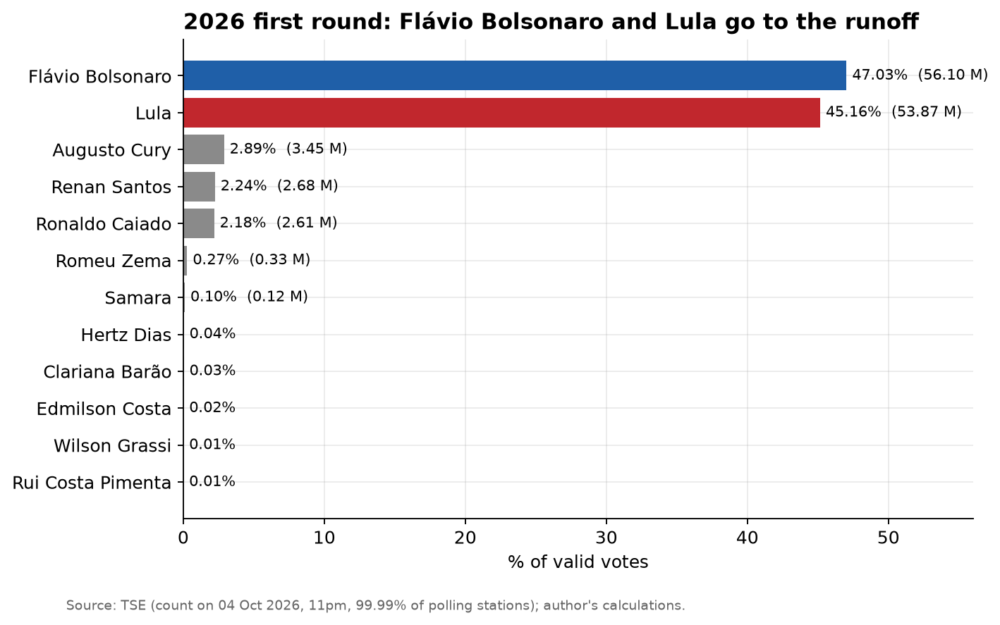

---

## 1. The question

Once the first round is over, what are each candidate's chances in the runoff? That question has two phases:

1. **While the count is still going:** can we project the final first-round result when votes are missing? (The early hours of a count are misleading: the municipalities that finish first are not representative.)
2. **After it:** how do the votes of the 10 eliminated candidates redistribute, and how much does that move the score?

This text answers both, measures the first against the actual result, and shows how much the second depends on assumptions.

## 2. Data

| Source | What it provided | Confidence | Original data | Copy in this repository |
|---|---|---|---|---|
| TSE — results portal (official files for election 6257) | Count by municipality (5,757), polling stations and electorate counted | **High** (official) | [results portal](https://resultados.tse.jus.br/) · sample JSON: [Caruaru](https://resultados.tse.jus.br/oficial/ele2026/6257/dados/pe/pe23817-c0001-e006257-u.json) | [`mun_2026.csv`](../data/interim/mun_2026.csv) · [original JSON (release)](https://github.com/berndof/eleicao-2026/releases/tag/dados-brutos-2026-10-04) |
| TSE open data: 2022 votes | 2022 presidential votes (both rounds) by municipality | **High** (official) | [`votacao_candidato_munzona_2022.zip`](https://cdn.tse.jus.br/estatistica/sead/odsele/votacao_candidato_munzona/votacao_candidato_munzona_2022.zip) (642 MB) | [`pres_2022_mun.csv`](../data/interim/pres_2022_mun.csv) · [`pres_2022_t2_mun.csv`](../data/interim/pres_2022_t2_mun.csv) · [zip (release)](https://github.com/berndof/eleicao-2026/releases/tag/dados-brutos-2026-10-04) |
| TSE open data: electorate profile | Age, gender and schooling by municipality, 2022 and 2026 | **High** (official) | [`perfil_eleitorado_2022.zip`](https://cdn.tse.jus.br/estatistica/sead/odsele/perfil_eleitorado/perfil_eleitorado_2022.zip) · [`perfil_eleitorado_2026.zip`](https://cdn.tse.jus.br/estatistica/sead/odsele/perfil_eleitorado/perfil_eleitorado_2026.zip) | [`perfil_2022_mun.csv`](../data/interim/perfil_2022_mun.csv) · [`perfil_2026_mun.csv`](../data/interim/perfil_2026_mun.csv) · [zips (release)](https://github.com/berndof/eleicao-2026/releases/tag/dados-brutos-2026-10-04) |
| Wikipedia (EN), *Opinion polling for the 2026 Brazilian presidential election* | 56 first-round polls (excluding the page's "Results" row, which is the ballot box) and 56 runoff polls, each linking to its source | Medium-high (compilation; I did not re-check every link) | [page](https://en.wikipedia.org/wiki/Opinion_polling_for_the_2026_Brazilian_presidential_election) | [raw wikitext](../data/external/wikipedia_pesquisas_2026.wikitext) · [`pesquisas_1turno.csv`](../data/interim/pesquisas_1turno.csv) · [`pesquisas_2turno.csv`](../data/interim/pesquisas_2turno.csv) |
| Quaest and Datafolha (Oct 2–3), via search summaries | Runoff voting intention **among each eliminated candidate's voters** | **Medium-low**: I did not read the original articles; the two pollsters diverge a lot | no verified primary link | [`transferencia_pesquisas.csv`](../data/external/transferencia_pesquisas.csv) |
| TSE (history) | 2002–2022 presidential rounds | Medium-high (2022 re-checked against open data) | [TSE open data](https://dadosabertos.tse.jus.br/) | [`historico_2turnos.csv`](../data/external/historico_2turnos.csv) |
| IBGE | State boundaries (maps only) | High | [Malhas API v3](https://servicodados.ibge.gov.br/api/docs/malhas?versao=3) | [`ufs_ibge.geojson`](../data/external/ufs_ibge.geojson) |

What is **not** a numeric input: government approval, rejection ratings, formal endorsements — only qualitative context (the race is polarised and balanced). Details and data dictionary: [`docs/dados.md`](dados.md) (Portuguese).

## 3. Projecting the first round with votes still missing

**Method** (details in [`docs/metodologia.md`](metodologia.md), Portuguese): for each municipality, estimate how many valid votes are still to come (votes counted ÷ share of electorate counted) and **how they will split**, using a weighted regression on 2022 results and electorate profile, blended with what has already been counted in that same municipality. Uncertainty by Monte Carlo.

Core idea: the part that is **missing** differs from the part already **counted**. That is why extrapolating the partial count is wrong; the 85% partial had Flávio 48.4%, Lula 43.5%.

### The backtest

The ~8pm projection was frozen in a *snapshot* (`data/snapshots/`). Now that the count is nearly complete, we can measure its error.

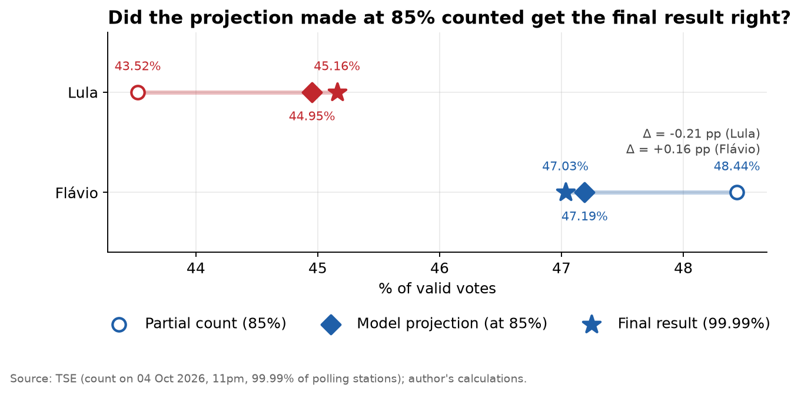

| | Partial (85%) | Projection (85%) | Final |
|---|---:|---:|---:|
| Lula | 43.52% | 44.95% | **45.16%** |
| Flávio | 48.44% | 47.19% | **47.03%** |
| Lula − Flávio margin | −4.92 pp | −2.24 pp | **−1.87 pp** |

* **National:** projection error of −0.21 pp (Lula) and +0.16 pp (Flávio); the partial was off by −1.64 and +1.41. The margin error went from 3.0 pp to 0.4.
* **By state:** mean absolute margin error (vote-weighted) of **0.60 pp vs. 1.13** for the partial; correct winner in **28/28**.
* **By municipality (5,716):** mean absolute error of 0.49 pp in Lula's share and 0.44 pp in Flávio's.
* **Total valid votes:** projected 0.15% above the final.

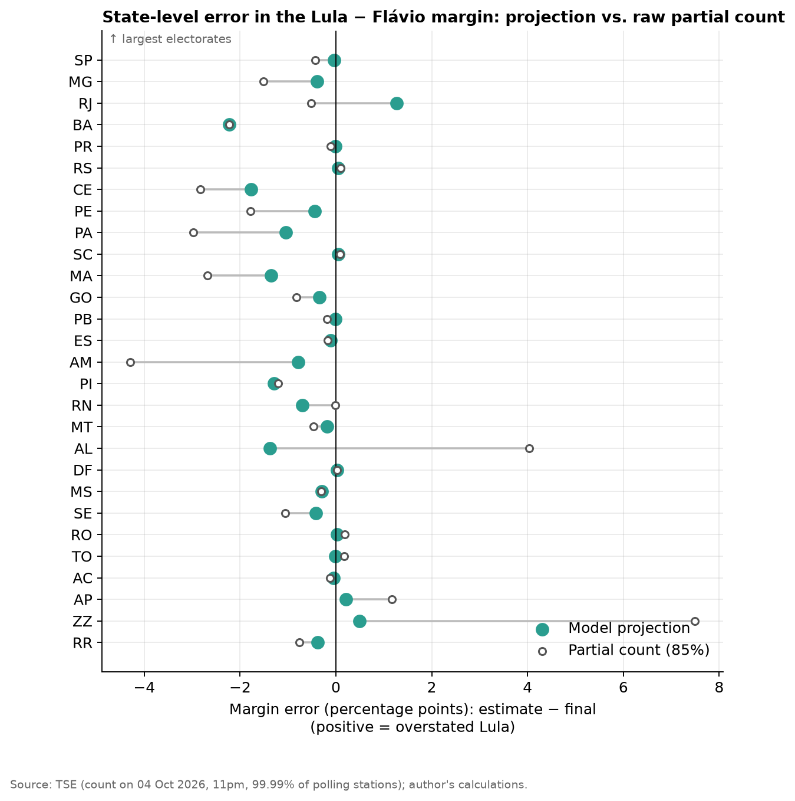

**Where it missed.** Bahia (−2.2 pp on the margin: Lula did better than expected in the municipalities still to be counted, and the model corrected nothing there), Ceará (−1.8) and Alagoas (−1.4). Abroad (+7.5 pp on the partial, +0.5 after projection) was the most misleading unit in the partial count.

> [!WARNING]
> **The confidence interval was too narrow.** The 90% interval for the national margin was −2.53 to −1.95 pp; the actual result was −1.87 pp, **outside** it by 0.08 pp. So the central estimate was good, but the stated uncertainty was understated. That matters because the same narrow-interval style appears in the runoff's structural model (M1) — see the limitations.

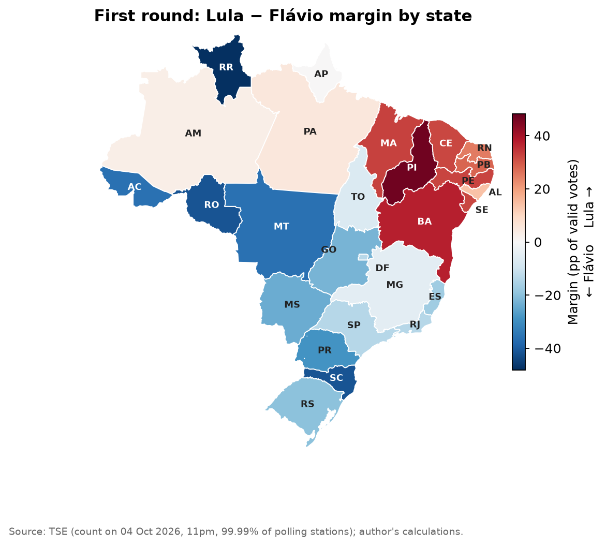

## 4. First-round polls erred in Lula's favor

Comparing each pollster's last poll (from Sep 26) with the ballot box:

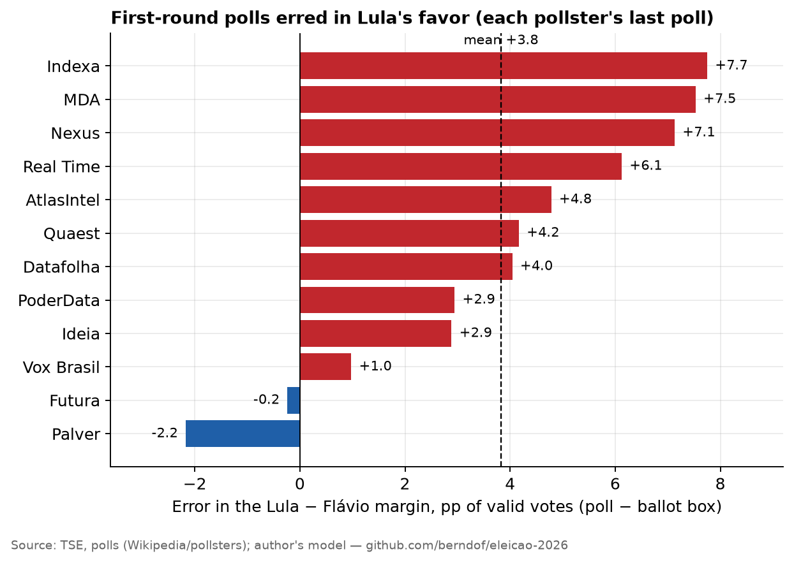

Mean **+3.8 pp on the Lula − Flávio margin** (standard deviation across pollsters: 3.1). Ten of 12 favored Lula; Palver (−2.2) and Futura (−0.2) favored Flávio. This bias matters most for method M2, below — and raises a question we **cannot** answer here: how much of it repeats in the runoff?

## 5. Forecasting the runoff: three methods

Instead of betting on one model, I use three **independent** methods and compare them.

### M1 — Structural (vote transfer)

1. **Calibration on 2022.** A regression (by municipality and region) measures, in the 2022 runoff, how much of each candidate's base was retained, how much of the eliminated candidates' electorate turned out (94%) and the regional tilt. Bolsonaro's base **grew** by ~6.6% from round 1 to round 2 (mobilisation); Lula's stayed flat. Cross-validated error per municipality is 0.66 pp, versus 1.88 for a naive model.
2. **Eliminated candidates' voters in 2026.** From the transfer polls (Quaest–Datafolha average), **65.3%** of the eliminated candidates' valid vote would go to Flávio — versus 48.4% in 2022. For candidates without a poll there are explicit assumptions (see table).
3. **Geography.** The Northeast tilts the eliminated candidates' voters to Lula and the South to Flávio, as in 2022.

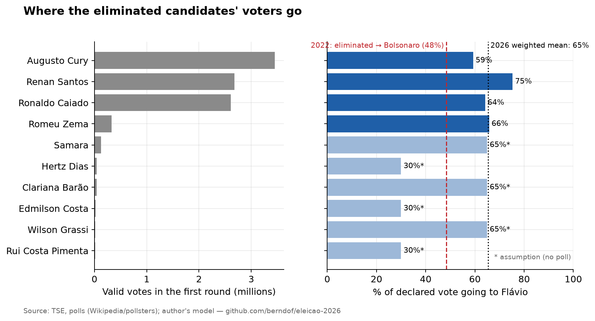

> The three eliminated candidates that matter (Cury, Renan, Caiado) add up to 8.7 million valid votes (7.3% of the total). The other seven add up to < 0.6 million — assumptions about them barely move the result.

### M2 — Adjusted polls

Average of runoff polls (last one per pollster, recency-weighted, 7-day half-life): **Lula 49.7%**. I correct for the first-round error, but only **40% ± 20%** of it (my assumption, based on search summaries saying that in 2022 the runoff error was a quarter to a half of the first-round error). Result: **Lula 48.8%**.

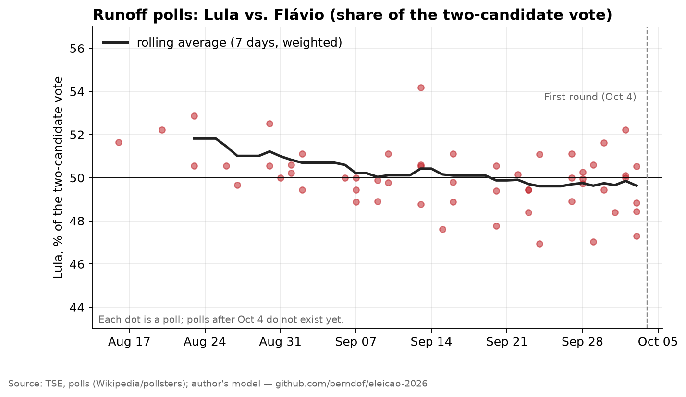

### M3 — Historical

Over six elections (2002–2022), the first-round leader ends up, in the runoff, at roughly `50 + 0.66 × (their lead among the two in round 1 − 50)`. Flávio has 51.0% among the two → **Flávio 50.7% / Lula 49.3%**. The standard error is large (4 pp; 2006 was atypical). It ignores that the 2026 eliminated candidates are mostly right-leaning.

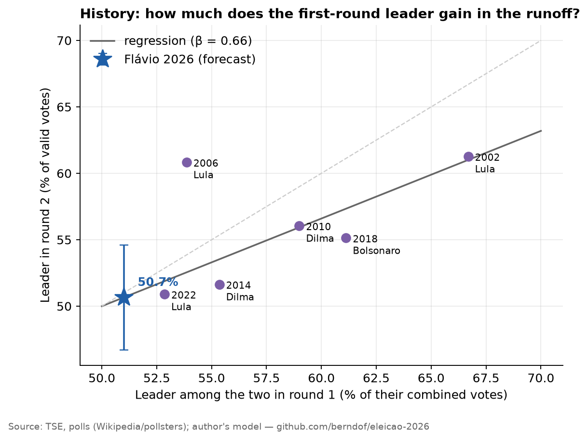

### Ensemble

Weighted mixture: **M1 50%, M2 30%, M3 20%**. These weights are **my judgement**, not estimated.

| Component | Weight | Lula (mean) | 90% CI | P(Lula wins) | Median margin |
|---|---:|---:|---|---:|---:|
| M1 structural | 50% | 47.19% | 45.44% – 48.91% | **0.3%** | −6.7 M |
| M2 adjusted polls | 30% | 48.86% | 44.91% – 52.83% | **31.7%** | −2.7 M |
| M3 historical | 20% | 49.35% | 43.41% – 55.29% | **41.1%** | −1.7 M |
| **Ensemble** | | **48.12%** | **45.12% – 52.58%** | **17.9%** | **−5.4 M** |

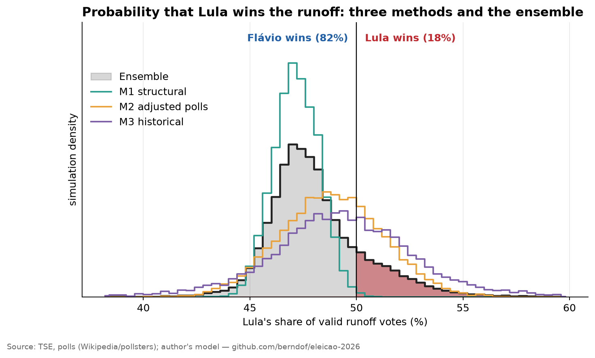

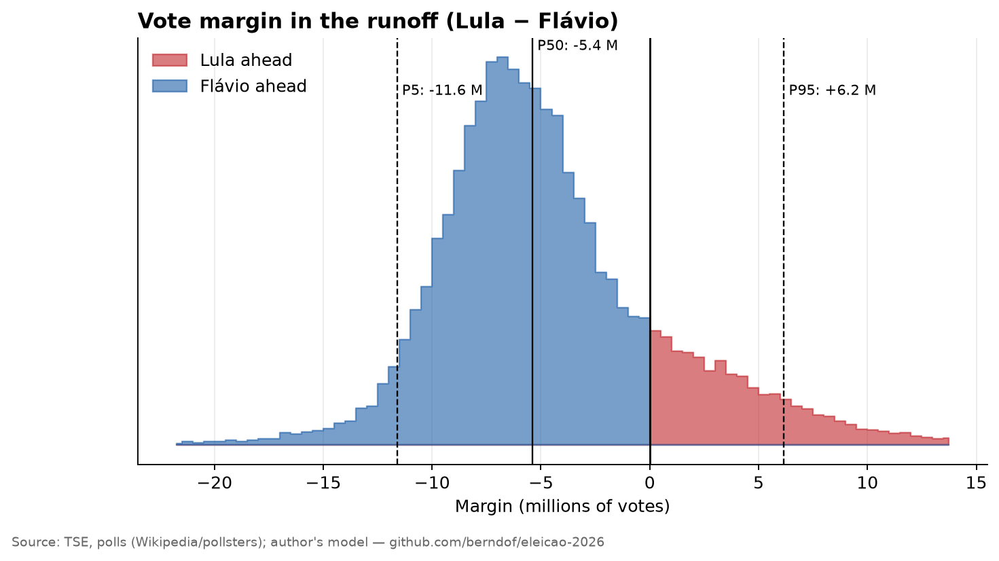

## 6. What moves the result

### The probability depends on the weights

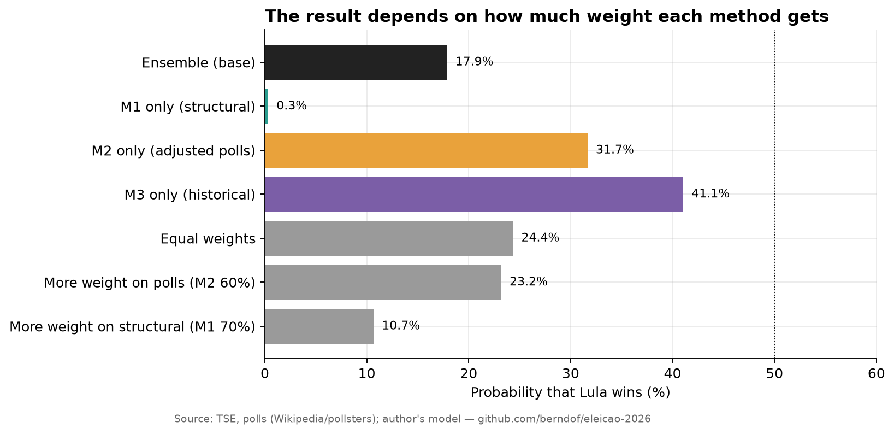

With equal weights, P(Lula) = 24.4%; with 70% on M1, 10.7%; with 60% on M2, 23.2%. **All of these mixtures put Flávio ahead**, but the probability ranges from ~10% to ~25% (and from 0.3% to 41% if you use a single method). Read the result as "**Flávio favored; a close race in Lula-friendly scenarios**" rather than memorising the 18%.

### Inside M1

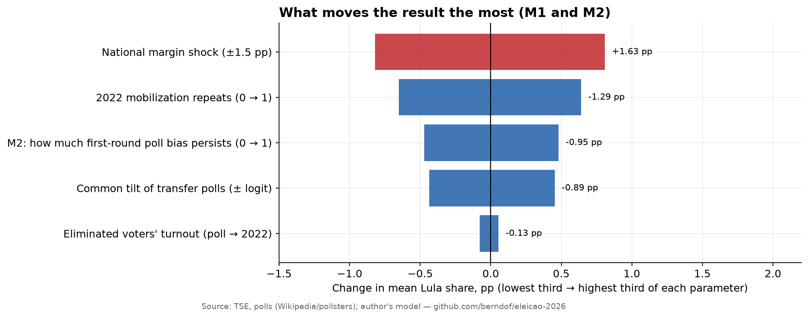

The biggest factors, by range (lowest to highest third of each parameter): a ±1.5 pp national margin shock (1.6 pp on Lula's share), whether the 2022 mobilisation repeats (−1.3 pp for Lula), and the common bias of the transfer polls (0.9 pp).

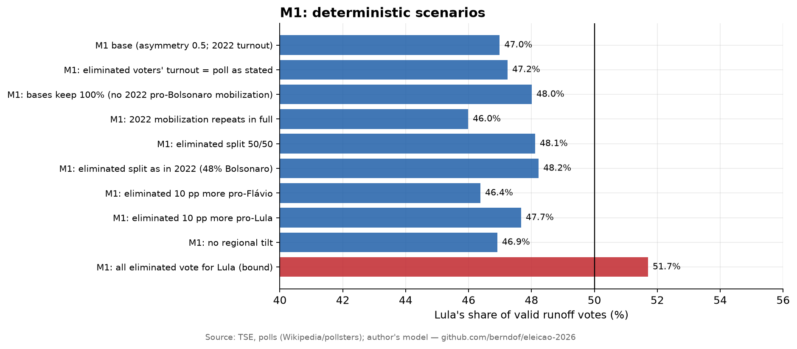

* If the eliminated voters split as in 2022 (48% Bolsonaro): Lula 48.2%.
* If the two bases held with no asymmetric mobilisation: Lula 48.0%.
* **If all eliminated voters voted for Lula** (impossible upper bound): Lula 51.7%, winning by 4 million votes.

### Geography

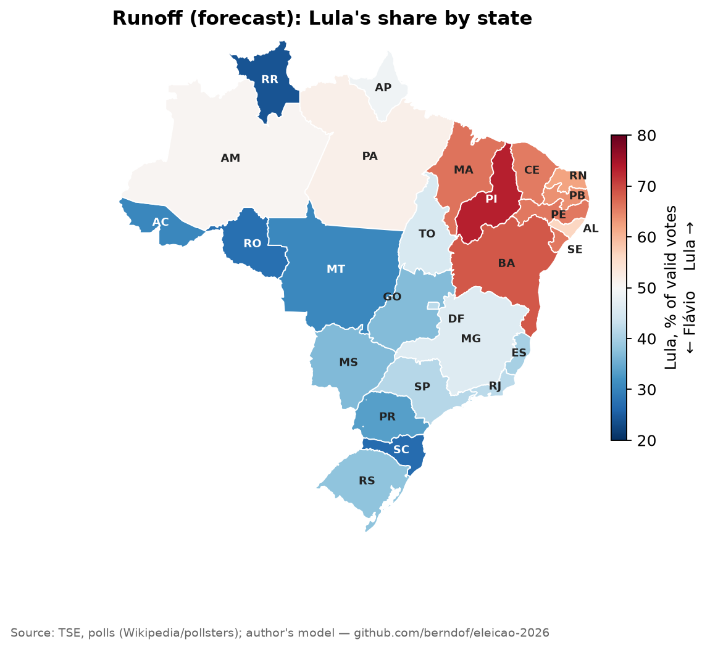

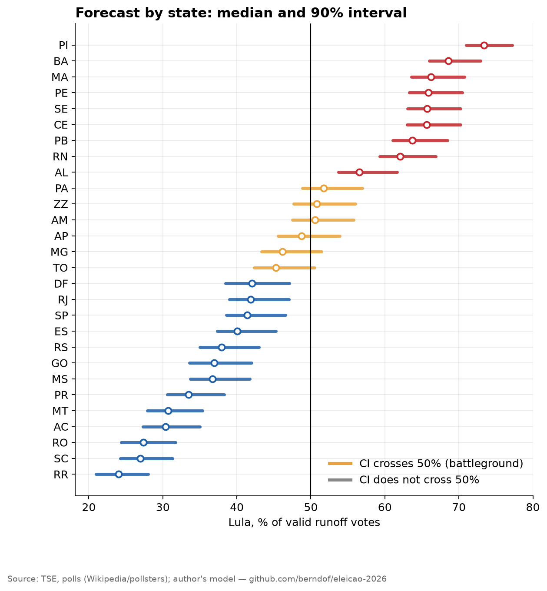

Six units have an interval crossing 50% and decide the race: **Pará** (P(Lula) 85%), **abroad** (67%), **Amazonas** (61%), **Amapá** (29%), **Minas Gerais** (10%; the most populous battleground) and **Tocantins** (7%). The Southeast and South hold 56% of votes and go against Lula by 16 and 35 pp; the Northeast (28% of votes) goes for him by +31 pp.

## 7. Limitations (read before quoting a number)

1. **The forecast is conditional on Oct 4, 11pm.** No model captures debates, scandals, formal endorsements or withdrawals until Oct 25 beyond a generic national shock (±1.5 pp).
2. **The intervals are probably too narrow**, especially in M1 (90% CI of only ~3.5 pp). The first-round backtest showed the same symptom. The ensemble, with wider M2 and M3, is the most honest reading of uncertainty — but it still understates it.
3. **The ensemble weights (50/30/20) and the bias-persistence factor (0.4) are my assumptions.** Section 6 shows the effect.
4. **Transfer polls** come from search summaries, with samples of a few dozen respondents per candidate, and Quaest and Datafolha diverge widely (Renan: 60/11 vs. 43/22). They come from the same pollsters that missed round 1 in Lula's favor: M1 may be **underestimating Flávio** (the opposite of the bias M2 corrects).
5. **M3 uses only 6 elections** and 2006 weighs heavily; it ignores that the eliminated candidates are mostly right-leaning.
6. **Runoff polls include some taken before the first round** and do not incorporate the actual result.
7. **TSE file timing:** the national total and the municipality sum were downloaded at different moments (≈ 9 thousand votes apart, 0.008%).

## 8. Reproducibility

```bash
git clone https://github.com/berndof/eleicao-2026 && cd eleicao-2026
make setup      # Python environment
make fetch-raw  # downloads the raw data (~1.1 GB) from the GitHub release and checks SHA-256  (or: make data, straight from TSE)
make data       # once: builds the per-municipality tables from the raw data
make all        # refreshes count and polls, runs models, backtest, figures and tables
```

* The seed is fixed: running the first-round model on the 85% *snapshot* reproduces the projection published at the time **exactly**.
* The models' core uses only the Python standard library; `matplotlib` and `numpy` are only needed for plots.
* All 30,000 simulations are in [`data/processed/sims_2turno.csv`](../data/processed/sims_2turno.csv).
* Full tables (by state, polls, thresholds, scenarios): [`docs/tables.en.md`](tables.en.md).

## 9. Next steps

* **Post-mortem on Oct 25:** this forecast is frozen at tag `previsao-2t-2026-10-04-v2` (`-v2` fixes an error in the original version; see the [erratum](layers.en.md#erratum)). After the election I will compare forecast and result (by method, by state) and publish what went wrong.
* Post-first-round runoff polls (starting to come out in the next days) should be incorporated; `make collect` fetches them.
* Estimate (instead of assume) the bias-persistence factor and the ensemble weights, using 2014 and 2018.

---

**Licenses.** Code: MIT. Text and figures: CC BY 4.0. Data: owned by their producers (TSE, IBGE, pollsters; Wikipedia under CC BY-SA).
