# Flávio × Lula: projetando o 2º turno de 2026 a partir da apuração do 1º

> · [English version](article.en.md)
>
> Este é um exercício de modelagem estatística com dados públicos, **não** é uma pesquisa eleitoral nem uma recomendação de voto. Todo o código, os dados e as simulações estão [no repositório](../README.md) e podem ser auditados e refeitos.

## Resumo

> [!TIP]
> **Quer entender cada etapa?** [`docs/camadas.pt.md`](camadas.pt.md) explica as 12 camadas da análise (o que entra, o que acontece, o que sai, o que significa) com números reais, e [`docs/pesquisas.pt.md`](pesquisas.pt.md) mostra quais pesquisas entram, onde, e quanto cada uma pesa. Os dados brutos estão numa [release](https://github.com/berndof/eleicao-2026/releases/tag/dados-brutos-2026-10-04).

* **1º turno (final, 99,99%):** Flávio Bolsonaro 47,03% × Lula 45,16% dos votos válidos. Ninguém passou de 50%; o 2º turno é em **25/10/2026**.
* **Backtest:** às ~20h, com 85% apurado, o modelo projetou Lula 44,95% × Flávio 47,19%. O resultado final foi 45,16% × 47,03% — **erro de 0,2 p.p. em cada candidato**, contra 1,6 e 1,4 p.p. de quem apenas olhasse o parcial. Acertou o vencedor nas 28 UFs (27 + exterior). Mas o intervalo de 90% que o modelo dava para a margem nacional **errou por pouco** (0,08 p.p.): era estreito demais.
* **As pesquisas de 1º turno erraram a favor de Lula**: em média **+3,8 p.p. na margem** (12 institutos, de −2,2 a +7,7).
* **2º turno (previsão, 3 métodos + ensemble):** Lula 48,1% dos válidos em média (mediana 47,7%; intervalo de 90%: 45,1% a 52,6%). **Probabilidade de Lula vencer: 18%** — mas entre **0,3% e 41%** conforme o método. A divergência entre os métodos é o resultado mais importante deste trabalho.
* **Quem decide:** os 8,7 milhões de eleitores de Cury, Renan e Caiado. A pesquisa os põe ~65% com Flávio (em 2022 os eliminados foram 48% para Bolsonaro). Mesmo que **todos** votassem em Lula, ele só chegaria a 51,7%.

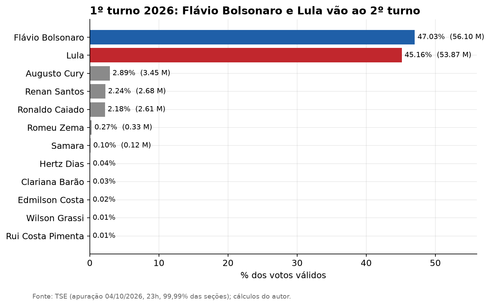

---

## 1. A pergunta

Terminado o 1º turno, qual a chance de cada candidato no 2º? Há duas fases nessa pergunta:

1. **Antes de acabar a apuração:** dá para projetar o resultado final do 1º turno enquanto faltam votos? (as primeiras horas de apuração enganam: os municípios que terminam primeiro não são representativos.)
2. **Depois:** como os votos dos 10 candidatos eliminados se redistribuem e quanto isso muda o placar?

Este texto responde às duas, mede o erro da primeira contra o resultado real, e mostra o quanto a segunda depende de suposições.

## 2. Dados

| Fonte | O que forneceu | Confiança | Dado original | Cópia neste repositório |
|---|---|---|---|---|
| TSE — resultados (arquivos oficiais da eleição 6257) | Apuração por município (5.757), seções e eleitorado apurados | **Alta** (oficial) | [portal de resultados](https://resultados.tse.jus.br/) · JSON de exemplo: [Caruaru](https://resultados.tse.jus.br/oficial/ele2026/6257/dados/pe/pe23817-c0001-e006257-u.json) | [`mun_2026.csv`](../data/interim/mun_2026.csv) · [JSON originais (release)](https://github.com/berndof/eleicao-2026/releases/tag/dados-brutos-2026-10-04) |
| TSE — dados abertos: votos de 2022 | Votos de Presidente em 2022 (1º e 2º turno) por município | **Alta** (oficial) | [`votacao_candidato_munzona_2022.zip`](https://cdn.tse.jus.br/estatistica/sead/odsele/votacao_candidato_munzona/votacao_candidato_munzona_2022.zip) (642 MB) | [`pres_2022_mun.csv`](../data/interim/pres_2022_mun.csv) · [`pres_2022_t2_mun.csv`](../data/interim/pres_2022_t2_mun.csv) · [zip (release)](https://github.com/berndof/eleicao-2026/releases/tag/dados-brutos-2026-10-04) |
| TSE — dados abertos: perfil do eleitorado | Idade, gênero e escolaridade por município, 2022 e 2026 | **Alta** (oficial) | [`perfil_eleitorado_2022.zip`](https://cdn.tse.jus.br/estatistica/sead/odsele/perfil_eleitorado/perfil_eleitorado_2022.zip) · [`perfil_eleitorado_2026.zip`](https://cdn.tse.jus.br/estatistica/sead/odsele/perfil_eleitorado/perfil_eleitorado_2026.zip) | [`perfil_2022_mun.csv`](../data/interim/perfil_2022_mun.csv) · [`perfil_2026_mun.csv`](../data/interim/perfil_2026_mun.csv) · [zips (release)](https://github.com/berndof/eleicao-2026/releases/tag/dados-brutos-2026-10-04) |
| Wikipédia (EN), *Opinion polling for the 2026 Brazilian presidential election* | 56 pesquisas de 1º turno (sem a linha "Results" da página, que é a urna) e 56 de 2º turno; **auditadas com 100% de correspondência contra o registro TSE PesqEle** | **Alta** (auditada no TSE) | [página](https://en.wikipedia.org/wiki/Opinion_polling_for_the_2026_Brazilian_presidential_election) · [TSE PesqEle](https://dadosabertos.tse.jus.br/) | [wikitext bruto](../data/external/wikipedia_pesquisas_2026.wikitext) · [`auditoria_pesquisas.csv`](../data/processed/auditoria_pesquisas.csv) |
| Quaest e Datafolha (02–03/10) | Intenção de voto no 2º turno **por eleitorado de cada candidato eliminado**, conferidos nas publicações primárias | **Média** (auditado contra relatórios originais) | G1 / Genial Quaest (BR017082026) · Folha / Datafolha | [`transferencia_pesquisas_primaria.csv`](../data/external/transferencia_pesquisas_primaria.csv) |
| TSE (histórico) | 1º e 2º turnos presidenciais 2002–2022 | Média-alta (2022 reconferido com os dados abertos) | [TSE dados abertos](https://dadosabertos.tse.jus.br/) | [`historico_2turnos.csv`](../data/external/historico_2turnos.csv) |
| IBGE | Malha das UFs (só para os mapas) | Alta | [API de Malhas v3](https://servicodados.ibge.gov.br/api/docs/malhas?versao=3) | [`ufs_ibge.geojson`](../data/external/ufs_ibge.geojson) |

O que **não** entra como peso numérico na projeção final, mas serve de diagnóstico contextual independente: indicadores do Censo 2022 (religião, renda e raça), alinhamento de prefeitos eleitos em 2024, aprovação governamental e séries de rejeição no Datafolha, além de probabilidades do Polymarket (que convergiram para 83% Flávio vs. 17% Lula no encerramento da apuração). Detalhes e dicionário em [`docs/dados.md`](dados.md); o catálogo de 29 fontes em [`docs/fontes/`](fontes/); e todos os dados em gráficos em [`docs/dados_visual.md`](dados_visual.md).

## 3. Projetando o 1º turno com votos faltando

**Método** (detalhes em [`docs/metodologia.md`](metodologia.md)): para cada município, estima-se quantos votos válidos ainda virão (votos apurados ÷ fração do eleitorado já apurado) e **como esses votos se dividirão**, por uma regressão ponderada com a votação de 2022 e o perfil do eleitorado, combinada com o que já foi apurado no próprio município. Incerteza por Monte Carlo.

Ideia central: a parte que **falta** é diferente da parte que **já foi contada**. Por isso extrapolar o parcial erra; foi o que o parcial de 85% fez: Flávio 48,4%, Lula 43,5%.

### O backtest

A projeção das ~20h foi congelada num *snapshot* (`data/snapshots/`). Agora, com a apuração praticamente completa, dá para medir o erro.

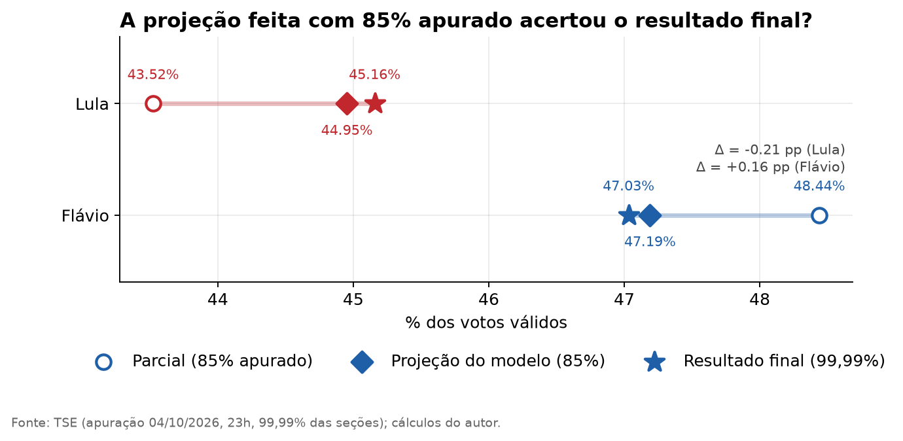

| | Parcial (85%) | Projeção (85%) | Final |
|---|---:|---:|---:|
| Lula | 43,52% | 44,95% | **45,16%** |
| Flávio | 48,44% | 47,19% | **47,03%** |
| Margem Lula − Flávio | −4,92 p.p. | −2,24 p.p. | **−1,87 p.p.** |

* **Nacional:** erro da projeção de −0,21 p.p. (Lula) e +0,16 p.p. (Flávio); o parcial errava −1,64 e +1,41. A margem passou de 3,0 p.p. de erro para 0,4.
* **Por UF:** erro médio absoluto da margem (ponderado por votos) de **0,60 p.p. contra 1,13** do parcial; vencedor certo em **28/28**.
* **Por município (5.716):** erro absoluto médio de 0,49 p.p. no share de Lula e 0,44 p.p. no de Flávio.
* **Total de votos válidos:** projetado 0,15% acima do final.

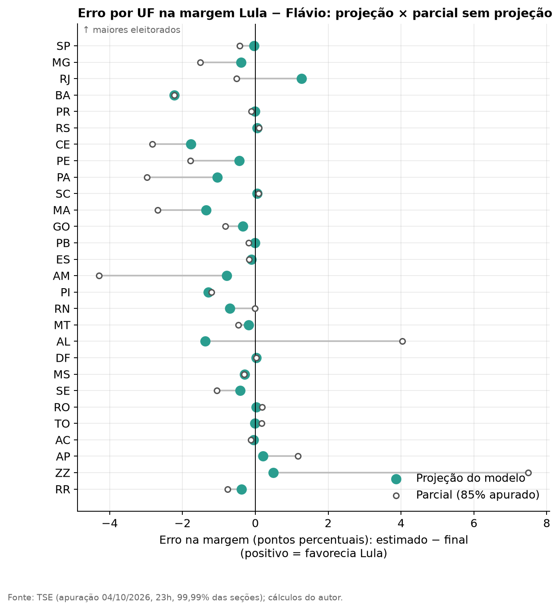

**Onde errou.** Bahia (−2,2 p.p. na margem: Lula foi melhor que o previsto nos municípios que faltavam, e o modelo não corrigiu nada ali), Ceará (−1,8) e Alagoas (−1,4). O exterior (+7,5 p.p. no parcial, +0,5 na projeção) era a UF mais enganosa no parcial.

> [!WARNING]
> **O intervalo de confiança era curto demais.** O IC de 90% da margem nacional era de −2,53 a −1,95 p.p.; o resultado real foi −1,87 p.p., **fora** do intervalo por 0,08 p.p. Ou seja: o ponto central acertou bem, mas a incerteza declarada estava subestimada. Isso importa porque o mesmo estilo de intervalo (estreito) aparece no modelo estrutural do 2º turno, M1 — veja as limitações.

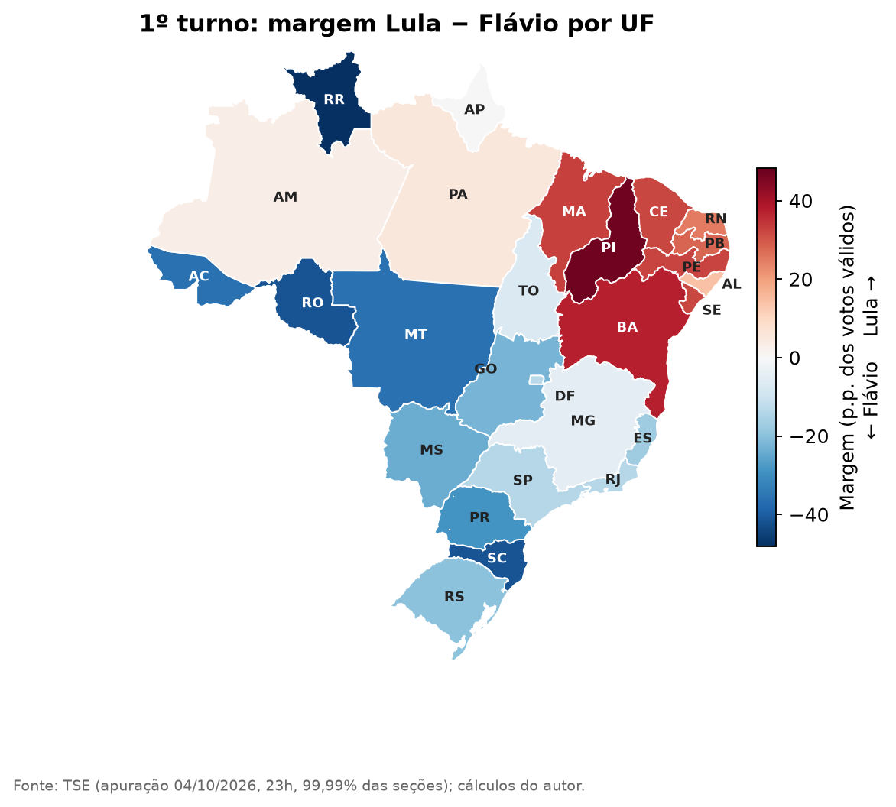

## 4. As pesquisas de 1º turno erraram a favor de Lula

Comparando a última pesquisa de cada instituto (a partir de 26/09) com a urna:

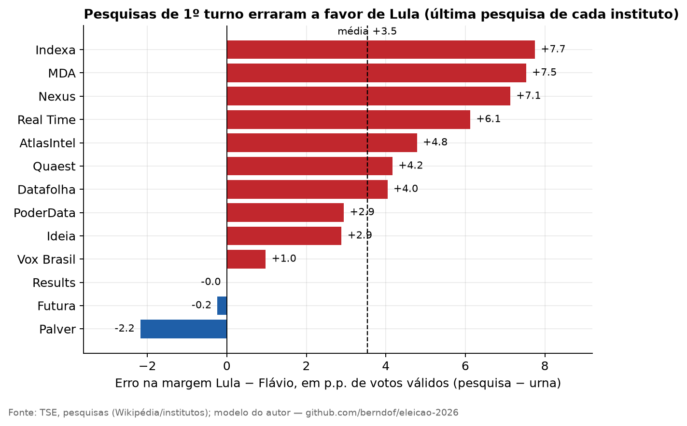

Média **+3,8 p.p. na margem Lula − Flávio** (desvio-padrão entre institutos: 3,1). Dez dos 12 favoreceram Lula; Palver (−2,2) e Futura (−0,2) favoreceram Flávio. Esse viés foi o que mais importou para o método M2, abaixo — e levanta uma pergunta que **não** conseguimos responder aqui: quanto dele se repete no 2º turno?

## 5. Prevendo o 2º turno: três métodos

Em vez de apostar num único modelo, uso três métodos **independentes** e comparo.

### M1 — Estrutural (transferência de votos)

1. **Calibração em 2022.** Uma regressão (por município e região) mede, no 2º turno de 2022, quanto da base de cada candidato foi retida, quanto dos eleitores dos eliminados compareceu (94%) e a inclinação regional. A base de Bolsonaro **cresceu** ~6,6% do 1º para o 2º turno (mobilização); a de Lula ficou estável. O erro de validação cruzada por município é de 0,66 p.p., contra 1,88 de um modelo ingênuo.
2. **Destino dos eliminados em 2026.** Pelas pesquisas de transferência (média Quaest e Datafolha), **65,3%** do voto válido dos eliminados iria a Flávio — contra 48,4% em 2022. Para candidatos sem pesquisa há suposições explícitas (ver tabela).
3. **Geografia.** O Nordeste inclina os eliminados a Lula e o Sul a Flávio, como em 2022.

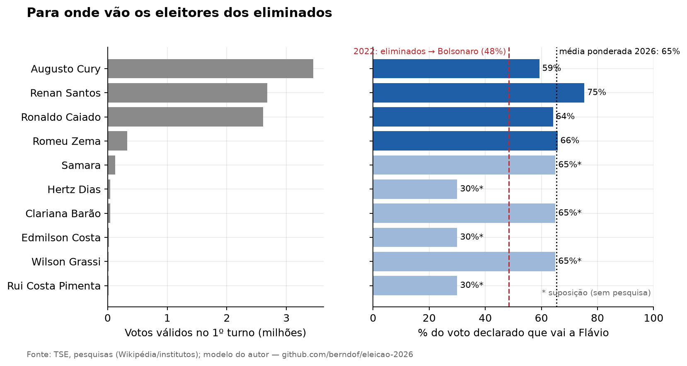

> Os três eliminados que contam (Cury, Renan, Caiado) somam 8,7 milhões de votos válidos (7,3% do total). Os outros sete somam < 0,6 milhão — as suposições sobre eles quase não mexem no resultado.

### M2 — Pesquisas corrigidas

Média das pesquisas de 2º turno (última de cada instituto, peso por recência, meia-vida de 7 dias): **Lula 49,7%**. Corrijo pelo erro do 1º turno, mas só **40% ± 20%** dele (suposição minha, apoiada em resumos de busca segundo os quais em 2022 o erro do 2º turno foi de um quarto a metade do erro do 1º). Resultado: **Lula 48,8%**.

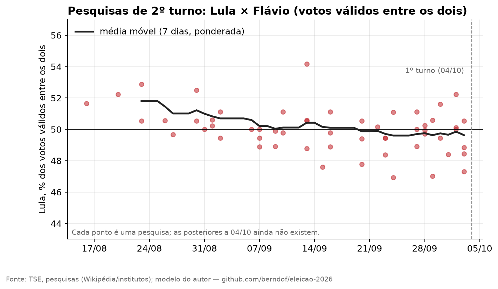

### M3 — Histórico

Em seis eleições (2002–2022), o líder do 1º turno ganha, no 2º, aproximadamente `50 + 0,66 × (sua vantagem entre os dois no 1º − 50)`. Flávio tem 51,0% entre os dois → **Flávio 50,7% / Lula 49,3%**. O erro-padrão é grande (4 p.p.; 2006 foi atípico). Ignora que os eliminados de 2026 são majoritariamente de direita.

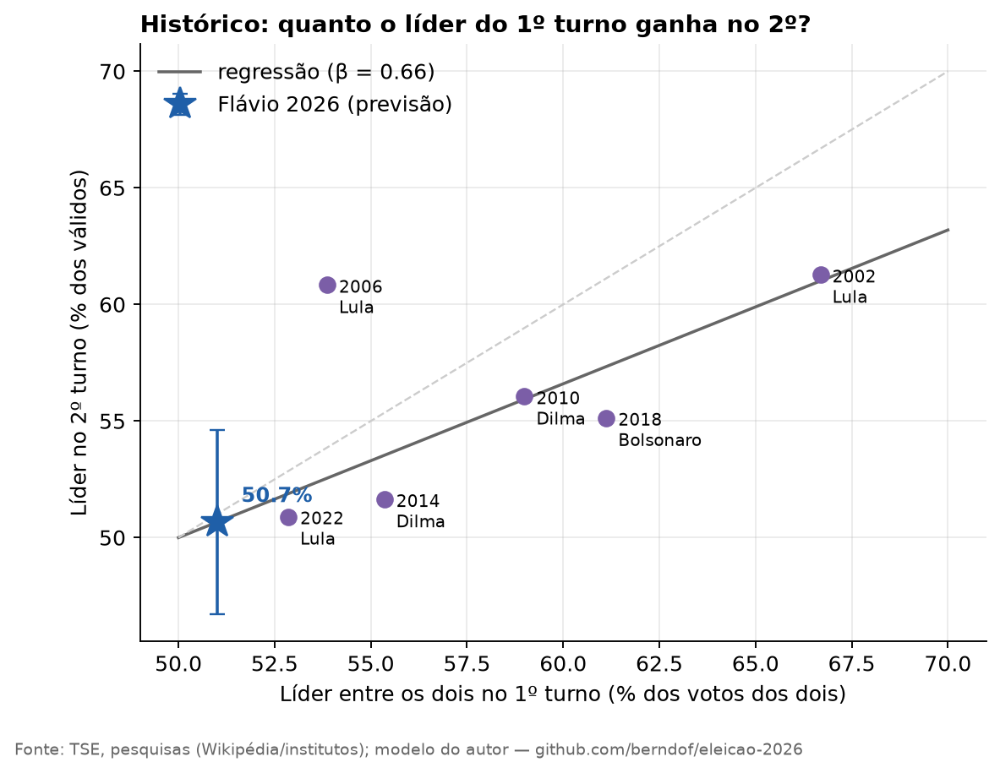

### Ensemble

Mistura ponderada: **M1 50%, M2 30%, M3 20%**. Esses pesos são **julgamento meu**, não estimados.

| Componente | Peso | Lula (média) | IC 90% | P(Lula vence) | Margem mediana |
|---|---:|---:|---|---:|---:|
| M1 estrutural | 50% | 47,19% | 45,44% – 48,91% | **0,3%** | −6,7 M |
| M2 pesquisas corrigidas | 30% | 48,86% | 44,91% – 52,83% | **31,7%** | −2,7 M |
| M3 histórico | 20% | 49,35% | 43,41% – 55,29% | **41,1%** | −1,7 M |
| **Ensemble** | | **48,12%** | **45,12% – 52,58%** | **17,9%** | **−5,4 M** |

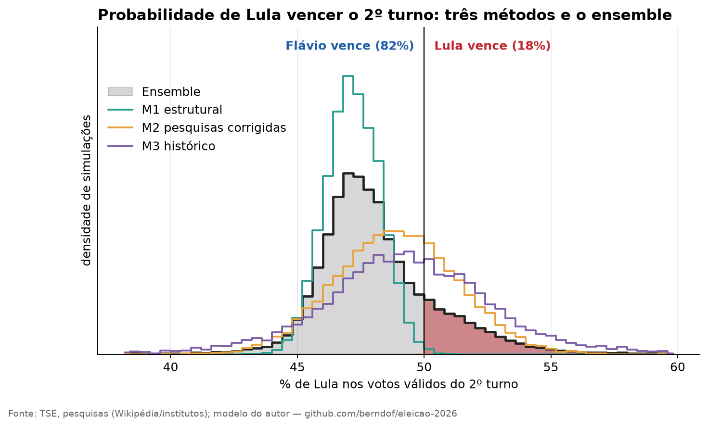

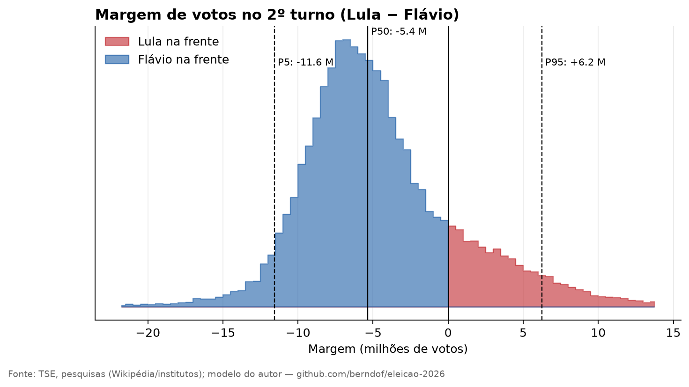

## 6. O que muda o resultado

### A probabilidade depende dos pesos

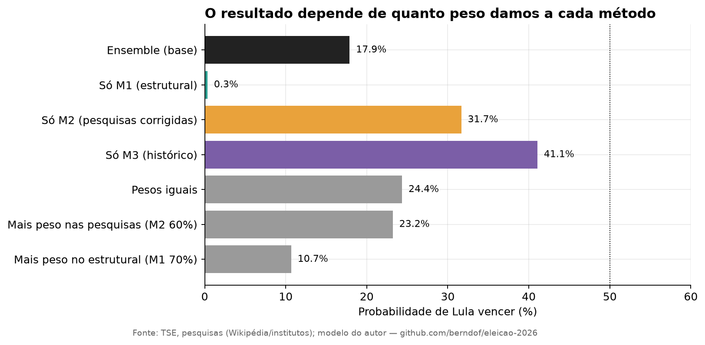

Com pesos iguais, P(Lula) = 24,4%; com 70% no M1, 10,7%; com 60% no M2, 23,2%. **Todas essas misturas dão Flávio na frente**, mas a probabilidade vai de ~10% a ~25% (e de 0,3% a 41% se usarmos um método só). Prefira ler o resultado como "**Flávio favorito, disputa apertada nos cenários otimistas para Lula**" a gravar o 18%.

### Dentro do M1

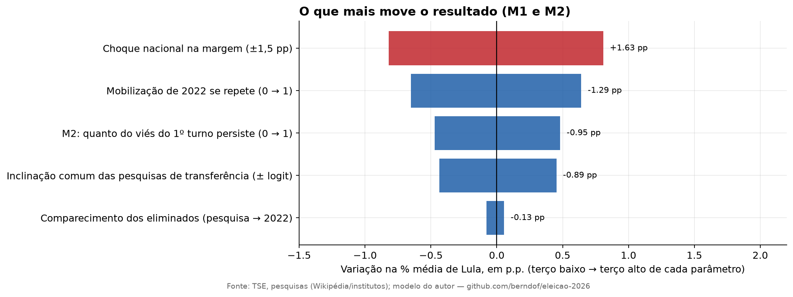

Os fatores que mais pesam, em amplitude (do terço baixo ao terço alto de cada parâmetro): o choque nacional de ±1,5 p.p. na margem (1,6 p.p. no share de Lula), se a mobilização de 2022 se repete (−1,3 p.p. para Lula) e o viés comum das pesquisas de transferência (0,9 p.p.).

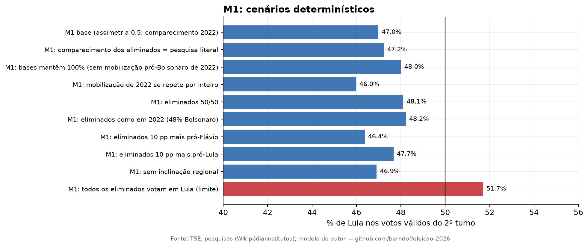

* Se os eliminados votassem como em 2022 (48% Bolsonaro): Lula 48,2%.
* Se as bases se mantivessem sem mobilização assimétrica: Lula 48,0%.
* **Se todos os eliminados votassem em Lula** (limite impossível): Lula 51,7%, ganhando por 4 milhões de votos.

### Geografia

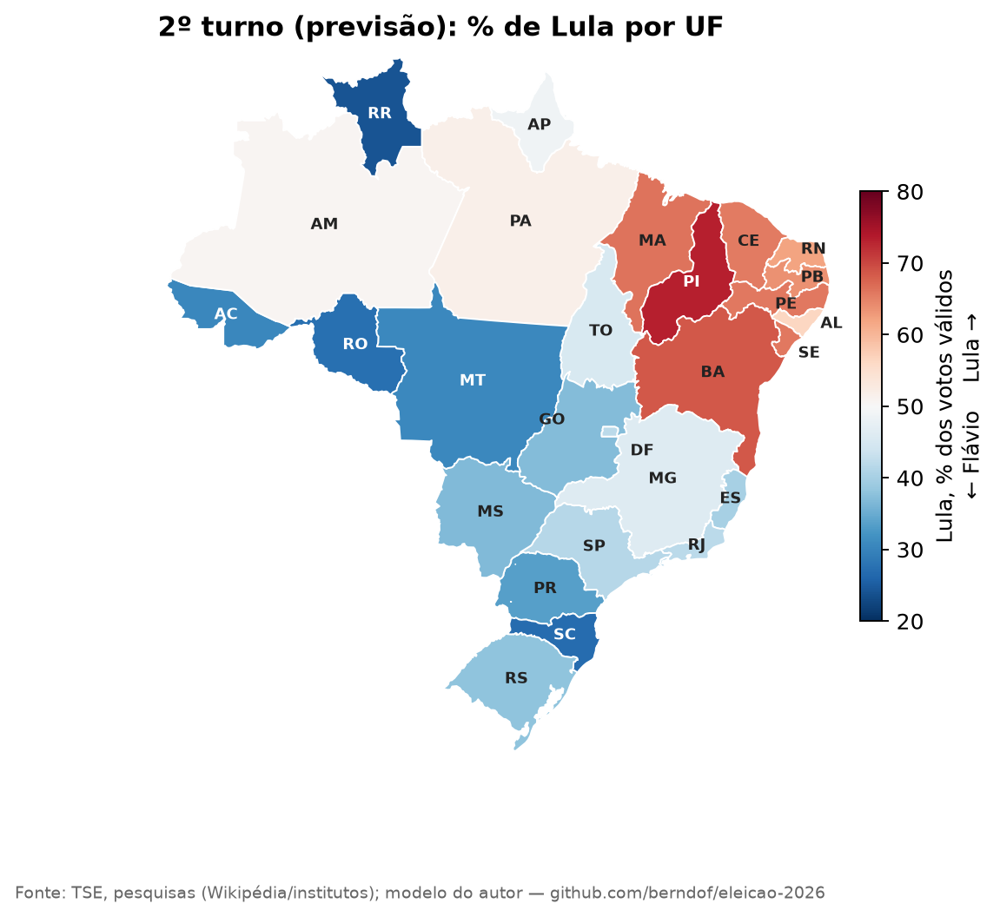

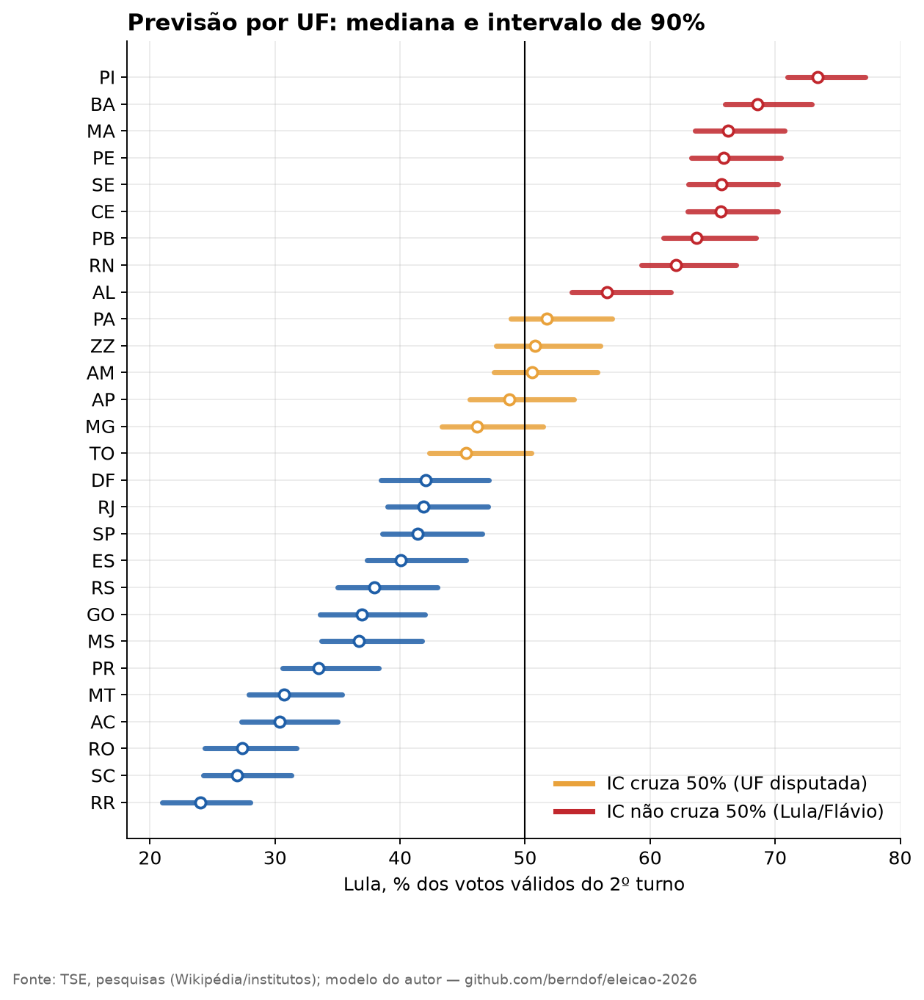

Seis UFs têm intervalo que cruza 50% e decidem: **Pará** (P(Lula) 85%), **Exterior** (67%), **Amazonas** (61%), **Amapá** (29%), **Minas Gerais** (10%; a UF mais populosa disputada) e **Tocantins** (7%). Sudeste e Sul somam 56% dos votos e votam contra Lula por 16 e 35 p.p.; o Nordeste (28% dos votos) vota nele com +31 p.p.

## 7. Limitações (leia antes de citar um número)

1. **A previsão é condicional a 04/10, 23h.** Nenhum modelo capta debates, escândalos, apoios formais ou desistências até 25/10 além de um choque nacional genérico (±1,5 p.p.).
2. **Os intervalos são provavelmente estreitos demais**, em especial no M1 (IC 90% de só ~3,5 p.p.). O backtest do 1º turno mostrou o mesmo sintoma. O ensemble, com M2 e M3 mais largos, é a leitura mais honesta da incerteza — mas continua subestimando-a.
3. **Os pesos do ensemble (50/30/20) e o fator de persistência do viés (0,4) são suposições minhas.** A seção 6 mostra o efeito.
4. **Pesquisas de transferência** vêm de resumos de busca, com amostras de dezenas de respondentes por candidato, e Quaest e Datafolha divergem muito (Renan: 60/11 contra 43/22). Elas vêm dos mesmos institutos que erraram o 1º turno a favor de Lula: o M1 pode estar **subestimando Flávio** (o inverso do viés que o M2 corrige).
5. **M3 usa só 6 eleições** e 2006 pesa; o modelo ignora que os eliminados são majoritariamente de direita.
6. **Pesquisas de 2º turno incluem as feitas antes do 1º turno** e não incorporam o resultado real.
7. **Diferenças de data dos arquivos do TSE:** o total nacional e a soma por município foram baixados em momentos diferentes (≈ 9 mil votos de diferença, 0,008%).

## 8. Reprodutibilidade

```bash
git clone https://github.com/berndof/eleicao-2026 && cd eleicao-2026
make setup      # ambiente Python
make fetch-raw  # baixa os brutos (~1,1 GB) da release do GitHub e confere o SHA-256  (ou: make data, direto do TSE)
make data       # 1x: gera as tabelas por município a partir dos brutos
make all        # atualiza apuração e pesquisas, roda os modelos, backtest, figuras e tabelas
```

* A semente é fixa: rodar o modelo de 1º turno sobre o *snapshot* de 85% reproduz **exatamente** a projeção publicada na época.
* O núcleo dos modelos usa só a biblioteca padrão do Python; `matplotlib` e `numpy` só são necessários para os gráficos.
* Todas as 30.000 simulações estão em [`data/processed/sims_2turno.csv`](../data/processed/sims_2turno.csv).
* Tabelas completas (por UF, pesquisas, limiares, cenários): [`docs/tabelas.pt.md`](tabelas.pt.md).

## 9. Próximos passos

* **Pós-mortem em 25/10:** esta previsão está congelada na tag `previsao-2t-2026-10-04-v2` (a `-v2` corrige um erro da versão original; veja a [errata](camadas.pt.md#errata)). Depois da eleição, comparo previsão e resultado (por método, por UF) e publico o que errou.
* **Modelos V2 Experimentais:** em paralelo à previsão congelada oficial, implementamos a versão experimental V2 em `eleicao2026.v2` (incorporando Censo 2022, Prefeitos 2024 e pesos de pesquisas auditados no TSE). A análise comparativa detalhada está documentada no [Gráfico 15 de dados_visual.md](dados_visual.md#15-comparativo-dos-modelos-v1-baseline-vs-v2-aprimorado) e na [Camada 13 de camadas.pt.md](camadas.pt.md#camada-13--a-segunda-versão-dos-modelos-v2).
* **Modelo M4 e Ensemble de 4 Pilares:** implementamos o modelo econométrico M4 de fundamentos macroeconômicos (desemprego em 5,3% e inflação sob controle) e avaliação de governo (Datafolha), além do Ensemble V2 com otimização de portfólio de Markowitz e cenários balanceados. Veja detalhes nas [Camadas 14 e 15 de camadas.pt.md](camadas.pt.md#camada-14-modelo-m4--fundamentos-macroeconômicos-e-popularidade-srceleicao2026v2m4_fundamentospy) e nos [Gráficos 17 a 20 de dados_visual.md](dados_visual.md#17-fundamentos-macroeconômicos-e-popularidade-histórica-20022026).
* Pesquisas de 2º turno pós-1º turno (começam a sair nos próximos dias) devem ser incorporadas; o `make collect` as busca.
* Estimar (em vez de assumir) o fator de persistência do viés e os pesos do ensemble, olhando 2014 e 2018.

---

**Licenças.** Código: MIT. Texto e figuras: CC BY 4.0. Dados: dos respectivos produtores (TSE, IBGE, institutos; Wikipédia sob CC BY-SA).
