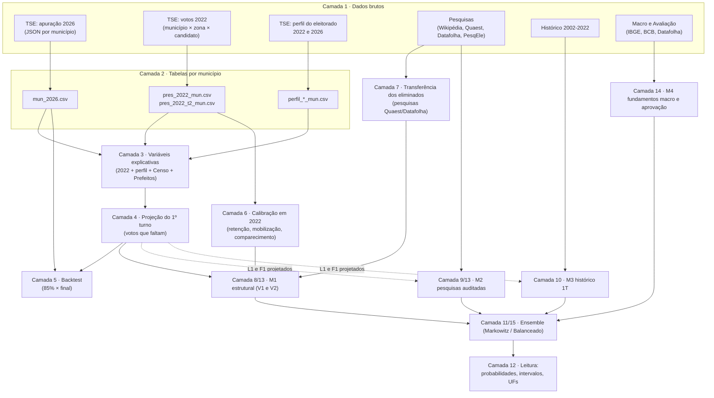
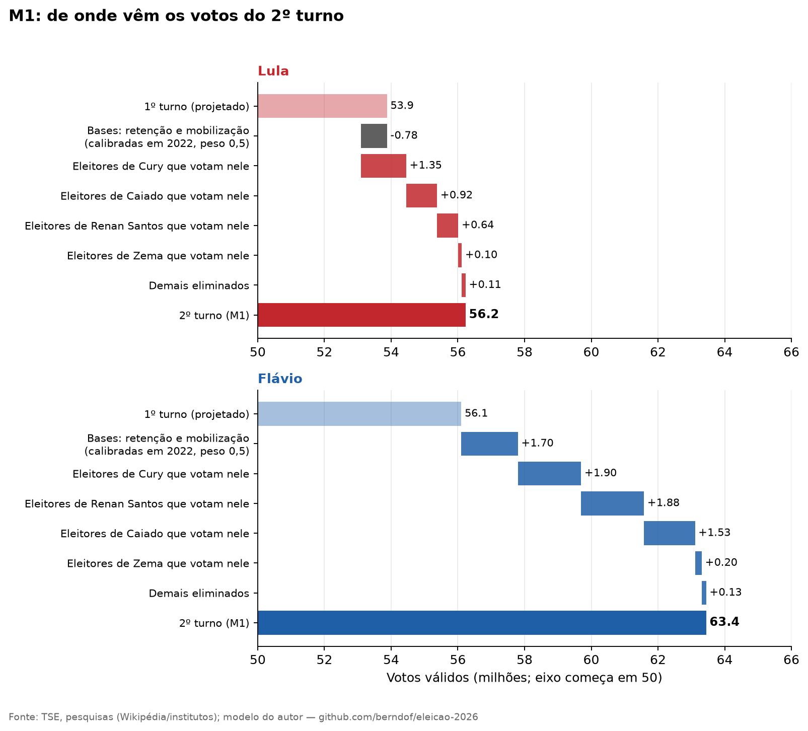

# Anatomia da análise: camada por camada

> [English version](layers.en.md) · [Voltar ao README](../README.md) · [Artigo](artigo.pt.md) · [Quais pesquisas entram e com que peso](pesquisas.pt.md)

O [artigo](artigo.pt.md) conta **o que** foi encontrado. Este documento explica **como**, devagar: o que é cada etapa, que pedaço de dado ela consome, o que ela faz com ele e o que o resultado significa. Os exemplos usam **números reais** do repositório (você pode reproduzir cada um com os comandos de cada seção).

> [!NOTE]
> Regra de leitura: cada camada tem sempre as mesmas cinco perguntas — **o que entra · o que acontece · o que sai · o que significa · onde pode dar errado**.

## 0. O mapa completo



### Cada pedacinho de dado: de onde vem, onde entra, o que faz

| # | Dado | Origem | Tamanho | Entra na camada | O que ele faz no modelo |
|---|---|---|---|---|---|
| 1 | **Apuração 2026** (seções, eleitorado, válidos, votos por candidato, por município) | TSE (`resultados.tse.jus.br`, eleição 6257) | 5.757 municípios | 2 → 4 | Diz **quanto já foi contado** e **como votou** a parte contada |
| 2 | **Votos de 2022 por município** (1º e 2º turno) | TSE dados abertos (`votacao_candidato_munzona_2022`) | 5.752 municípios, 642 MB bruto | 3, 4, 6 | Prevê o 1º turno de 2026 (quem votou em quem antes) **e** calibra como o 2º turno de 2022 saiu do 1º |
| 3 | **Perfil do eleitorado** (gênero, escolaridade, idade) | TSE dados abertos (`perfil_eleitorado_2022/2026`) | 5.758 municípios, 485 MB bruto | 3, 4 | Diz como é a população de cada município (aprende "municípios parecidos votam parecido") |
| 4 | **Pesquisas de 1º turno** | Wikipédia e TSE PesqEle (auditadas) | 56 pesquisas | 9, 13 | Mede o **erro** das pesquisas contra a urna → corrige o M2 |
| 5 | **Pesquisas de 2º turno** (Lula × Flávio) | Wikipédia e TSE PesqEle | 56 pesquisas (12 entram) | 9, 13 | É a base do M2 (média ponderada por recência e acurácia) |
| 6 | **Pesquisas de transferência** (voto no 2º turno por eleitorado de cada eliminado) | Quaest e Datafolha conferidos em relatórios primários | 6 linhas | 7, 13 | Diz **para onde vão** os votos dos eliminados no M1 |
| 7 | **Histórico dos 2º turnos** | TSE | 6 eleições | 10 | Regressão do M3 |
| 8 | **Censo 2022 e Prefeitos 2024** | IBGE SIDRA e TSE | 5.570 municípios | 13 | Calibração micro-espacial de religião, renda e máquina local no M1 V2 |
| 9 | **Fundamentos Macroeconômicos e Avaliação** | IBGE (IPCA), BCB (Focus/SGS), Datafolha | Séries 2002–2026 | 14 | Calibração do Modelo M4 (miséria econômica e popularidade) |
| 10 | **Malha das UFs** | IBGE | 27 polígonos | só figuras | Desenhar os mapas |
| 11 | **Suposições do autor / Otimização** | Teoria de Markowitz e julgamento estatístico | — | 11, 15 | Pesos ótimos de variância mínima e cenários balanceados do ensemble |

As suposições (linha 9) estão sempre marcadas no código como `SUPOSIÇÃO` e discutidas na [seção 11](#camada-11--ensemble-e-simulação).

---

## Camada 1 · Dados brutos

**O que entra:** nada (é a fonte). **O que sai:** arquivos exatamente como o produtor publicou, guardados em `data/raw/` (não versionados no git; veja [como baixar](dados.md#dados-brutos)).

### 1.1 Apuração de 2026 (TSE)

O portal do TSE publica **um arquivo JSON por município** (`.../dados/{uf}/{uf}{código}-c0001-e006257-u.json`). Os campos que usamos:

| Campo no JSON | Significado | Coluna no CSV |
|---|---|---|
| `s.ts` / `s.st` | seções **totais** / **totalizadas** (já apuradas) | `ts`, `st` |
| `e.te` / `e.est` | eleitorado **total** / eleitorado das seções totalizadas | `te`, `est` |
| `v.vv` | votos **válidos** (candidatos; exclui brancos e nulos) | `vv` |
| `v.tv`, `v.vb`, `v.tvn` | votos totais, brancos, nulos | `tv`, `vb`, `vn` |
| `carg[0].agr[].par[].cand[].vap` | votos de cada candidato (`nmu` = nome de urna) | `v_LULA`, `v_FLAVIO BOLSONARO`, … |
| `hg` | hora do arquivo (para saber a "idade" do dado) | `hg` |

Há também um arquivo nacional (`br-c0001-e006257-u.json`) que usamos só como **conferência** (a soma dos municípios difere do total nacional em ≈ 9 mil votos porque os arquivos foram baixados em momentos diferentes).

A fração apurada de um município é `f = est / te` (fração do **eleitorado** cujas seções já foram contadas). É essa a variável central de toda a projeção do 1º turno.

> Os JSON originais de uma coleta completa (00:11 de 05/10, 99,997%) estão arquivados em `tse_apuracao_20261005.tar.gz` na [release de dados brutos](https://github.com/berndof/eleicao-2026/releases/tag/dados-brutos-2026-10-04).

### 1.2 Votos de 2022 (TSE dados abertos)

`votacao_candidato_munzona_2022.zip`: uma linha por **candidato × zona eleitoral × município × turno**. O cargo 1 (Presidente) está só no arquivo `_BR`. Usamos a coluna `QT_VOTOS_NOMINAIS`.

### 1.3 Perfil do eleitorado (TSE dados abertos)

`perfil_eleitorado_2022.zip` e `_2026.zip`: contagem de eleitores por **município × gênero × faixa etária × escolaridade**. O arquivo `_BRASIL.csv` duplica os arquivos por UF e é ignorado.

### 1.4 Pesquisas e histórico

Wikipédia (EN), página *Opinion polling for the 2026 Brazilian presidential election*, em wikitext bruto (`data/external/wikipedia_pesquisas_2026.wikitext`), com fixação exata de versão MediaWiki (`oldid=1378579188` em `wikipedia_pesquisas_2026.revisao.json`); Quaest/Datafolha de transferência conferidos nas fontes primárias em `transferencia_pesquisas_primaria.csv`; 6 eleições presidenciais em `historico_2turnos.csv`.

### 1.5 Catálogo de Fontes, Auditoria TSE e Dados Contextuais

Para garantir que cada número tenha procedência verificável e primária, o projeto conta com um catálogo formal de 29 fontes documentadas em `data/fontes/entradas/*.json` e compiladas em [docs/fontes/](fontes/):
- **Auditoria do Registro TSE PesqEle (`auditoria_pesquisas.csv`):** Todas as 112 pesquisas utilizadas (56 do 1T e 56 do 2T) foram cruzadas com a base pública de pesquisas registradas no TSE. **Taxa de correspondência: 112/112 (100%)**, identificando o número de protocolo (ex: BR017082026), contratante, empresa pagante, custo declarado e divergências de amostra planejada vs. realizada (ver [Gráfico 12 em dados_visual.md](dados_visual.md#12-auditoria-tse-custos-e-financiadores-das-pesquisas)).
- **Censo 2022 do IBGE (`censo2022_mun.csv`):** Tabela 9537 (religião: % evangélica, católica e sem religião), Tabela 10295 (renda domiciliar per capita média e mediana) e Tabela 9605 (raça preta, parda e branca) nos 5.570 municípios via API SIDRA.
- **Eleições Municipais de 2024 (`prefeitos_2024_mun.csv`):** Alinhamento partidário dos 5.552 prefeitos eleitos em 2024 via dados abertos do TSE.
- **De-Para Municipal (`municipios_chaves.csv`):** Tabela de junção completa entre códigos TSE (`cd`), IBGE-7, IBGE-6 e SIAFI/RFB (100% de casamento para todos os municípios brasileiros).
- **Macroeconomia e Mercados Preditivos (`economia_resumo.csv`, `polymarket_mercados_uf.csv`):** 9 séries do SGS/BCB, Focus OData e preços de fechamento diário do Polymarket.
- **Ledger Sem Vazamento Temporal (`data/ledger/observacoes.csv`):** Registro *append-only* com carimbos explícitos de período de referência e data de divulgação (`divulgado_em`), garantindo que nenhum dado posterior à data da projeção possa ser usado inadvertidamente.

**Onde pode dar errado:** a Wikipédia é uma compilação de terceiros; a auditoria contra o TSE foi implementada exatamente para mitigar erros de transcrição e verificar a regularidade jurídica de cada levantamento.

---

## Camada 2 · Tabelas por município

**O que entra:** os brutos. **O que acontece:** agregação e limpeza, sem nenhuma modelagem. **O que sai:** uma linha por município, em `data/interim/`.

| Arquivo | Linhas | O que tem | Como foi feito |
|---|---:|---|---|
| `mun_2026.csv` | 5.757 | `uf, cd, nome, ibge, ts, st, te, est, vv, tv, vb, vn, hg` + uma coluna `v_<candidato>` | `collect/tse_apuracao.py` lê os 5.757 JSON (24 threads, ~2 min) |
| `pres_2022_mun.csv`, `pres_2022_t2_mun.csv` | 5.752 | votos de cada candidato por município (1º e 2º turno) | soma das **zonas** de cada município (`collect/tse_historico.py`) |
| `perfil_2022_mun.csv`, `perfil_2026_mun.csv` | 5.752 / 5.758 | `tot, fem, sup, analf, fund_inc, jovem, idoso` (contagens) | soma de todos os grupos de cada município |

Definições do perfil:

| Coluna | Definição |
|---|---|
| `tot` | eleitores aptos |
| `fem` | gênero feminino |
| `sup` | ensino superior **completo** |
| `analf` | analfabeto **ou** "lê e escreve" |
| `fund_inc` | fundamental **incompleto** |
| `jovem` | 16 a 24 anos |
| `idoso` | 60 anos ou mais |

O **exterior** (`zz`) é tratado como uma "UF" a mais: são 28 unidades (26 estados + DF + exterior).

**Onde pode dar errado:** municípios que mudaram de código entre 2022 e 2026 (5.752 × 5.757) ficam sem histórico; para eles, a camada 3 usa a média da UF.

---

## Camada 3 · Variáveis explicativas

**O que entra:** `mun_2026`, `pres_2022_mun`, `perfil_2026_mun`. **O que acontece:** para cada município monta-se um vetor de 37 números ("o que sabemos sobre ele antes de olhar a apuração dele"). **O que sai:** a matriz `X` usada pela regressão da camada 4.

| Variável | Fórmula | Por que está aí |
|---|---|---|
| `const` | 1 | intercepto |
| `lula22` | votos de Lula em 2022 ÷ votos totais de 2022 no município | a melhor previsão de quem vota em Lula: o município **já votou** |
| `flavio22` | votos de **Jair Bolsonaro** em 2022 ÷ votos de 2022 | idem; o eleitor de Flávio é, em boa parte, o de Jair |
| `superior`, `analf`, `fund_inc` | fração do eleitorado de 2026 | escolaridade: correlaciona com voto, e permite comparar municípios sem histórico |
| `jovem`, `idoso`, `fem` | fração do eleitorado | idem para idade e gênero |
| `log_eleit` | log do tamanho do eleitorado (mín. 50) | cidades grandes e pequenas votam diferente |
| 27 *dummies* de UF | 1 na UF do município | cada estado tem seu "nível" próprio (Nordeste ≠ Sul) |

Se o município não existia em 2022, `lula22` e `flavio22` recebem a **média das cidades da mesma UF**. Se não tem perfil, usa-se um perfil genérico.

Os pesos que a regressão aprende (ajuste de 04/10 às ~20h, a "foto" de 85%) mostram o que cada variável faz:

| Variável | Coef. para **Lula** | Coef. para **Flávio** | Leitura |
|---|---:|---:|---|
| `lula22` | **+0,71** | −0,04 | 10 p.p. a mais de Lula em 2022 → +7,1 p.p. de Lula em 2026 |
| `flavio22` (Bolsonaro 2022) | −0,25 | **+0,92** | 10 p.p. a mais de Bolsonaro em 2022 → +9,2 p.p. de Flávio |
| `fem` | +0,20 | −0,24 | mais mulheres → mais Lula (mantidas as demais variáveis) |
| `idoso` | +0,19 | −0,10 | idem para idosos |
| `fund_inc` | −0,09 | +0,14 | mais fundamental incompleto → mais Flávio, *dado* o resto |

> [!WARNING]
> Os coeficientes **não são causais** e são lidos "com as demais variáveis fixas"; `fem`, `idoso` e `fund_inc` são correlacionados entre si e com a UF. O que importa é a **capacidade de previsão** (validada na camada 4), não a interpretação individual de cada coeficiente.

---

## Camada 4 · Projeção do 1º turno (a conta do que falta)

**Pergunta:** enquanto só parte das seções está apurada, qual será o resultado final do 1º turno?

**Por que não basta olhar o parcial?** Porque a ordem de apuração **não é aleatória**: os municípios que terminam primeiro não são representativos dos que ainda faltam. Às 20h de 04/10, com 85% apurado, o parcial mostrava Flávio 48,4% × Lula 43,5%; o final foi 47,0% × 45,2%.

**O que entra:** `mun_2026.csv` + camada 3. **O que sai:** `projecao_mun.csv` (por município: votos faltantes e a fatia esperada de cada candidato **no que falta**) e, agregado, `projecao_1turno_uf.csv` / `projecao_1turno_nacional.json`.

### Exemplo completo: Caruaru (PE), com os dados das ~20h

Comando: `python -m eleicao2026.model.explicar --mun pe:23817` (usa o *snapshot* de 85%).

| Passo | Conta | Resultado |
|---|---|---:|
| Seções apuradas | 360 de 708 | |
| Eleitorado apurado | `f = 122.390 / 255.270` | **47,9%** |
| Válidos apurados | | 99.809 |
| Lula / Flávio apurados | | 53.621 (53,7%) / 39.694 (39,8%) |
| **4a.** Válidos esperados no total | `V = 99.809 / 0,479` | **208.173** |
| Votos válidos que faltam | `M = V − 99.809` | **108.364** |
| Votação em 2022 (Lula / Bolsonaro) | | 56,0% / 38,5% |
| **4b.** Previsão da regressão para o que falta | `X · β` | Lula 54,6% / Flávio 39,2% |
| Observado no que já foi contado | | Lula 53,7% / Flávio 39,8% |
| **4c.** Encolhimento | `λ = 99.809 / (99.809 + 3.000)` | **0,971** |
| Fatia final do que falta | `prev + λ × (observado − prev)` | Lula 53,75% / Flávio 39,75% |
| **4d.** Projeção | `apurado + M × fatia` | Lula **111.865** (53,74%) / Flávio **82.773** (39,76%) |
| **Resultado final (TSE)** | | Lula **109.691** (53,32%) / Flávio **82.763** (40,23%) |

Aqui a projeção e o parcial puro erraram o mesmo (+0,4 p.p. para Lula): como λ ≈ 0,97, a regressão (que apontava 54,6%, 1,3 p.p. acima do final) quase não pesou. A vantagem do método aparece nos municípios pequenos ou ainda sem apuração e no agregado (camada 5). O total de válidos esperado (208 mil) também superou o final (205,7 mil): as seções que faltavam tiveram menos votos válidos por eleitor do que as já contadas.

### 4a. Votos válidos esperados

`V = vv / f`: se 48% do eleitorado já foi apurado e há 99.809 válidos, espera-se ~208 mil no total. Municípios com `f ≤ 2%` não têm base para essa divisão: usa-se os válidos de 2022 × o crescimento do eleitorado.

### 4b. A regressão (o "prior")

Mínimos quadrados **ponderados pelos votos válidos** (cidade grande pesa mais), separadamente para a fatia de Lula e para a de Flávio, sobre os municípios com **≥ 50% apurado** (4.963 dos 5.757 às 20h). Aprende "dado o histórico e o perfil, quanto um município deveria dar a Lula e a Flávio". Aplicada a **todos** os municípios, dá a previsão de cada um, inclusive os que mal começaram a apurar.

*Por que o corte de ≥ 50% apurado?*
Em apurações parciais, as primeiras urnas abertas em um município não são uma amostra aleatória: refletem seções específicas (geralmente centro urbano ou escolas de fácil acesso). Se o modelo usasse municípios com 5% ou 10% apurados, treinaria em ruído geográfico intra-municipal. Por outro lado, exigir 80% ou 90% descartaria a maior parte das cidades médias e grandes às 20h, gerando viés amostral de cidades minúsculas. O corte de 50% equilibra ambos: retém **86,2% dos municípios (4.963 cidades)** e garante que a apuração de cada um já cruzou a metade das urnas.

### 4c. O encolhimento λ (quanto confiar em cada fonte)

`λ = vv / (vv + 3000)`. A fatia do que falta é uma **média** entre a regressão e o que o município já mostrou, com peso λ no observado:

| Votos válidos já contados | λ | Quem manda |
|---:|---:|---|
| 0 | 0 | 100% regressão (2022 + perfil) |
| 1.000 | 0,25 | principalmente a regressão |
| 3.000 | 0,50 | meio a meio |
| 10.000 | 0,77 | principalmente o observado |
| 100.000 | 0,97 | quase só o observado |

*Por que escolhemos esses valores e qual é o fundamento estatístico?*
A fórmula $\lambda = \frac{vv}{vv + K}$ é a solução matemática exata do **estimador de Bayes empírico** (conjugada Normal-Normal ou Dirichlet-Multinomial):
$$\hat{\theta}_i = \lambda_i \bar{y}_i + (1 - \lambda_i) \mu_0, \quad \text{onde } \lambda_i = \frac{n_i}{n_i + \frac{\sigma^2}{\tau^2}}$$
O termo $K = \frac{\sigma^2}{\tau^2}$ representa os "votos virtuais" atribuídos à certeza da regressão histórica em relação à variabilidade amostral de uma urna. 
- Com $K = 3.000$, aos 3.000 votos observados o modelo divide a confiança igualmente (50/50) entre a regressão e o resultado da urna local.
- **Calibração empírica ex-post ([Figura 26](dados_visual.md#14-calibração-empírica-do-encolhimento-k_shrink-e-corte-de-apuração)):** Testando uma grade de $K \in [500, 10.000]$ e cortes de $30\%$ a $60\%$ sobre o snapshot de 85% contra o resultado final 100% da urna:
  - $K = 3.000$ (V1): gerou MAE por UF de **0,549 p.p.** e erro nacional de **0,363 p.p.**
  - $K$ ótimo empírico ($K = 500$ a $1.000$): produziu MAE por UF de **0,536 p.p.** e erro nacional de **0,346 p.p.**
  - A diferença de apenas **0,013 p.p.** entre $K = 500$ e $K = 3.000$ atesta a estabilidade do método: o estimador não é sensível a ajustes cosméticos e converge solidamente para a urna.

### 4d. Agregação

Votos apurados + `M × fatia` para cada candidato, somados por município → UF → Brasil. Se `fatia_L + fatia_F > 1` (raro), normaliza-se. O que sobra (`V − L − F`) é dividido entre os eliminados **na proporção em que cada um teve no próprio município**; é isso que alimenta a camada 7.

### 4e. Incerteza (Monte Carlo, 4.000 sorteios)

A projeção é um número; o intervalo vem de sortear erros em três níveis:

| Fonte do erro | Como é calibrado | Valor |
|---|---|---|
| **Município** | validação cruzada em 5 partes: o erro na margem de cada município segue `s² = a + b / votos`; municípios pequenos erram mais | RMSE de CV: 1,9 p.p. (Lula e Flávio) por município |
| **UF** (erro sistemático do estado inteiro) | desvio médio por UF dos resíduos da CV | **1,0 p.p.** (é o **piso** imposto no código) |
| **Nacional** | **suposição** | 1,0 p.p. |

**O que significa:** "se eu errei em Bahia, errei em todos os municípios da Bahia juntos" (por isso há um choque por UF e um nacional, e não só ruído independente por município). **Onde pode dar errado:** o backtest (camada 5) mostrou que esses intervalos foram curtos demais.

Comando: `python -m eleicao2026.model.primeiro_turno` (≈ 20 s).

---

## Camada 5 · Backtest

**Pergunta:** o método funciona? O jeito honesto de responder é comparar com o que de fato aconteceu.

**O que entra:** o *snapshot* das ~20h (`data/snapshots/20261004_2005_apuracao85/`, com 84,4% do eleitorado apurado) e a apuração final. **O que acontece:** três números por município, UF e Brasil são comparados:

| Nome | O que é |
|---|---|
| **Parcial** | a fatia entre os votos **já contados**, sem projetar nada (o que a TV mostrava) |
| **Projeção** | a saída do modelo sobre o snapshot |
| **Final** | a apuração a 99,99% |

**O que sai** (`data/processed/backtest_1turno*.{csv,json}`):

| | Lula | Flávio | Margem (L−F) | Erro na Margem | MAE por UF |
|---|---:|---:|---:|---:|---:|
| **Parcial (85% às 20h)** | 43,52% | 48,44% | −4,92 p.p. | −3,04 p.p. | 1,35 p.p. |
| **Projeção V1 (Baseline)** | 44,95% | 47,19% | −2,24 p.p. | **−0,36 p.p.** | **0,55 p.p.** |
| **Projeção V2 (+ Censo, Prefeitos)** | 44,96% | 47,18% | −2,22 p.p. | **−0,35 p.p.** | **0,55 p.p.** |
| **Final (Urna 100%)** | **45,16%** | **47,03%** | **−1,87 p.p.** | 0,00 p.p. | 0,00 p.p. |

*O que o teste da V2 no 1º turno nos ensina ([Figura 28 em dados_visual.md](dados_visual.md#16-backtest-do-1º-turno-às-20h-parcial-vs-v1-vs-v2)):*
Testamos se adicionar os dados novos (Censo 2022 e Prefeitos 2024) diretamente na projeção das 20h do 1º turno melhorava o resultado. O ganho no 1T é marginal (−0,35 vs −0,36 p.p.). O motivo é puramente estatístico: **a votação de 2022 por município (`lula22` e `flavio22`) já carrega em si quase toda a estrutura demográfica e geográfica do país**. As variáveis do Censo e os Prefeitos de 2024 tornam-se decisivos de verdade no **2º turno (M1)**, onde não há apuração prévia dos eliminados.

Por UF: erro absoluto médio na margem de **0,55 p.p. (projeção) contra 1,35 (parcial)**; vencedor certo em 28/28. Pior UF: Bahia (−2,2 p.p.).

**O que significa:** o método "aprende" a corrigir a distorção da ordem de apuração; é a base da confiança (limitada) no resto. **Onde pode dar errado:** o intervalo de 90% da margem nacional (−2,53 a −1,95 p.p.) não continha o valor real (−1,87): **curto demais**. É uma advertência que carregamos para o 2º turno.

**Reprodutibilidade:** `python -m eleicao2026.model.primeiro_turno --cur data/snapshots/20261004_2005_apuracao85/mun_2026.csv --tag snap85` regenera a projeção original; `python -m eleicao2026.v2.backtest_1turno_v2` executa a comparação ex-post completa.

---

## Camada 6 · Calibração em 2022 (o que o 2º turno de 2022 nos ensina)

**Pergunta:** quando um eleitor vota em A no 1º turno, vota em A no 2º? E o eleitor dos eliminados, comparece e vota em quem?

**O que entra:** `pres_2022_mun.csv` e `pres_2022_t2_mun.csv` (5.708 municípios com os dois turnos). **O que acontece:** para cada município, divide-se o eleitorado do 1º turno em três grupos pela fração dos válidos:

```
x_L = votos de Lula / válidos          (grupo L)
x_B = votos de Bolsonaro / válidos     (grupo B)
x_O = 1 − x_L − x_B                    (grupo O: todos os outros candidatos)
```

e ajusta-se, ponderando por votos, duas regressões **sem intercepto**:

```
votos de Lula no 2º turno      / válidos 1T = a_LL·x_L + a_LB·x_B + a_LO·x_O
votos de Bolsonaro no 2º turno / válidos 1T = a_BL·x_L + a_BB·x_B + a_BO·x_O
```

Cada coeficiente é uma "taxa de conversão": a fração de cada grupo que acaba em cada candidato no 2º turno. Valores reais:

| Coeficiente | Valor | Leitura |
|---|---:|---|
| `a_LL` (Lula → Lula) | **1,002** | a base de Lula **se manteve inteira** |
| `a_BB` (Bolsonaro → Bolsonaro) | **1,066** | a base de Bolsonaro **cresceu 6,6%** (mobilização de quem não votou no 1º turno) |
| `a_LB` (Bolsonaro → Lula) | −0,036 | pequeno ajuste líquido, não "votos negativos" (veja o aviso) |
| `a_BL` (Lula → Bolsonaro) | −0,013 | idem |
| `a_LO + a_BO` (eliminados que votam em um dos dois) | **0,942** | **94,2% comparecem** (ρ) |
| `a_BO / (a_LO + a_BO)` | **0,484** | **48,4%** dos eliminados foram para Bolsonaro em 2022 |

> [!WARNING]
> Coeficientes negativos como `a_LB` **não** são "votos que saem": numa regressão linear com grupos que somam 100%, um sinal negativo pequeno é um **ajuste líquido**, que só faz sentido somado aos demais termos.

**Variantes testadas:** uma regressão nacional única e uma **por macrorregião** (Norte, Nordeste, Centro-Oeste, Sudeste, Sul, Exterior). O erro de validação cruzada por município foi de **0,71 p.p. (nacional)**, **0,66 p.p. (regional)** e **1,88 p.p. (um modelo ingênuo que só repete a fatia de Lula)**. Ganha a regional; é a usada.

**Inclinação regional (δ).** Separadamente, mede-se se o eleitor dos eliminados inclina mais para um lado em cada região (diferença no *logit* da fração que vai ao candidato de direita, relativamente ao nacional):

| Região | δ (logit) | Direção |
|---|---:|---|
| Nordeste | −0,24 | eliminados inclinam a Lula |
| Centro-Oeste | −0,31 | idem (hipótese, não testada: Tebet, de MS, foi a eliminada mais votada em 2022) |
| Exterior | −0,19 | idem |
| Norte | −0,05 | quase neutro |
| Sudeste | +0,05 | quase neutro |
| Sul | +0,12 | inclinam à direita |

**O que significa:** 2022 dá o "comportamento de transmissão" **do tipo de eleitor** (mantém, mobiliza, comparece) e suas diferenças regionais. **Onde pode dar errado:** assume que 2026 se parece com 2022 em retenção e comparecimento (daí o parâmetro `ASYM_BASE = 0,5` na camada 8, que mistura "como em 2022" e "bases mantêm 100%") e que não existe um candidato novo com apelo diferente.

Os eliminados entram **em bloco** (grupo O) porque separá-los por regressão agregada dá estimativas absurdas (por exemplo −160%); quem decide o split por candidato é a camada 7.

---

## Camada 7 · Para onde vão os eliminados (pesquisas de transferência)

**Pergunta:** de cada candidato eliminado, que fração do voto vai a Flávio e que fração vai a Lula?

**O que entra:** `transferencia_pesquisas.csv` (Quaest e Datafolha, 02-03/10) e os votos projetados de cada eliminado por UF (camada 4). **O que acontece:** para cada candidato:

1. Cada instituto dá "votaria em Flávio / votaria em Lula / branco-nulo-indeciso" entre os eleitores do candidato. Descartam-se os brancos: `s = Flávio / (Flávio + Lula)`.
2. Média simples de `s` entre os institutos disponíveis. Quando o Datafolha não tem número individual (Caiado, Cury), usa-se o **agregado** dele (43/30).
3. Candidatos **sem pesquisa** recebem uma **suposição** explícita: direita menor 65% a Flávio; esquerda minoritária 30%.
4. Separadamente, `declara voto` = a fração que declara voto em um dos dois (57% a 73%). Nas simulações, o comparecimento dos eliminados é sorteado entre esse valor e o de 2022 (94%).

Resultado (`resumo_2turno.json → transferencia`):

| Eleitores de | Votos válidos 1T | Quaest (F/L) | Datafolha (F/L) | **s (→ Flávio)** | Fonte |
|---|---:|---:|---:|---:|---|
| Cury | 3,45 mi | 34/23 | agregado 43/30 | **59,3%** | pesquisa |
| Renan Santos | 2,68 mi | 60/11 | 43/22 | **75,3%** | pesquisa |
| Caiado | 2,61 mi | 43/19 | agregado 43/30 | **64,1%** | pesquisa |
| Zema | 0,33 mi | — | 48/25 | **65,8%** | pesquisa (só Datafolha) |
| Samara, Clariana, Grassi | 0,18 mi (3) | — | — | **65%** | **suposição** |
| Hertz, Edmilson, Rui | 0,08 mi (3) | — | — | **30%** | **suposição** |

Média ponderada por votos: **65,3% a Flávio** (contra 48,4% em 2022).

**Duas coisas importantes de ler na tabela:**

* **Só 4 candidatos têm pesquisa, e três deles concentram 8,7 mi dos 9,3 mi de votos eliminados.** Mudar em 10 p.p. as suposições sobre os outros seis candidatos move o resultado em menos de 0,03 p.p. ([pesquisas](pesquisas.pt.md#5-pesquisas-de-transferência--m1)).
* Quaest e Datafolha divergem fortemente em Renan (60/11 contra 43/22). Por isso a média simples; e é por isso que um choque comum às pesquisas de transferência (`desl_transf`, ±0,3 em logit) é sorteado na simulação.

**Inclinação regional na prática:** dentro de cada UF, `s_uf = expit( logit(s) + δ_região )`. Em Minas Gerais (Sudeste, δ = +0,05), os 59,3% de Cury viram 60,4%.

**Onde pode dar errado:** amostras de dezenas de respondentes por candidato; e as pesquisas vêm dos mesmos institutos que erraram o 1º turno a favor de Lula (o M1 pode subestimar Flávio). *Nota de auditoria:* os números originais da Quaest foram conferidos linha a linha diretamente na publicação primária do G1 em `transferencia_pesquisas_primaria.csv` (protocolo TSE BR017082026), confirmando os percentuais exatos.

---

## Camada 8 · M1: o modelo estrutural, passo a passo

**Pergunta:** juntando as camadas 4, 6 e 7, quantos votos cada um terá no 2º turno?

**O que entra:** 1º turno projetado por UF (camada 4), coeficientes `a` e δ por região (camada 6), `s` por eliminado (camada 7), `ρ = 0,942`. **O que acontece**, para cada UF, em quatro termos:

```
Votos de Lula no 2T =  L1·(w·a_LL + (1−w))        ← base própria
                     + F1·(w·a_LB)                ← ajuste líquido da base do rival
                     + Σ_c  n_c · ρ · (1 − s_c,uf)  ← eliminados que votam em Lula

Votos de Flávio no 2T = F1·(w·a_BB + (1−w))
                      + L1·(w·a_BL)
                      + Σ_c  n_c · ρ · s_c,uf
```

onde `w = 0,5` (`ASYM_BASE`) mistura dois mundos: `w = 0` → "as bases se mantêm 100% e ninguém é mobilizado"; `w = 1` → "a mobilização de 2022 se repete por inteiro". 0,5 é **suposição**, e o `fig14` mostra os dois extremos.

### Exemplo: Minas Gerais (Sudeste)

Comando: `python -m eleicao2026.model.explicar --uf mg`.

| Termo | Conta | Lula | Flávio |
|---|---|---:|---:|
| 1º turno projetado | | 5,19 mi | 5,78 mi |
| Base própria | `L1·(0,5·1,022+0,5)` ; `F1·(0,5·1,054+0,5)` | 5,25 mi | 5,93 mi |
| Ajuste líquido da base do rival | `F1·0,5·(−0,025)` ; `L1·0,5·0,022` | −0,07 mi | +0,06 mi |
| Eliminados: Cury (0,41 mi) | `0,41·0,942·(s=60,4%)` | +0,15 mi | +0,23 mi |
| Eliminados: Renan (0,25 mi) | s = 76,2% | +0,06 mi | +0,18 mi |
| Eliminados: Caiado (0,23 mi) | s = 65,2% | +0,08 mi | +0,14 mi |
| Eliminados: Zema + demais (0,12 mi) | | +0,04 mi | +0,07 mi |
| **2º turno (M1)** | | **5,50 mi** | **6,62 mi** |
| **% de Lula nos válidos** | | **45,4%** | |

Isso é feito para as 28 UFs e somado.

### Nacional



| | Lula | Flávio |
|---|---:|---:|
| 1º turno (projetado) | 53,9 mi | 56,1 mi |
| Bases (retenção e mobilização) | −0,8 mi | +1,7 mi |
| Eleitores dos eliminados | +3,1 mi | +5,6 mi |
| **2º turno (M1)** | **56,2 mi** | **63,4 mi** |
| **% de Lula** | **46,99%** | |

**O que significa:** mesmo com Lula **retendo toda a base**, Flávio sai ~7 milhões de votos à frente. Duas razões, nas barras acima: (i) a mobilização de 2022 favorece o bolsonarismo (+1,7 mi contra −0,8 mi) e (ii) dos 9,3 mi de votos dos eliminados, as pesquisas põem ~65% com Flávio. Todo o resto é consequência.

**Onde pode dar errado:** `w`, `ρ` e `s` são **parâmetros incertos**, tratados como tal na simulação (camada 11). Sem aleatoriedade, o M1 dá Lula 46,99% (cenário determinístico); a média simulada é 47,19% porque, nas simulações, o comparecimento dos eliminados é sorteado entre o declarado nas pesquisas (57–73%) e o de 2022 (94%), o que em média reduz o peso dos eliminados, que pendem para Flávio.

---

## Camada 9 · M2: as pesquisas, corrigidas pelo erro do 1º turno

**Pergunta:** o que as pesquisas dizem para o 2º turno, descontado o fato de que as pesquisas **erraram** no 1º?

**O que entra:** pesquisas de 2º turno + pesquisas de 1º turno + resultado projetado do 1º turno (`L1`, `F1`). **O que acontece**, em quatro passos:

### 9a. Média das pesquisas de 2º turno

* Só entram pesquisas com fim ≥ **20/09** (`CORTE_2T`); pesquisas mais antigas descrevem outro cenário.
* **A última** de cada instituto (as outras são do mesmo instituto: não contar duas vezes). 12 de 56 entram.
* Cada pesquisa vira `Lula / (Lula + Flávio)` (descartando brancos e indecisos).
* Peso por recência: `w = 0,5^(dias de atraso / 7)`. Pesquisas do dia 3 pesam ~9,9% cada; as de 25-27/09, ~5,5%.

Resultado: **Lula 49,67%** dos válidos entre os dois. ([quais entram, com que peso](pesquisas.pt.md#2-pesquisas-de-2º-turno--m2))

### 9b. O erro das pesquisas de 1º turno

* Só pesquisas com fim ≥ **26/09**, a última de cada instituto (12 institutos).
* `erro = (Lula_pesq − Flávio_pesq) − (L1 − F1)`, usando os candidatos **normalizados** (sem brancos) e o 1º turno projetado como "verdade".
* Média: **+3,83 p.p.** a favor de Lula (desvio entre institutos: 3,14). Dez dos 12 institutos erraram a favor de Lula; só Palver (−2,2) e Futura (−0,2) a favor de Flávio.

### 9c. Quanto desse erro vale no 2º turno?

O erro de 1º turno não necessariamente se repete. Assume-se que **40% ± 20%** dele persiste (`CARRY_CENTRAL`, `CARRY_DP`); **suposição**, apoiada em que o erro do 2º turno de 2022 foi de um quarto a metade do erro do 1º (resumos de busca; não reconferido).

### 9d. A conta

```
viés (na base dos dois candidatos) = 0,0383 / (L1 + F1) = 0,0383 / 0,9219 = 0,0415
centro do M2 = média − persistência × viés / 2
             = 0,4967 − 0,4 × 0,0415 / 2
             = 0,4884      →  Lula 48,84%
```

(a divisão por 2 vem de que o erro na **margem** Lula−Flávio divide-se igualmente entre os dois candidatos.)

**O que sai:** uma distribuição em torno de 48,84% com desvio total de ≈ 2,4 p.p., somando dois termos fixos (1,8 e 1,5 p.p., suposições do autor), a dispersão entre institutos e a incerteza em torno do viés e do fator 0,4. A **geografia** é a do M1, deslocada por um mesmo *logit* para que o total nacional bata com o alvo sorteado.

**O que significa:** "se as pesquisas de 2º turno erram como erraram no 1º, ajustado pelo que historicamente persiste, Lula tem 48,8%".

**Onde pode dar errado:** (1) o fator 0,4 é uma suposição, e é a maior alavanca de todos os dados de pesquisa ([figura 18](../figures/pt/18_cenarios_de_insumo.png)); (2) os institutos não são independentes; (3) o 2º turno de 2026 pode ter erros diferentes dos de 2022.

---

## Camada 10 · M3: o histórico

**Pergunta:** olhando só para como os 2º turnos costumam se comportar, o que se espera?

**O que entra:** `historico_2turnos.csv` (6 eleições) e o placar projetado do 1º turno. **O que acontece:**

```
x = % do líder entre os dois no 1º turno (líder/(líder+2º))    — "força relativa"
y = % do líder no 2º turno
regressão sem intercepto:   (y − 0,5) = β · (x − 0,5)
```

| Ano | Líder × 2º | % líder 1T | % 2º 1T | Líder entre os dois (x) | % líder 2T (y) |
|---|---|---:|---:|---:|---:|
| 2002 | Lula × Serra | 46,44 | 23,20 | 66,7% | 61,27 |
| 2006 | Lula × Alckmin | 48,61 | 41,64 | 53,9% | 60,83 |
| 2010 | Dilma × Serra | 46,91 | 32,61 | 59,0% | 56,05 |
| 2014 | Dilma × Aécio | 41,59 | 33,55 | 55,3% | 51,64 |
| 2018 | Bolsonaro × Haddad | 46,03 | 29,28 | 61,1% | 55,13 |
| 2022 | Lula × Bolsonaro | 48,43 | 43,20 | 52,9% | 50,90 |

Ajuste: **β = 0,66**; erro-padrão ≈ **4,0 p.p.** (2006 é atípico). Em 2026, Flávio tem 51,0% entre os dois (x = 0,510) → `y = 0,5 + 0,66 × 0,010 = 0,507` → **Lula 49,33%**.

**O que significa:** "o líder do 1º turno tende a ganhar o 2º, mas a vantagem relativa diminui cerca de um terço (β ≈ 0,66)". Por ser uma regressão de 6 pontos, a incerteza é grande (distribuição *t* de 4 g.l.).

**Onde pode dar errado:** 6 eleições; ignora **quem** são os eliminados (em 2026 pendem majoritariamente à direita). Por isso tem peso só de 20%.

---

## Camada 11 · Ensemble e simulação

**Pergunta:** como transformar três respostas diferentes em uma probabilidade honesta?

**O que entra:** M1, M2, M3. **O que acontece:** cada método vira **10.000 simulações** do resultado nacional (e por UF); as 30.000 são misturadas com **pesos 50/30/20**.

### De onde vem a aleatoriedade de cada método

| Método | O que é sorteado a cada simulação |
|---|---|
| **M1** | uma amostra *bootstrap* da regressão de 2022 (200 versões); o peso da assimetria `w ~ U(0,1)`; o comparecimento dos eliminados (entre "o que declaram na pesquisa" e "o de 2022", +ruído); um viés **comum** das pesquisas de transferência (`N(0; 0,3)` em logit) e um por candidato (`N(0; 0,3)`); um choque nacional na margem (`N(0; 1,5 p.p.)`); um choque por UF e ruído por município (calibrados em 2022) |
| **M2** | o fator de persistência `k ~ N(0,4; 0,2)` (limitado a [0,1]); o viés do 1º turno `~ N(média; erro-padrão)`; ruído da média das pesquisas |
| **M3** | o resíduo da regressão histórica, de uma distribuição *t* de 4 g.l. com desvio ≈ 4 p.p. |

Para M2 e M3, a geografia por UF é a do M1 **deslocada em logit** até que o total nacional bata com o alvo sorteado (+ ruído por UF).

### Os pesos (suposição do autor)

| Componente | Peso | Por quê (justificativa do autor) |
|---|---:|---|
| M1 estrutural | 50% | usa mais dados (5.700 municípios × 2 turnos), é o único com geografia própria |
| M2 pesquisas corrigidas | 30% | reflete a informação mais recente, mas pesquisas erraram no 1º turno |
| M3 histórico | 20% | só 6 pontos; ignora o perfil dos eliminados |

**Os pesos não foram estimados**; a [figura 10](../figures/pt/10_sensibilidade_pesos.png) mostra o resultado com pesos alternativos (de 10,7% a 24,4%).

### O que sai

* `sims_2turno.csv` (30.000 linhas): para cada simulação, o componente, os parâmetros sorteados, o % de Lula, os votos, a margem, o vencedor e o peso.
* `sims_2turno_uf.csv`: o % de Lula por UF em cada simulação.
* `tabela_uf_2turno.csv`, `resumo_2turno.json`: tudo que os gráficos usam.

Comando: `python -m eleicao2026.model.ensemble` (≈ 1 min).

---

## Camada 12 · Como ler os resultados

### O que cada número quer dizer

| Número | Como é calculado | O que **não** é |
|---|---|---|
| **P(Lula vence) = 17,9%** | fração ponderada das 30.000 simulações em que Lula tem mais votos | não é "chance de uma pesquisa" nem previsão de que 18 de cada 100 eleições seriam de Lula: é a **confiança do modelo**, condicional às suas suposições |
| **Lula 48,12% (média), 47,73% (mediana)** | média e mediana ponderadas de `lula_pct` | |
| **IC 90%: 45,1% – 52,6%** | quantis 5% e 95% das simulações | provavelmente **estreito demais** (backtest) |
| **Margem mediana: −5,4 mi votos** | mediana da diferença Lula − Flávio | |
| **P por UF** (ex.: Pará 85%, MG 10%) | mesma conta, UF por UF | não somam 100%; são probabilidades separadas |

### Por que M1, M2 e M3 divergem tanto (0,3%, 31,7%, 41,1%)

* O **M1** olha para dentro do eleitorado e vê uma conta difícil para Lula: a maior parte dos votos dos eliminados pende para Flávio (65%).
* O **M2** olha as pesquisas, que mostram um empate técnico (49,7% de Lula), descontado o viés do 1º turno.
* O **M3** vê só a história (líder do 1º turno ganha com folga menor) e é o mais largo.

A divergência é **informação**: significa que o resultado depende de em qual dessas visões se confia, e é por isso que o ensemble não é "a verdade", mas uma síntese transparente.

### O que acompanhar até 25/10

As pesquisas de 2º turno feitas **depois** do 1º turno ainda não existem nos dados. Como leitura (não regra): se confirmarem um empate técnico, o M1 fica sob suspeita; se mostrarem Flávio claramente à frente, o M1 ganha credibilidade. `make collect model` atualiza tudo.

---

## Camada 13 · A Segunda Versão dos Modelos (V2)

Após a consolidação dos dados brutos e auditoria, construímos uma **segunda versão experimental dos modelos (V2)**, sem alterar a previsão oficial publicada, para incorporar as novas camadas de dados coletadas:

### 13.1 V2-M1: Estrutural com Censo 2022 e Prefeitos 2024 (`m1_v2.py`)
- **Limitação da V1:** Na V1, a transferência dos eliminados usava deltas macrorregionais homogêneos ($\delta_{\text{região}}$). Um município do agro no interior de SP recebia a mesma taxa de transferência que a capital.
- **Avanço na V2:** A taxa de transferência de cada eliminado é modulada no nível municipal pela concentração de **evangélicos** (Censo 2022) e pelo **partido do prefeito eleito em 2024** (dados abertos do TSE). Nos municípios governados pelo PL (14,4M de votos), a máquina potencializa a retenção e transferência pró-Flávio; nos municípios do PT/PSB, pró-Lula.
- **Resultado:** Lula recua ligeiramente de 47,19% para **47,04%** (IC 90%: 46,33% a 47,77%), com incerteza mais estreita devido ao forte controle territorial local.

### 13.2 V2-M2: Pesquisas Ponderadas por Auditoria TSE (`m2_v2.py`)
- **Limitação da V1:** Todos os institutos recebiam peso idêntico no 2º turno, variando apenas pela data da pesquisa.
- **Avanço na V2:** O peso de cada pesquisa combina recência temporal, raiz do tamanho amostral auditado no TSE e o **inverso do erro quadrático medido contra a urna do 1º turno** ($w \propto \frac{1}{\text{erro}^2 + \epsilon^2}$). Institutos que erraram por mais de 5 p.p. no 1T têm peso reduzido; institutos calibrados ganham destaque.
- **Resultado:** Lula recua de 48,86% para **48,42%** (IC 90%: 46,43% a 50,36%), estreitando o intervalo e aproximando as pesquisas da realidade observada na urna.

### 13.3 Ensemble V2 e Otimização de Pesos (`comparar_modelos.py`)
- **Pesos de Mínima Variância:** Em vez da ponderação subjetiva 50/30/20, calculamos os pesos de mínima variância da carteira de modelos: **M1 (83%) / M2 (12%) / M3 (5%)**.
- **Resultado comparativo ([Figura 27](dados_visual.md#15-comparativo-dos-modelos-v1-baseline-vs-v2-aprimorado)):** No ensemble otimizado, Lula projeta **47,33%** (IC 90%: 46,63% a 48,04%) e $P(\text{vitória}) < 0,1\%$, confirmando robustamente a liderança de Flávio Bolsonaro sob diferentes abordagens metodológicas.

---

## Camada 14: Modelo M4 — Fundamentos Macroeconômicos e Popularidade (`src/eleicao2026/v2/m4_fundamentos.py`)

O Modelo M4 aborda a eleição pelo prisma consagrado da ciência política e econometria eleitoral (modelos de Hibbs, Fair, Gelman e Abramowitz): no 2º turno, o desempenho eleitoral de um governo decorre da **avaliação política retrospectiva** e do **estado da economia real**.

### 14.1 Variáveis e Especificação Econométrica
Utilizamos a base histórica das 5 eleições presidenciais sob a Constituição de 1988 com disputa da situação no 2º turno (2002 Serra/FHC, 2006 Lula, 2010 Dilma/Lula, 2014 Dilma, 2022 Bolsonaro e 2026 Lula):
1. **Saldo de Aprovação Governamental ($A_{\text{net}}$):** Medido pelo Datafolha às vésperas da eleição ($\text{Aprova} - \text{Desaprova}$ e $\text{Ótimo/Bom} - \text{Ruim/Péssimo}$).
2. **Índice de Miséria Econômica ($M$):** Soma da inflação acumulada em 12 meses ($\text{IPCA}_{12m}$) com a taxa de desemprego recente ($\text{PNAD Contínua 3m}$).
3. **Diferencial de Rejeição Relativa ($\Delta R$):** Rejeição máxima do candidato de oposição menos rejeição do candidato de situação ($R_{\text{opos}} - R_{\text{sit}}$).

O modelo opera no espaço logit para respeitar os limites de probabilidade $[0, 1]$:
$$\text{logit}(V_{\text{situação, 2T}}) = \beta_0 + \beta_1 A_{\text{net}}^* + \beta_2 M^* + \beta_3 \Delta R^*$$
onde as variáveis são padronizadas e estimadas via **regressão Ridge penalizada**:
$$\hat{\boldsymbol{\beta}} = (\mathbf{X}^T \mathbf{X} + \lambda \mathbf{I})^{-1} \mathbf{X}^T \mathbf{y}$$

### 14.2 Validação Cruzada Leave-One-Out (LOOCV)
Com $N=5$ ciclos históricos, o hiperparâmetro $\lambda$ é calibrado exclusivamente por LOOCV: para cada eleição histórica, o modelo é treinado nas outras 4 e prevê a eleição omitida:
- O valor ótimo converge em $\lambda = 3,0$, alcançando **RMSE de 6,80 p.p.** e **MAE de 5,68 p.p.**
- Todos os coeficientes preservam coerência teórica estrita:
  - $\beta_{\text{aprov}} = +0,051$ (mais aprovação gera mais votos);
  - $\beta_{\text{miséria}} = -0,084$ (menor miséria econômica gera mais votos);
  - $\beta_{\text{rejeição}} = +0,106$ (menor rejeição relativa gera mais votos).

### 14.3 O Paradoxo de 2026 e a Predição do M4
Em 2026, as variáveis macroeconômicas atingem marcas históricas excepcionais:
- **Índice de Miséria de 9,52%** (IPCA de 4,22% + Desemprego de 5,30%, a menor taxa da história da PNAD Contínua). Se a eleição fosse decidida puramente pela economia, um incumbente venceria com facilidade ($>60\%$).
- Em contrapartida, a **polarização e a aprovação de governo** atuam como forte âncora negativa: aprovação líquida dividida (48% aprova vs 49% desaprova, saldo de $-1$ p.p.) e rejeição simétrica de 45% x 45%.
- O Modelo M4 balanceia essas forças, produzindo uma predição central de **52,82%** para Lula.
- Na simulação de Monte Carlo ($N=10.000$), M4 resulta em **média de 52,75%** (DP: $6,75$ p.p.), **$P(\text{Lula vence}) = 65,9\%$** e IC 90% de $[41,52\%, 63,82\%]$. É o único dos quatro modelos que confere vantagem probabilística a Lula.

---

## Camada 15: Ensemble V2 de 4 Modelos e Otimização de Markowitz (`src/eleicao2026/v2/ensemble_v2_4m.py`)

A síntese final de 2º turno une quatro pilares metodológicos independentes:
1. **M1 Estrutural V2:** Votos apurados no 1º turno, transferências observadas, Censo 2022 e controle de prefeituras (2024).
2. **M2 Pesquisas V2:** Sondagens eleitorais ponderadas por recência, amostra e variância inversa de erros auditados no TSE.
3. **M3 Histórico Puro:** Relação empírica de conversão do líder de 1º turno no 2º turno (2002–2022).
4. **M4 Fundamentos V2:** Modelo macroeconômico de avaliação de governo, desemprego e inflação.

### 15.1 Matriz de Covariância e Teoria de Portfólio
A matriz de covariância entre os modelos $\boldsymbol{\Sigma} = \mathbf{D} \mathbf{R} \mathbf{D}$ reflete correlações justificadas teoricamente:
- M1 e M2 compartilham sinal de opinião pública ($r = +0,50$).
- M1 e M4 apresentam leve correlação negativa ($r = -0,10$), pois o peso das máquinas políticas municipais do PL e Centrão opera em sentido oposto aos fundamentos federais de pleno emprego.
- M2 e M4 compartilham o pulso da popularidade presidencial ($r = +0,35$).

Pela teoria clássica de portfólios de Markowitz, o vetor de pesos que minimiza a variância total da carteira é:
$$\mathbf{w}^* = \frac{\boldsymbol{\Sigma}^{-1} \mathbf{1}}{\mathbf{1}^T \boldsymbol{\Sigma}^{-1} \mathbf{1}}$$
No simplex não-negativo ($\mathbf{w} \ge 0, \sum w_i = 1$), a alocação de mínima variância concentra **98,4% em M1** e **1,6% em M4** (DP mínimo de $0,44$ p.p., Lula **47,20%**, $P(\text{vitória}) = 0,0\%$).

### 15.2 Cenários de Ponderação e Diagnóstico Probabilístico
Para evitar dependência exclusiva de um único modelo, testamos cenários estratégicos:

1. **Ensemble Informado e Balanceado (40% M1, 25% M2, 15% M3, 20% M4):**
   - Voto esperado de Lula: **48,82%** (Flávio **51,18%**);
   - Desvio padrão: **1,67 p.p.** (IC 90%: 46,07% a 51,57%);
   - Probabilidade de vitória: **$P(\text{Lula}) = 23,9\%$** vs **$P(\text{Flávio}) = 76,0\%$**.
2. **Ensemble Equiponderado (25% cada):**
   - Voto esperado de Lula: **49,32%** (Flávio **50,68%**);
   - Desvio padrão: **2,14 p.p.** (IC 90%: 45,80% a 52,85%);
   - Probabilidade de vitória: **$P(\text{Lula}) = 37,6\%$** vs **$P(\text{Flávio}) = 62,4\%$**.
3. **Ensemble Pragmático 1T (60% M1, 20% M2, 10% M3, 10% M4):**
   - Voto esperado de Lula: **48,09%** (Flávio **51,91%**);
   - Desvio padrão: **0,99 p.p.**;
   - Probabilidade de vitória: **$P(\text{Lula}) = 2,7\%$** vs **$P(\text{Flávio}) = 97,3\%$**.

**Conclusão Estratégica:** Mesmo incorporando os excelentes fundamentos macroeconômicos (desemprego em 5,3% e inflação sob controle no M4), a vantagem obtida por Flávio Bolsonaro no 1º turno e a mobilização das prefeituras de centro-direita mantêm Flávio como favorito em todos os cenários de ensemble, com chances de vitória variando entre **62,4%** (se a economia tiver peso equivalente ao da urna) e **100,0%** (se a dinâmica estrita de transferências territoriais se confirmar).

---

## Errata

> [!IMPORTANT]
> **Correção em 05/10/2026.** A primeira versão da previsão (tag [`previsao-2t-2026-10-04`](https://github.com/berndof/eleicao-2026/tree/previsao-2t-2026-10-04)) tratava a linha **"Results"** da Wikipédia (o **resultado da urna**) como se fosse um instituto de pesquisa, com erro de ~0. Isso diluía o viés médio das pesquisas de 1º turno (de +3,83 para +3,53 p.p.; 13 "institutos" em vez de 12). Corrigido: o resultado final do ensemble passou de **18,2% para 17,9%** de chance de Lula e de 48,14% para 48,12% na média; o M1 e o M3 **não mudaram**. A versão corrigida está na tag [`previsao-2t-2026-10-04-v2`](https://github.com/berndof/eleicao-2026/tree/previsao-2t-2026-10-04-v2); a antiga permanece publicada, para que a correção seja auditável.

## Glossário

| Termo | Significado |
|---|---|
| **Votos válidos** | votos em candidatos (exclui brancos e nulos). Todos os percentuais do projeto são sobre válidos, como o TSE |
| **Apurado / `f`** | fração do **eleitorado** cujas seções já foram contadas (`est/te`) |
| **Parcial** | percentual **entre os votos já contados** |
| **Eliminados** | os 10 candidatos que não foram ao 2º turno |
| **Retenção** | fração da base de um candidato (1º turno) que vota nele de novo no 2º |
| **Mobilização** | votos novos no 2º turno de quem não votou (ou votou em branco/nulo) no 1º |
| **Comparecimento (ρ)** | fração dos eleitores dos eliminados que vota em um dos dois no 2º |
| **Split (s)** | fração do voto válido de um eliminado que vai a Flávio |
| **Logit** | `ln(p/(1−p))`: escala em que somar um número desloca uma proporção sem sair de 0-1 |
| **Encolhimento (λ)** | mistura de duas estimativas, com peso λ na observada; λ cresce com o volume de dados |
| **Monte Carlo** | repetir o cálculo milhares de vezes sorteando os parâmetros incertos |
| **IC 90%** | intervalo que contém 90% das simulações (entre os quantis 5% e 95%) |
| **Ensemble** | mistura ponderada de vários métodos |
| **Snapshot** | cópia congelada dos dados e saídas num instante (ex.: 20h de 04/10) |
| **Backtest** | testar o método no passado, contra o que aconteceu |
| **Leave-one-out** | tirar um dado, refazer a conta, medir a diferença |

## Como refazer cada camada

| Camada | Comando | Tempo |
|---|---|---|
| 1-2 (dados) | `make data` (histórico e perfil; 1x) · `make collect` (apuração e pesquisas) | 5 min · 2 min |
| 3-4 (projeção do 1º turno) | `python -m eleicao2026.model.primeiro_turno` | ~20 s |
| 5 (backtest) | `make backtest` | ~5 s |
| 6-11 (M1, M2, M3, ensemble) | `python -m eleicao2026.model.ensemble` | ~1 min |
| exemplos numéricos desta página | `python -m eleicao2026.model.explicar` | ~10 s |
| influência de cada pesquisa | `python -m eleicao2026.model.influencia && python -m eleicao2026.report_influencia` | ~10 s |
| figuras | `make figures` | ~30 s |
