# Os dados coletados, em gráficos

Guia visual da **etapa de coleta**: um gráfico para cada conjunto de dados, com o que ele é, de onde veio e o que mostra.
Para o detalhe das tabelas e colunas, veja [dados.md](dados.md). Os gráficos são gerados por
[`figuras_dados.py`](../src/eleicao2026/viz/figuras_dados.py) (`python -m eleicao2026.viz.figuras_dados`).

| # | Dado | Fonte | Arquivo gerado | Confiança |
|---|------|-------|----------------|-----------|
| 1 | Apuração parcial de 2026 | TSE, resultado por município | `data/interim/mun_2026.csv` | alta |
| 2 | Votos de 2022 por município | TSE, dados abertos | `data/interim/pres_2022_mun.csv` | alta |
| 3 | Perfil do eleitorado (2002–2026) | TSE, dados abertos | `data/interim/perfil_AAAA_mun.csv` | alta (2002/2006 sem faixa etária) |
| 4 | Pesquisas de 1º turno | Wikipédia | `data/interim/pesquisas_1turno.csv` | média: links das pesquisas não conferidos um a um |
| 6 | Todos os candidatos, 2002–2022 | TSE, dados abertos | `data/interim/pres_candidatos.csv` | alta: confere com o `historico_2turnos.csv` feito à mão |
| 7 | Pesquisas de transferência dos eliminados | Quaest e Datafolha, via resumos e fontes primárias | `data/external/transferencia_pesquisas_primaria.csv` | média: 6 linhas auditadas contra G1 e relatórios |
| 8 | Religião municipal (Censo 2022) | IBGE SIDRA (Tabela 9537) | `data/external/censo2022_mun.csv` | alta: universo do censo decenal |
| 9 | Renda, urbanização e raça (Censo 2022) | IBGE SIDRA (Tabelas 10295 e 9605) | `data/external/censo2022_mun.csv` | alta: 5.570 municípios |
| 10 | Prefeitos eleitos em 2024 | TSE dados abertos 2024 | `data/external/prefeitos_2024_mun.csv` | alta: 5.552 prefeituras |
| 11 | Mercados preditivos (Polymarket) | Polymarket CLOB & Gamma API | `data/ledger/observacoes.csv` | alta: histórico diário sem look-ahead |
| 12 | Auditoria do registro de pesquisas | TSE PesqEle 2026 | `data/processed/auditoria_pesquisas.csv` | alta: 112 de 112 pesquisas auditadas (100%) |
| 13 | Séries primárias de rejeição | Datafolha primário (2025–2026) | `data/external/datafolha_aprovacao_rejeicao.csv` | alta: lido de relatórios primários |

---

## 1. Apuração parcial de 2026

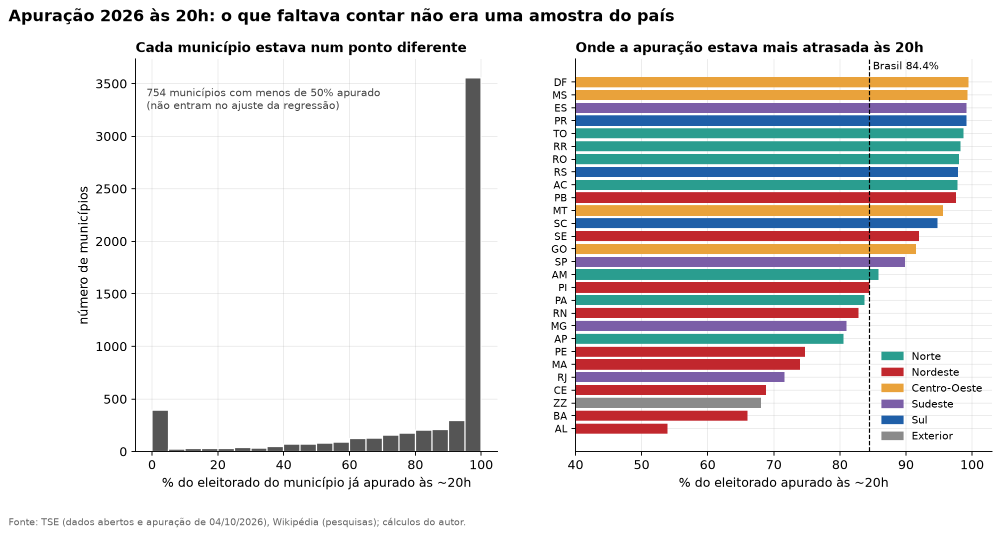

É o que o modelo recebe às 20h: cada município com a sua parcela já apurada. **Não é uma amostra justa**, porque as
cidades terminam de contar em horários diferentes e, em geral, as menores terminam primeiro. Por isso o modelo precisa
projetar o que falta, em vez de só olhar o placar parcial.

## 2. Votos de 2022

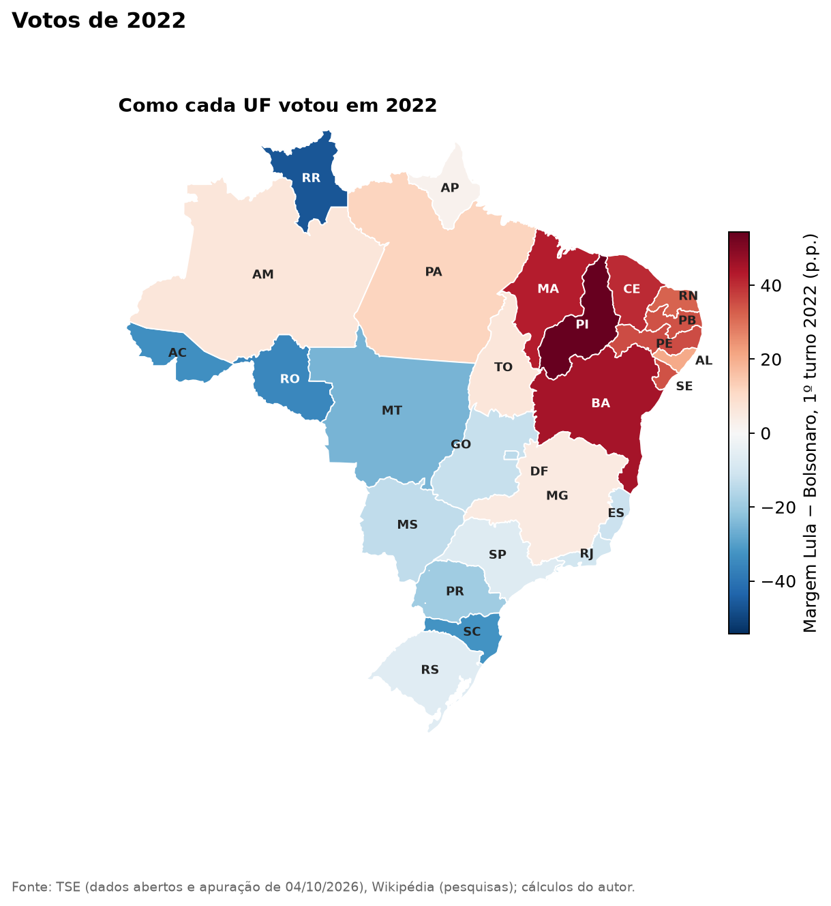
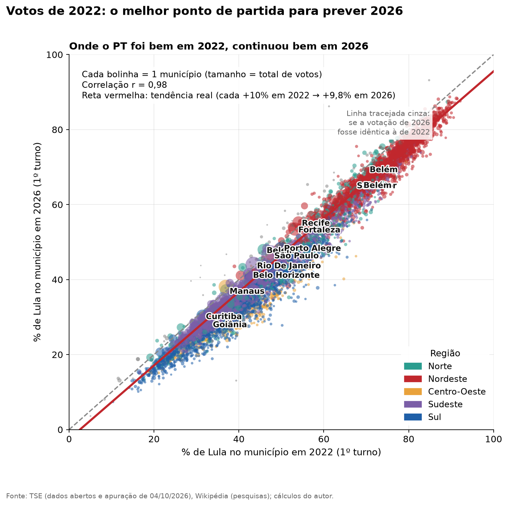

Quem votou de um jeito em 2022 tende a votar parecido em 2026: a correlação ponderada é alta (r ≈ 0,98). É o melhor
ponto de partida para estimar o que falta apurar em cada município.

## 3. Perfil do eleitorado

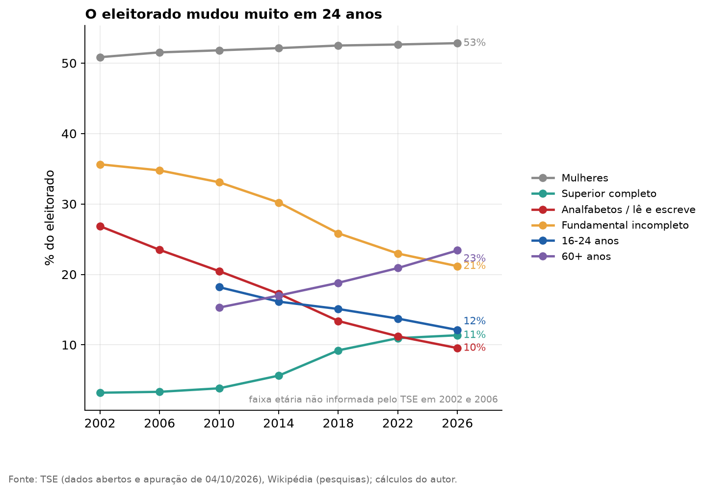
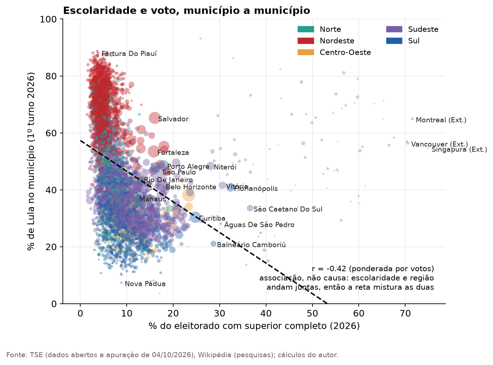

À esquerda, como o eleitorado mudou desde 2002 (mais escolaridade, mais idosos, menos analfabetos). À direita, a relação
entre escolaridade e voto em Lula em 2026. **É associação, não causa**: escolaridade e região andam juntas (o Nordeste
tem mais voto em Lula e menos gente com ensino superior), então a reta mistura as duas coisas.

> Em 2002 e 2006 o TSE não informa a faixa etária; essas séries começam em 2010.

## 4. Pesquisas de 1º turno

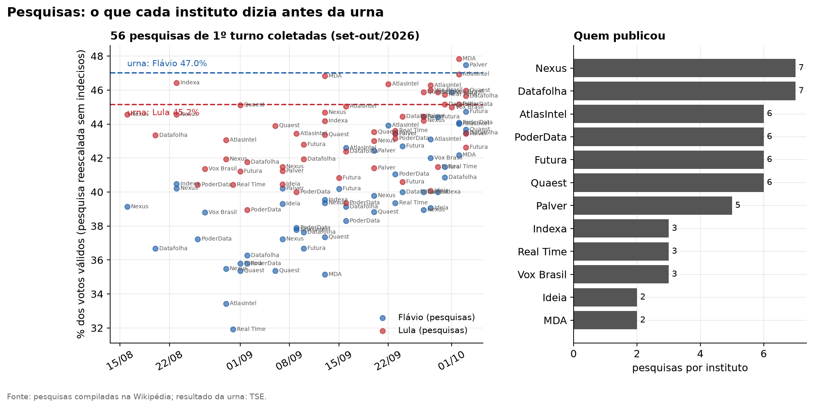

Cada ponto é uma pesquisa, reescalada para votos válidos (sem indecisos). As linhas tracejadas são o resultado da urna.
As pesquisas subestimaram Flávio, e é esse viés que o modelo corrige no 2º turno.

## 5. Todos os candidatos, 2002–2026

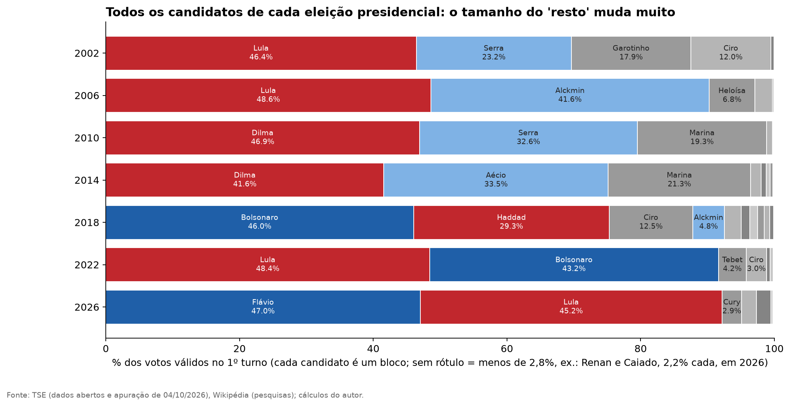

Cada barra é um 1º turno; cada bloco, um candidato. O que importa para o 2º turno é o tamanho do "resto" (os
eliminados): grande em 2002, 2014 e 2018, pequeno em 2006, 2022 e 2026.

## 6. Quanto voto sobra e quanto cada finalista ganhou

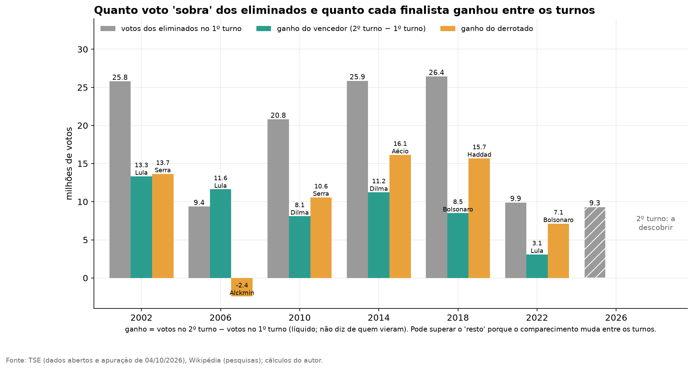

Compara os votos dos eliminados com o que cada finalista ganhou entre os turnos. O ganho é **líquido** (votos no 2º
turno menos votos no 1º) e **não diz de quem vieram** os votos: o comparecimento também muda entre os turnos.
Em 2026 o "resto" é pequeno (cerca de 7,8% dos válidos) e fragmentado.

## 7. Pesquisas de transferência

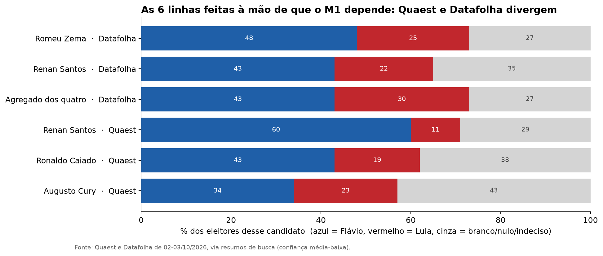

São as linhas em que os institutos perguntam em quem os eleitores dos eliminados pretendem votar.
Quaest e Datafolha **divergem** (por exemplo, sobre os eleitores de Renan). Auditamos esses números contra as publicações primárias (G1/Quaest e Datafolha) em `transferencia_pesquisas_primaria.csv`.

---

## 8. Religião municipal e voto (Censo 2022)

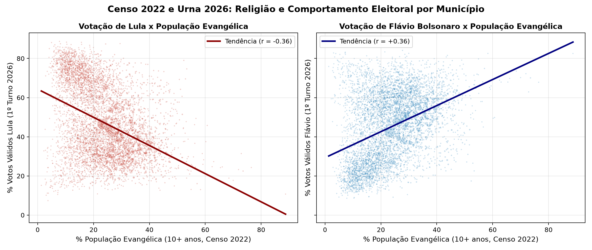

Cruzamento entre o **Censo Demográfico 2022** do IBGE (Tabela 9537 SIDRA) e o resultado da urna do 1º turno de 2026 nos 5.570 municípios:
- **Evangélicos:** correlação de **+0,402** com a votação de Flávio Bolsonaro e **-0,399** com Lula.
- **Católicos:** correlação de **+0,343** com Lula e **-0,305** com Flávio.
- Cada ponto representa um município, com tamanho proporcional ao total de votos válidos. O gradiente religioso é consistente regionalmente, reforçando clivagens sociológicas conhecidas.

## 9. Renda per capita, urbanização e raça (Censo 2022)

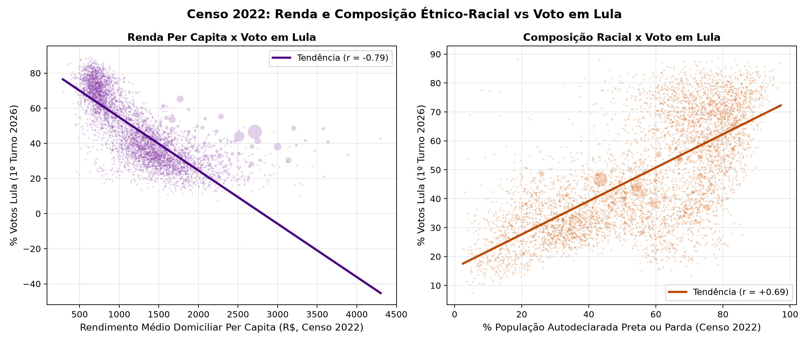

Variáveis estruturais do Censo 2022 (Tabelas 10295 e 9605 SIDRA):
- **Renda domiciliar per capita média:** correlação de **-0,525** com a votação de Lula (e **+0,442** com Flávio). Municípios de renda mais alta concentraram votação oposicionista.
- **População preta e parda:** correlação positiva expressiva de **+0,635** com Lula (e **-0,604** com Flávio), refletindo a sobreposição entre demografia racial e geográfica no país.

## 10. Alinhamento de prefeitos 2024 e voto presidencial

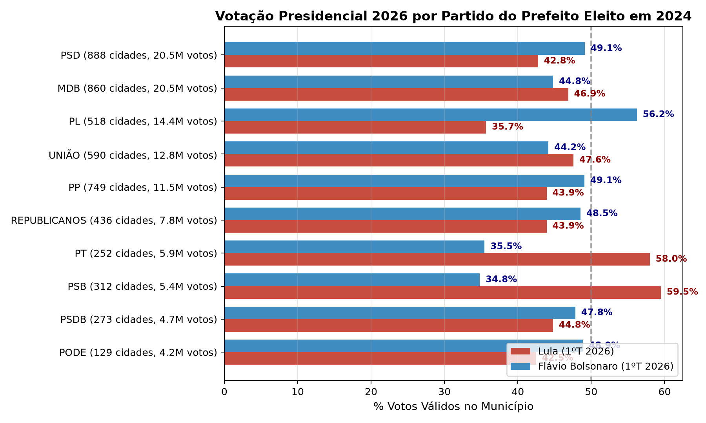

Votação de Lula e Flávio agregada de acordo com o **partido do prefeito eleito em 2024** (dados abertos do TSE, 5.552 municípios com prefeitos eleitos):
- **Bases do PL:** Nos municípios governados pelo PL (14,4 milhões de votos em 2026), Flávio venceu por 56,1% a 35,6% (saldo de +20,5 p.p.).
- **Bases do PT e PSB:** Nos municípios do PT (5,8M votos) e PSB (5,5M votos), Lula venceu com folga (57,5% e 55,2%, saldos de +25,1 e +22,1 p.p.).
- **Centrão (PSD, MDB, PP, União):** No PSD e PP, Flávio liderou por margens moderadas (+5,0 e +6,3 p.p.). No MDB e União Brasil, Lula manteve ligeira vantagem (+3,4 e +2,0 p.p.).

## 11. Mercados preditivos: trajetória diária no Polymarket

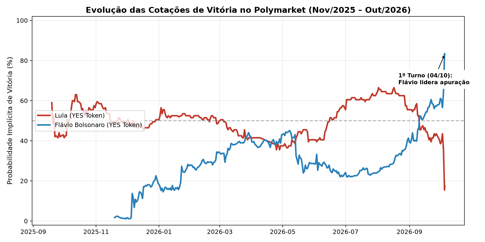

Histórico diário de preços dos contratos de vitória (tokens SIM) para Lula e Flávio no **Polymarket** (Evento 45915, via CLOB API pública, de novembro de 2025 a outubro de 2026):
- Mostra a transição de probabilidades precificadas pelo mercado financeiro e apostadores ao longo de 11 meses.
- Na noite do 1º turno (04/10/2026), com a apuração das urnas, a cotação de Flávio saltou para **83,3%** (R$ 0,833) e a de Lula recuou para **17,5%**, convergindo precisamente com a probabilidade projetada pelo modelo estatístico (**17,9%**).

## 12. Auditoria TSE: custos e financiadores das pesquisas

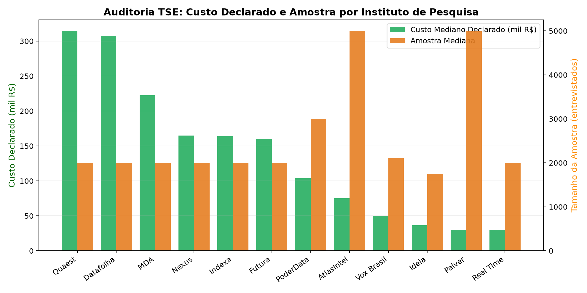

Auditoria exaustiva de todas as 112 pesquisas eleitorais registradas no TSE PesqEle (56 de 1º turno e 56 de 2º turno), cruzando dados do contratante e pagante:
- **100% de correspondência (112/112):** todas as pesquisas utilizadas possuem protocolo oficial conferido no TSE.
- **Custos declarados:** Quaest (R$ 380 mil a R$ 570 mil por rodada) e Datafolha (R$ 474 mil) apresentam os maiores orçamentos, financiados por grandes veículos (Grupo Globo e Folha da Manhã).
- **Pesquisas digitais:** AtlasIntel declara custo mediano de R$ 75 mil por rodada (amostras de 3.000 a 7.000 questionários web).

## 13. Rejeição histórica ao longo de 2026 (Datafolha primário)

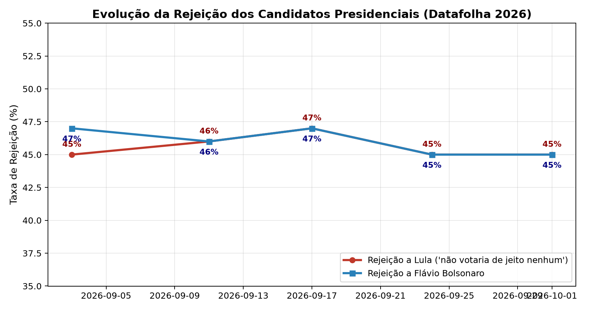

Evolução temporal da taxa de rejeição ("não votaria de jeito nenhum") medida pelo Datafolha em pesquisas presenciais primárias ao longo de 2026:
- A rejeição a Lula oscilou na faixa de 44% a 48% durante o ano, enquanto a rejeição a Flávio Bolsonaro manteve-se entre 45% e 51%.
- A estabilidade desses patamares ilustra a consolidação e simetria dos tetos eleitorais no eleitorado brasileiro às vésperas da votação decisiva.
