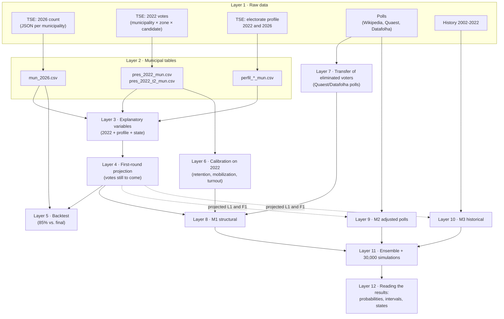
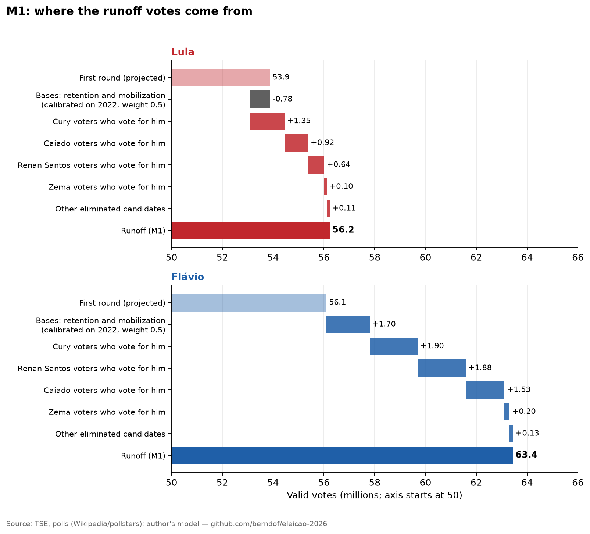

# Anatomy of the analysis: layer by layer

> [Versão em português](camadas.pt.md) · [Back to README](../README.en.md) · [Article](article.en.md) · [Which polls enter and with what weight](polls.en.md)

The [article](article.en.md) tells **what** was found. This document explains **how**, slowly: what each step is, which piece of data it consumes, what it does with it, and what the output means. The examples use **real numbers** from the repository (you can reproduce each one with the commands in each section).

> [!NOTE]
> Reading rule: every layer answers the same five questions — **what goes in · what happens · what comes out · what it means · where it can go wrong**.

## 0. The full map



### Every piece of data: where it comes from, where it enters, what it does

| # | Data | Source | Size | Enters at layer | What it does in the model |
|---|---|---|---|---|---|
| 1 | **2026 count** (sections, electorate, valid votes, votes per candidate, per municipality) | TSE (`resultados.tse.jus.br`, election 6257) | 5,757 municipalities | 2 → 4 | Says **how much has been counted** and **how the counted part voted** |
| 2 | **2022 votes by municipality** (both rounds) | TSE open data (`votacao_candidato_munzona_2022`) | 5,752 municipalities, 642 MB raw | 3, 4, 6 | Predicts the 2026 first round (who voted for whom before) **and** calibrates how the 2022 runoff emerged from the first round |
| 3 | **Electorate profile** (gender, education, age) | TSE open data (`perfil_eleitorado_2022/2026`) | 5,758 municipalities, 485 MB raw | 3, 4 | Describes each municipality's population (learns "similar municipalities vote similarly") |
| 4 | **First-round polls** | Wikipedia (cites each pollster) | 56 polls | 9 | Measures the polls' **error** against the ballot box → corrects M2 |
| 5 | **Runoff polls** (Lula vs. Flávio) | Wikipedia | 56 polls (12 enter) | 9 | Basis of M2 (recency-weighted average) |
| 6 | **Transfer polls** (runoff vote by each eliminated candidate's electorate) | Quaest and Datafolha, via search summaries | 6 rows | 7 | Says **where** the eliminated candidates' votes go in M1 |
| 7 | **History of runoffs** | TSE | 6 elections | 10 | M3 regression |
| 8 | **State boundaries** | IBGE | 27 polygons | figures only | Draw the maps |
| 9 | **Author's assumptions** | — | 5 numbers | 7, 9, 11 | Ensemble weights 50/30/20; factor 0.4±0.2 (bias persistence); 65%/30% for candidates without polls; asymmetry 0.5; national shock ±1.5 pp |

The assumptions (row 9) are always tagged `SUPOSIÇÃO` in the code and discussed in [layer 11](#layer-11--ensemble-and-simulation).

---

## Layer 1 · Raw data

**What goes in:** nothing (this is the source). **What comes out:** files exactly as published by the producer, kept in `data/raw/` (not versioned in git; see [how to download](dados.md#dados-brutos)).

### 1.1 2026 count (TSE)

The TSE portal publishes **one JSON file per municipality** (`.../dados/{uf}/{uf}{code}-c0001-e006257-u.json`). The fields we use:

| JSON field | Meaning | CSV column |
|---|---|---|
| `s.ts` / `s.st` | **total** / **tallied** polling sections | `ts`, `st` |
| `e.te` / `e.est` | **total** electorate / electorate of tallied sections | `te`, `est` |
| `v.vv` | **valid** votes (candidates; excludes blank and null) | `vv` |
| `v.tv`, `v.vb`, `v.tvn` | total, blank, null votes | `tv`, `vb`, `vn` |
| `carg[0].agr[].par[].cand[].vap` | votes per candidate (`nmu` = ballot name) | `v_LULA`, `v_FLAVIO BOLSONARO`, … |
| `hg` | file timestamp (to know the data's "age") | `hg` |

There is also a national file (`br-c0001-e006257-u.json`) used only as a **cross-check** (the sum of municipalities differs from the national total by ≈ 9 thousand votes because the files were downloaded at different moments).

A municipality's counted fraction is `f = est / te` (fraction of the **electorate** whose sections have been tallied). It is the central variable of the whole first-round projection.

> The original JSON of a complete collection (00:11 on 5 Oct, 99.997%) is archived in `tse_apuracao_20261005.tar.gz` in the [raw data release](https://github.com/berndof/eleicao-2026/releases/tag/dados-brutos-2026-10-04).

### 1.2 2022 votes (TSE open data)

`votacao_candidato_munzona_2022.zip`: one row per **candidate × electoral zone × municipality × round**. Office 1 (President) is only in the `_BR` file. We use the `QT_VOTOS_NOMINAIS` column.

### 1.3 Electorate profile (TSE open data)

`perfil_eleitorado_2022.zip` and `_2026.zip`: voter counts per **municipality × gender × age band × education**. The `_BRASIL.csv` file duplicates the per-state files and is ignored.

### 1.4 Polls and history

Wikipedia (EN), page *Opinion polling for the 2026 Brazilian presidential election*, as raw wikitext (`data/external/wikipedia_pesquisas_2026.wikitext`); Quaest/Datafolha by electorate, typed into `transferencia_pesquisas.csv` (with **medium-low** confidence, see [polls](polls.en.md)); 6 presidential elections in `historico_2turnos.csv`.

**Where it can go wrong:** Wikipedia is a compilation; transcription errors are possible. (We already found one: the "Results" row, which is the **ballot box** and not a poll, was entering as if it were a zero-error pollster. Fixed and documented in the [erratum](#erratum).)

---

## Layer 2 · Municipal tables

**What goes in:** the raw files. **What happens:** aggregation and cleaning, no modeling. **What comes out:** one row per municipality, in `data/interim/`.

| File | Rows | Contents | How it was made |
|---|---:|---|---|
| `mun_2026.csv` | 5,757 | `uf, cd, nome, ibge, ts, st, te, est, vv, tv, vb, vn, hg` + one `v_<candidate>` column | `collect/tse_apuracao.py` reads the 5,757 JSON files (24 threads, ~2 min) |
| `pres_2022_mun.csv`, `pres_2022_t2_mun.csv` | 5,752 | votes per candidate per municipality (1st and 2nd round) | sum of the municipality's **zones** (`collect/tse_historico.py`) |
| `perfil_2022_mun.csv`, `perfil_2026_mun.csv` | 5,752 / 5,758 | `tot, fem, sup, analf, fund_inc, jovem, idoso` (counts) | sum of all groups of each municipality |

Profile definitions:

| Column | Definition |
|---|---|
| `tot` | eligible voters |
| `fem` | female |
| `sup` | **completed** higher education |
| `analf` | illiterate **or** "reads and writes" |
| `fund_inc` | **incomplete** primary education |
| `jovem` | aged 16 to 24 |
| `idoso` | aged 60 or over |

**Abroad** (`zz`) is treated as one more "state": 28 units (26 states + DF + abroad).

**Where it can go wrong:** municipalities whose code changed between 2022 and 2026 (5,752 vs. 5,757) lack history; for them layer 3 uses the state average.

---

## Layer 3 · Explanatory variables

**What goes in:** `mun_2026`, `pres_2022_mun`, `perfil_2026_mun`. **What happens:** for each municipality a vector of 37 numbers is built ("what we know about it before looking at its count"). **What comes out:** the matrix `X` used by the layer-4 regression.

| Variable | Formula | Why it is there |
|---|---|---|
| `const` | 1 | intercept |
| `lula22` | Lula's 2022 votes ÷ total 2022 votes in the municipality | the best predictor of who votes for Lula: the municipality **already voted** |
| `flavio22` | **Jair Bolsonaro's** 2022 votes ÷ 2022 votes | same; Flávio's voter is largely Jair's |
| `superior`, `analf`, `fund_inc` | fraction of the 2026 electorate | education: correlates with voting, and lets us compare municipalities without history |
| `jovem`, `idoso`, `fem` | fraction of the electorate | same for age and gender |
| `log_eleit` | log of electorate size (min. 50) | large and small cities vote differently |
| 27 state *dummies* | 1 in the municipality's state | each state has its own "level" (Northeast ≠ South) |

If the municipality did not exist in 2022, `lula22` and `flavio22` get the **average of cities in the same state**. If it has no profile, a generic profile is used.

The weights the regression learns (the 04 Oct ~8pm fit, the "85% snapshot") show what each variable does:

| Variable | Coef. for **Lula** | Coef. for **Flávio** | Reading |
|---|---:|---:|---|
| `lula22` | **+0.71** | −0.04 | +10 pp for Lula in 2022 → +7.1 pp for Lula in 2026 |
| `flavio22` (Bolsonaro 2022) | −0.25 | **+0.92** | +10 pp for Bolsonaro in 2022 → +9.2 pp for Flávio |
| `fem` | +0.20 | −0.24 | more women → more Lula (other variables held fixed) |
| `idoso` | +0.19 | −0.10 | same for the elderly |
| `fund_inc` | −0.09 | +0.14 | more incomplete primary → more Flávio, *given* the rest |

> [!WARNING]
> The coefficients are **not causal** and are read "holding the others fixed"; `fem`, `idoso` and `fund_inc` are correlated with each other and with the state. What matters is **predictive ability** (validated in layer 4), not the individual interpretation of each coefficient.

---

## Layer 4 · First-round projection (the arithmetic of what is missing)

**Question:** while only part of the sections is tallied, what will the final first-round result be?

**Why isn't the partial count enough?** Because the counting order is **not random**: the municipalities that finish first are not representative of those still pending. At 8pm on 4 Oct, with 85% counted, the partial showed Flávio 48.4% vs. Lula 43.5%; the final was 47.0% vs. 45.2%.

**What goes in:** `mun_2026.csv` + layer 3. **What comes out:** `projecao_mun.csv` (per municipality: remaining votes and each candidate's expected share **of what remains**) and, aggregated, `projecao_1turno_uf.csv` / `projecao_1turno_nacional.json`.

### Full example: Caruaru (PE), with the ~8pm data

Command: `python -m eleicao2026.model.explicar --mun pe:23817` (uses the 85% *snapshot*).

| Step | Computation | Result |
|---|---|---:|
| Tallied sections | 360 of 708 | |
| Tallied electorate | `f = 122,390 / 255,270` | **47.9%** |
| Valid votes counted | | 99,809 |
| Lula / Flávio counted | | 53,621 (53.7%) / 39,694 (39.8%) |
| **4a.** Expected total valid votes | `V = 99,809 / 0.479` | **208,173** |
| Valid votes still missing | `M = V − 99,809` | **108,364** |
| 2022 vote (Lula / Bolsonaro) | | 56.0% / 38.5% |
| **4b.** Regression prediction for what is missing | `X · β` | Lula 54.6% / Flávio 39.2% |
| Observed in what has been counted | | Lula 53.7% / Flávio 39.8% |
| **4c.** Shrinkage | `λ = 99,809 / (99,809 + 3,000)` | **0.971** |
| Final share of the missing part | `pred + λ × (observed − pred)` | Lula 53.75% / Flávio 39.75% |
| **4d.** Projection | `counted + M × share` | Lula **111,865** (53.74%) / Flávio **82,773** (39.76%) |
| **Final result (TSE)** | | Lula **109,691** (53.32%) / Flávio **82,763** (40.23%) |

Here the projection and the raw partial erred by the same amount (+0.4 pp for Lula): since λ ≈ 0.97, the regression (which pointed to 54.6%, 1.3 pp above the final) barely weighed. The method's advantage shows up in small or not-yet-counted municipalities and in the aggregate (layer 5). The expected valid-vote total (208 thousand) also exceeded the final (205.7 thousand): the remaining sections had fewer valid votes per voter than those already counted.

### 4a. Expected valid votes

`V = vv / f`: if 48% of the electorate has been counted and there are 99,809 valid votes, about 208 thousand are expected in total. Municipalities with `f ≤ 2%` have no basis for this division: 2022 valid votes × electorate growth is used instead.

### 4b. The regression (the "prior")

**Weighted** least squares, weighted by valid votes (a large city weighs more), separately for Lula's share and for Flávio's, over municipalities with **≥ 50% counted** (4,963 of 5,757 at 8pm). It learns "given the history and profile, how much should a municipality give Lula and Flávio". Applied to **all** municipalities, it gives each one's prediction, including those that have barely started counting.

### 4c. Shrinkage λ (how much to trust each source)

`λ = vv / (vv + 3000)`. The share of what is missing is an **average** of the regression and what the municipality already showed, with weight λ on the observed:

| Valid votes already counted | λ | Who dominates |
|---:|---:|---|
| 0 | 0 | 100% regression (2022 + profile) |
| 1,000 | 0.25 | mostly the regression |
| 3,000 | 0.50 | half and half |
| 10,000 | 0.77 | mostly the observed |
| 100,000 | 0.97 | almost only the observed |

The value 3,000 (`K_SHRINK`) is the author's choice; it works as "the 3,000 votes the prior is worth". In Caruaru (λ = 0.97) the observed dominates; the regression matters in small municipalities or those that have barely started.

### 4d. Aggregation

Counted votes + `M × share` for each candidate, summed by municipality → state → Brazil. If `share_L + share_F > 1` (rare), it is normalized. What is left over (`V − L − F`) is split among the eliminated candidates **in the proportion each had in that same municipality**; this feeds layer 7.

### 4e. Uncertainty (Monte Carlo, 4,000 draws)

The projection is one number; the interval comes from drawing errors at three levels:

| Error source | How it is calibrated | Value |
|---|---|---|
| **Municipality** | 5-fold cross-validation: each municipality's margin error follows `s² = a + b / votes`; small municipalities err more | CV RMSE: 1.9 pp (Lula and Flávio) per municipality |
| **State** (systematic error of a whole state) | mean per-state deviation of the CV residuals | **1.0 pp** (it is the **floor** imposed in the code) |
| **National** | **assumption** | 1.0 pp |

**What it means:** "if I was wrong in Bahia, I was wrong in all Bahia's municipalities together" (hence one shock per state and one national, not only independent noise per municipality). **Where it can go wrong:** the backtest (layer 5) showed these intervals were too short.

Command: `python -m eleicao2026.model.primeiro_turno` (≈ 20 s).

---

## Layer 5 · Backtest

**Question:** does the method work? The honest way to answer is to compare with what actually happened.

**What goes in:** the ~8pm *snapshot* (`data/snapshots/20261004_2005_apuracao85/`, 84.4% of the electorate counted) and the final count. **What happens:** three numbers per municipality, state and Brazil are compared:

| Name | What it is |
|---|---|
| **Partial** | the share among the votes **already counted**, without projecting anything (what TV showed) |
| **Projection** | the model output on the snapshot |
| **Final** | the count at 99.99% |

**What comes out** (`data/processed/backtest_1turno*.{csv,json}`):

| | Lula | Flávio |
|---|---:|---:|
| Partial (85%) | 43.52% | 48.44% |
| Projection | 44.95% | 47.19% |
| **Final** | **45.16%** | **47.03%** |
| Partial error | −1.64 pp | +1.41 pp |
| **Projection error** | **−0.21 pp** | **+0.16 pp** |

By state: mean absolute margin error of **0.60 pp (projection) vs. 1.13 (partial)**; correct winner in 28/28. Worst state: Bahia (−2.2 pp).

**What it means:** the method "learns" to correct the distortion of the counting order; this is the basis of the (limited) confidence in the rest. **Where it can go wrong:** the 90% interval for the national margin (−2.53 to −1.95 pp) did not contain the real value (−1.87): **too short**. It is a warning we carry into the runoff.

**Reproducibility:** `python -m eleicao2026.model.primeiro_turno --cur data/snapshots/20261004_2005_apuracao85/mun_2026.csv --tag snap85` regenerates exactly the projection published at the time (fixed seed).

---

## Layer 6 · Calibration on 2022 (what the 2022 runoff teaches us)

**Question:** when a voter picks A in the first round, do they pick A in the second? And the voters of eliminated candidates: do they turn out, and for whom do they vote?

**What goes in:** `pres_2022_mun.csv` and `pres_2022_t2_mun.csv` (5,708 municipalities with both rounds). **What happens:** for each municipality, the first-round electorate is split into three groups by share of valid votes:

```
x_L = Lula votes / valid               (group L)
x_B = Bolsonaro votes / valid          (group B)
x_O = 1 − x_L − x_B                    (group O: all other candidates)
```

and two **no-intercept** vote-weighted regressions are fitted:

```
Lula votes in the runoff      / first-round valid = a_LL·x_L + a_LB·x_B + a_LO·x_O
Bolsonaro votes in the runoff / first-round valid = a_BL·x_L + a_BB·x_B + a_BO·x_O
```

Each coefficient is a "conversion rate": the fraction of each group that ends up with each candidate in the runoff. Real values:

| Coefficient | Value | Reading |
|---|---:|---|
| `a_LL` (Lula → Lula) | **1.002** | Lula's base **held entirely** |
| `a_BB` (Bolsonaro → Bolsonaro) | **1.066** | Bolsonaro's base **grew 6.6%** (mobilization of people who did not vote in the first round) |
| `a_LB` (Bolsonaro → Lula) | −0.036 | small net adjustment, not "negative votes" (see the warning) |
| `a_BL` (Lula → Bolsonaro) | −0.013 | same |
| `a_LO + a_BO` (eliminated who vote for one of the two) | **0.942** | **94.2% turn out** (ρ) |
| `a_BO / (a_LO + a_BO)` | **0.484** | **48.4%** of the eliminated went to Bolsonaro in 2022 |

> [!WARNING]
> Negative coefficients such as `a_LB` are **not** "votes leaving": in a linear regression with groups summing to 100%, a small negative sign is a **net adjustment** that only makes sense summed with the other terms.

**Variants tested:** a single national regression and one **per macro-region** (North, Northeast, Center-West, Southeast, South, Abroad). The per-municipality cross-validation error was **0.71 pp (national)**, **0.66 pp (regional)** and **1.88 pp (a naive model that just repeats Lula's share)**. The regional one wins and is used.

**Regional tilt (δ).** Separately, we measure whether the eliminated candidates' voters lean more to one side in each region (difference in the *logit* of the fraction going to the right-wing candidate, relative to the national figure):

| Region | δ (logit) | Direction |
|---|---:|---|
| Northeast | −0.24 | eliminated lean to Lula |
| Center-West | −0.31 | same (hypothesis, untested: Tebet, from MS, was the top eliminated candidate in 2022) |
| Abroad | −0.19 | same |
| North | −0.05 | almost neutral |
| Southeast | +0.05 | almost neutral |
| South | +0.12 | lean right |

**What it means:** 2022 gives the "transmission behavior" **of the type of voter** (retain, mobilize, turn out) and its regional differences. **Where it can go wrong:** it assumes 2026 resembles 2022 in retention and turnout (hence the `ASYM_BASE = 0.5` parameter in layer 8, which mixes "as in 2022" and "bases keep 100%") and that there is no new candidate with a different appeal.

The eliminated candidates enter **as a block** (group O) because splitting them by aggregate regression gives absurd estimates (for example −160%); the per-candidate split is decided by layer 7.

---

## Layer 7 · Where the eliminated candidates' voters go (transfer polls)

**Question:** for each eliminated candidate, what fraction of the vote goes to Flávio and what fraction to Lula?

**What goes in:** `transferencia_pesquisas.csv` (Quaest and Datafolha, 2–3 Oct) and each eliminated candidate's projected votes by state (layer 4). **What happens:** for each candidate:

1. Each pollster gives "would vote for Flávio / would vote for Lula / blank-null-undecided" among that candidate's voters. Blanks are discarded: `s = Flávio / (Flávio + Lula)`.
2. Simple mean of `s` across the available pollsters. When Datafolha has no individual number (Caiado, Cury), its **aggregate** (43/30) is used.
3. Candidates **without a poll** get an explicit **assumption**: minor right 65% to Flávio; minor left 30%.
4. Separately, `declares a vote` = the fraction that states a vote for one of the two (57% to 73%). In the simulations, the eliminated voters' turnout is drawn between this value and the 2022 one (94%).

Result (`resumo_2turno.json → transferencia`):

| Voters of | Round-1 valid votes | Quaest (F/L) | Datafolha (F/L) | **s (→ Flávio)** | Source |
|---|---:|---:|---:|---:|---|
| Cury | 3.45 M | 34/23 | aggregate 43/30 | **59.3%** | poll |
| Renan Santos | 2.68 M | 60/11 | 43/22 | **75.3%** | poll |
| Caiado | 2.61 M | 43/19 | aggregate 43/30 | **64.1%** | poll |
| Zema | 0.33 M | — | 48/25 | **65.8%** | poll (Datafolha only) |
| Samara, Clariana, Grassi | 0.18 M (3) | — | — | **65%** | **assumption** |
| Hertz, Edmilson, Rui | 0.08 M (3) | — | — | **30%** | **assumption** |

Vote-weighted mean: **65.3% to Flávio** (vs. 48.4% in 2022).

**Two important things to read in the table:**

* **Only 4 candidates have a poll, and three of them hold 8.7 M of the 9.3 M eliminated votes.** Changing the assumptions about the other six candidates by 10 pp moves the result by less than 0.03 pp ([polls](polls.en.md#5-transfer-polls--m1)).
* Quaest and Datafolha disagree strongly on Renan (60/11 vs. 43/22). Hence the simple mean; and hence a shock common to the transfer polls (`desl_transf`, ±0.3 in logit) is drawn in the simulation.

**Regional tilt in practice:** within each state, `s_state = expit( logit(s) + δ_region )`. In Minas Gerais (Southeast, δ = +0.05), Cury's 59.3% becomes 60.4%.

**Where it can go wrong:** samples of dozens of respondents per candidate; the numbers come from search summaries, not the original articles; and the polls come from the same pollsters that erred in Lula's favor in the first round (M1 may underestimate Flávio).

---

## Layer 8 · M1: the structural model, step by step

**Question:** putting layers 4, 6 and 7 together, how many votes will each candidate have in the runoff?

**What goes in:** projected first round by state (layer 4), coefficients `a` and δ per region (layer 6), `s` per eliminated candidate (layer 7), `ρ = 0.942`. **What happens**, for each state, in four terms:

```
Lula votes in the runoff =  L1·(w·a_LL + (1−w))        ← own base
                          + F1·(w·a_LB)                ← net adjustment from the rival's base
                          + Σ_c  n_c · ρ · (1 − s_c,state)  ← eliminated who vote for Lula

Flávio votes in the runoff = F1·(w·a_BB + (1−w))
                           + L1·(w·a_BL)
                           + Σ_c  n_c · ρ · s_c,state
```

where `w = 0.5` (`ASYM_BASE`) mixes two worlds: `w = 0` → "the bases hold 100% and nobody is mobilized"; `w = 1` → "the 2022 mobilization repeats in full". 0.5 is an **assumption**, and `fig14` shows both extremes.

### Example: Minas Gerais (Southeast)

Command: `python -m eleicao2026.model.explicar --uf mg`.

| Term | Computation | Lula | Flávio |
|---|---|---:|---:|
| Projected first round | | 5.19 M | 5.78 M |
| Own base | `L1·(0.5·1.022+0.5)` ; `F1·(0.5·1.054+0.5)` | 5.25 M | 5.93 M |
| Net adjustment from the rival's base | `F1·0.5·(−0.025)` ; `L1·0.5·0.022` | −0.07 M | +0.06 M |
| Eliminated: Cury (0.41 M) | `0.41·0.942·(s=60.4%)` | +0.15 M | +0.23 M |
| Eliminated: Renan (0.25 M) | s = 76.2% | +0.06 M | +0.18 M |
| Eliminated: Caiado (0.23 M) | s = 65.2% | +0.08 M | +0.14 M |
| Eliminated: Zema + others (0.12 M) | | +0.04 M | +0.07 M |
| **Runoff (M1)** | | **5.50 M** | **6.62 M** |
| **Lula % of valid** | | **45.4%** | |

This is done for the 28 units and summed.

### National



| | Lula | Flávio |
|---|---:|---:|
| First round (projected) | 53.9 M | 56.1 M |
| Bases (retention and mobilization) | −0.8 M | +1.7 M |
| Eliminated candidates' voters | +3.1 M | +5.6 M |
| **Runoff (M1)** | **56.2 M** | **63.4 M** |
| **Lula %** | **46.99%** | |

**What it means:** even with Lula **retaining his entire base**, Flávio ends up ~7 million votes ahead. Two reasons, in the bars above: (i) the 2022 mobilization favors Bolsonarism (+1.7 M vs. −0.8 M) and (ii) of the 9.3 M eliminated votes, the polls put ~65% with Flávio. Everything else follows.

**Where it can go wrong:** `w`, `ρ` and `s` are **uncertain parameters**, treated as such in the simulation (layer 11). Without randomness, M1 gives Lula 46.99% (deterministic scenario); the simulated mean is 47.19% because in the simulations the eliminated voters' turnout is drawn between what they declare in the polls (57–73%) and the 2022 figure (94%), which on average reduces the weight of the eliminated voters, who lean to Flávio.

---

## Layer 9 · M2: the polls, corrected by the first-round error

**Question:** what do the polls say for the runoff, discounting the fact that the polls **erred** in the first round?

**What goes in:** runoff polls + first-round polls + projected first-round result (`L1`, `F1`). **What happens**, in four steps:

### 9a. Average of the runoff polls

* Only polls ending on or after **20 Sep** (`CORTE_2T`) enter; older polls describe a different scenario.
* **The latest** of each pollster (the others are from the same pollster: don't count twice). 12 of 56 enter.
* Each poll becomes `Lula / (Lula + Flávio)` (discarding blanks and undecided).
* Recency weight: `w = 0.5^(days of lag / 7)`. Polls from the 3rd weigh ~9.9% each; those from 25–27 Sep, ~5.5%.

Result: **Lula 49.67%** of the two-candidate vote. ([which enter, with what weight](polls.en.md#2-runoff-polls--m2))

### 9b. The first-round polls' error

* Only polls ending on or after **26 Sep**, the latest of each pollster (12 pollsters).
* `error = (Lula_poll − Flávio_poll) − (L1 − F1)`, using the **normalized** candidates (no blanks) and the projected first round as "truth".
* Mean: **+3.83 pp** in Lula's favor (spread across pollsters: 3.14). Ten of 12 pollsters erred in Lula's favor; only Palver (−2.2) and Futura (−0.2) in Flávio's.

### 9c. How much of this error holds in the runoff?

The first-round error does not necessarily repeat. We assume **40% ± 20%** of it persists (`CARRY_CENTRAL`, `CARRY_DP`); an **assumption**, supported by the 2022 runoff error being a quarter to a half of the first-round error (search summaries; not re-verified).

### 9d. The arithmetic

```
bias (two-candidate basis) = 0.0383 / (L1 + F1) = 0.0383 / 0.9219 = 0.0415
M2 center = average − persistence × bias / 2
          = 0.4967 − 0.4 × 0.0415 / 2
          = 0.4884      →  Lula 48.84%
```

(the division by 2 is because the error in the Lula−Flávio **margin** splits equally between the two candidates.)

**What comes out:** a distribution around 48.84% with a total standard deviation of ≈ 2.4 pp, adding two fixed terms (1.8 and 1.5 pp, author's assumptions), the spread across pollsters and the uncertainty around the bias and the 0.4 factor. The **geography** is M1's, shifted by a constant *logit* so that the national total matches the drawn target.

**What it means:** "if the runoff polls err as they did in the first round, adjusted by what historically persists, Lula has 48.8%".

**Where it can go wrong:** (1) the 0.4 factor is an assumption, and is the largest lever among all poll data ([figure 18](../figures/en/18_cenarios_de_insumo.png)); (2) pollsters are not independent; (3) the 2026 runoff may have different errors from 2022.

---

## Layer 10 · M3: the history

**Question:** looking only at how runoffs usually behave, what do we expect?

**What goes in:** `historico_2turnos.csv` (6 elections) and the projected first-round scoreboard. **What happens:**

```
x = leader's % among the two in the first round (leader/(leader+2nd))   — "relative strength"
y = leader's % in the runoff
no-intercept regression:   (y − 0.5) = β · (x − 0.5)
```

| Year | Leader × 2nd | Leader % R1 | 2nd % R1 | Leader among the two (x) | Leader % R2 (y) |
|---|---|---:|---:|---:|---:|
| 2002 | Lula × Serra | 46.44 | 23.20 | 66.7% | 61.27 |
| 2006 | Lula × Alckmin | 48.61 | 41.64 | 53.9% | 60.83 |
| 2010 | Dilma × Serra | 46.91 | 32.61 | 59.0% | 56.05 |
| 2014 | Dilma × Aécio | 41.59 | 33.55 | 55.3% | 51.64 |
| 2018 | Bolsonaro × Haddad | 46.03 | 29.28 | 61.1% | 55.13 |
| 2022 | Lula × Bolsonaro | 48.43 | 43.20 | 52.9% | 50.90 |

Fit: **β = 0.66**; standard error ≈ **4.0 pp** (2006 is atypical). In 2026, Flávio has 51.0% among the two (x = 0.510) → `y = 0.5 + 0.66 × 0.010 = 0.507` → **Lula 49.33%**.

**What it means:** "the first-round leader tends to win the runoff, but the relative advantage shrinks by about a third (β ≈ 0.66)". Being a 6-point regression, the uncertainty is large (*t* distribution with 4 d.f.).

**Where it can go wrong:** 6 elections; it ignores **who** the eliminated candidates are (in 2026 they lean mostly right). That is why it has a weight of only 20%.

---

## Layer 11 · Ensemble and simulation

**Question:** how do we turn three different answers into one honest probability?

**What goes in:** M1, M2, M3. **What happens:** each method becomes **10,000 simulations** of the national result (and per state); the 30,000 are mixed with **weights 50/30/20**.

### Where each method's randomness comes from

| Method | What is drawn in each simulation |
|---|---|
| **M1** | a *bootstrap* sample of the 2022 regression (200 versions); the asymmetry weight `w ~ U(0,1)`; the eliminated voters' turnout (between "what they declare in the poll" and "the 2022 one", + noise); a **common** transfer-poll bias (`N(0; 0.3)` in logit) and one per candidate (`N(0; 0.3)`); a national shock on the margin (`N(0; 1.5 pp)`); a per-state shock and per-municipality noise (calibrated on 2022) |
| **M2** | the persistence factor `k ~ N(0.4; 0.2)` (bounded to [0,1]); the first-round bias `~ N(mean; standard error)`; noise in the poll average |
| **M3** | the historical regression residual, from a *t* distribution with 4 d.f. and standard deviation ≈ 4 pp |

For M2 and M3, the per-state geography is M1's **shifted in logit** until the national total matches the drawn target (+ per-state noise).

### The weights (author's assumption)

| Component | Weight | Why (author's rationale) |
|---|---:|---|
| M1 structural | 50% | uses the most data (5,700 municipalities × 2 rounds), the only one with its own geography |
| M2 adjusted polls | 30% | reflects the most recent information, but polls erred in the first round |
| M3 historical | 20% | only 6 points; ignores the eliminated candidates' profile |

**The weights were not estimated**; [figure 10](../figures/en/10_sensibilidade_pesos.png) shows the result with alternative weights (from 10.7% to 24.4%).

### What comes out

* `sims_2turno.csv` (30,000 rows): for each simulation, the component, the drawn parameters, Lula %, votes, margin, winner and weight.
* `sims_2turno_uf.csv`: Lula % per state in each simulation.
* `tabela_uf_2turno.csv`, `resumo_2turno.json`: everything the charts use.

Command: `python -m eleicao2026.model.ensemble` (≈ 1 min).

---

## Layer 12 · How to read the results

### What each number means

| Number | How it is computed | What it is **not** |
|---|---|---|
| **P(Lula wins) = 17.9%** | weighted fraction of the 30,000 simulations in which Lula has more votes | not "a poll's chance" nor a claim that 18 out of 100 elections would be Lula's: it is the **model's confidence**, conditional on its assumptions |
| **Lula 48.12% (mean), 47.73% (median)** | weighted mean and median of `lula_pct` | |
| **90% CI: 45.1% – 52.6%** | 5% and 95% quantiles of the simulations | probably **too narrow** (backtest) |
| **Median margin: −5.4 M votes** | median of the Lula − Flávio difference | |
| **P per state** (e.g., Pará 85%, MG 10%) | same computation, state by state | they do not sum to 100%; they are separate probabilities |

### Why M1, M2 and M3 diverge so much (0.3%, 31.7%, 41.1%)

* **M1** looks inside the electorate and sees a hard computation for Lula: most of the eliminated candidates' votes lean to Flávio (65%).
* **M2** looks at the polls, which show a technical tie (Lula 49.7%), discounted by the first-round bias.
* **M3** sees only history (the first-round leader wins with a smaller margin) and is the widest.

The divergence is **information**: it means the result depends on which of these views one trusts, which is why the ensemble is not "the truth" but a transparent synthesis.

### What to watch until 25 Oct

Runoff polls taken **after** the first round do not yet exist in the data. As a reading (not a rule): if they confirm a technical tie, M1 comes under suspicion; if they show Flávio clearly ahead, M1 gains credibility. `make collect model` updates everything.

---

## Erratum

> [!IMPORTANT]
> **Correction on 5 Oct 2026.** The first version of the forecast (tag [`previsao-2t-2026-10-04`](https://github.com/berndof/eleicao-2026/tree/previsao-2t-2026-10-04)) treated the Wikipedia **"Results"** row (the **ballot-box result**) as if it were a polling firm, with an error of ~0. That diluted the mean bias of first-round polls (from +3.83 to +3.53 pp; 13 "pollsters" instead of 12). Fixed: the ensemble's Lula win probability went from **18.2% to 17.9%** and the mean from 48.14% to 48.12%; M1 and M3 **did not change**. The corrected version is at tag [`previsao-2t-2026-10-04-v2`](https://github.com/berndof/eleicao-2026/tree/previsao-2t-2026-10-04-v2); the old one remains published so that the correction is auditable.

## Glossary

| Term | Meaning |
|---|---|
| **Valid votes** | votes for candidates (excludes blank and null). All percentages in the project are over valid votes, as the TSE does |
| **Counted / `f`** | fraction of the **electorate** whose sections have been tallied (`est/te`) |
| **Partial** | percentage **among the votes already counted** |
| **Eliminated** | the 10 candidates who did not reach the runoff |
| **Retention** | fraction of a candidate's first-round base that votes for him again in the runoff |
| **Mobilization** | new votes in the runoff from people who did not vote (or voted blank/null) in the first round |
| **Turnout (ρ)** | fraction of eliminated candidates' voters who vote for one of the two in the runoff |
| **Split (s)** | fraction of an eliminated candidate's valid vote that goes to Flávio |
| **Logit** | `ln(p/(1−p))`: a scale in which adding a number shifts a proportion without leaving 0–1 |
| **Shrinkage (λ)** | blend of two estimates, with weight λ on the observed one; λ grows with data volume |
| **Monte Carlo** | repeating the computation thousands of times drawing the uncertain parameters |
| **90% CI** | interval containing 90% of the simulations (between the 5% and 95% quantiles) |
| **Ensemble** | weighted mixture of several methods |
| **Snapshot** | frozen copy of data and outputs at a moment (e.g., 8pm on 4 Oct) |
| **Backtest** | testing the method on the past, against what happened |
| **Leave-one-out** | drop one datum, redo the computation, measure the difference |

## How to redo each layer

| Layer | Command | Time |
|---|---|---|
| 1–2 (data) | `make data` (history and profile; once) · `make collect` (count and polls) | 5 min · 2 min |
| 3–4 (first-round projection) | `python -m eleicao2026.model.primeiro_turno` | ~20 s |
| 5 (backtest) | `make backtest` | ~5 s |
| 6–11 (M1, M2, M3, ensemble) | `python -m eleicao2026.model.ensemble` | ~1 min |
| numerical examples on this page | `python -m eleicao2026.model.explicar` | ~10 s |
| influence of each poll | `python -m eleicao2026.model.influencia && python -m eleicao2026.report_influencia` | ~10 s |
| figures | `make figures` | ~30 s |
