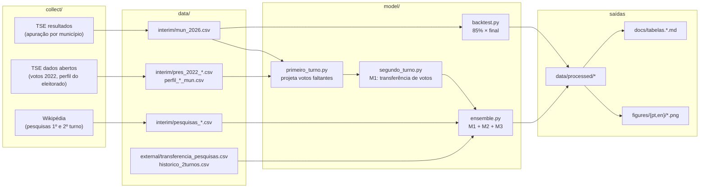

# Metodologia

Este documento descreve o **pipeline** e os **modelos** em detalhe técnico. A narrativa e a discussão dos resultados estão no [artigo](artigo.pt.md).

## 1. Pipeline

Comandos: veja o `Makefile` (`make data` uma vez; depois `make all`).

## 2. Modelo de 1º turno (`model/primeiro_turno.py`)

Objetivo: estimar o resultado **final** do 1º turno quando só parte das seções está apurada.

1. **Votos válidos esperados por município** = votos válidos apurados ÷ fração do eleitorado já apurado. Municípios com <2% apurado usam os válidos de 2022 × crescimento do eleitorado.
2. **Share dos votos que faltam** (Lula, Flávio, outros) = regressão ponderada por votos válidos, com *share* de Lula e de Bolsonaro em 2022, perfil do eleitorado (escolaridade, idade, gênero, tamanho) e efeito de UF. A previsão é **combinada com o que já foi observado no próprio município** por um fator de encolhimento `λ = vv / (vv + 3000)`: municípios com muita apuração confiam mais no observado.
3. **Incerteza** por Monte Carlo (4.000 simulações), com ruído de município calibrado por validação cruzada (5 folds) e choques por UF e nacional.

Por que não só extrapolar o parcial? Porque a ordem de apuração não é aleatória: os municípios que faltam não são representativos dos que já foram contados. O modelo corrige isso usando o perfil e a votação de 2022 dos municípios que faltam.

## 3. Modelo de 2º turno — três métodos e um ensemble

### M1 — Estrutural (`model/segundo_turno.py`)

1. **Calibração em 2022**: regressão (por município e macrorregião) dos votos de Lula e de Bolsonaro no 2º turno em função da composição do 1º turno (Lula / Bolsonaro / outros). Mede **retenção** das bases, **mobilização** assimétrica e **comparecimento** dos eleitores dos eliminados.
2. **Destino dos eliminados em 2026**: fração do voto válido de cada candidato eliminado que vai a Flávio, a partir das pesquisas Quaest e Datafolha por eleitorado (média das duas); candidatos sem pesquisa recebem suposições explícitas (direita menor 65%, esquerda minoritária 30%).
3. **Inclinação regional** dos eliminados (medida em 2022): Nordeste inclina a Lula, Sul a Flávio, etc.
4. `runoff()` converte os votos do 1º turno projetado, por UF, em votos de 2º turno.
5. **Simulação** (10.000): bootstrap da regressão, parâmetros sorteados (mobilização, comparecimento, inclinação comum das pesquisas de transferência), choque nacional e por UF, ruído de município.

### M2 — Pesquisas corrigidas pelo erro do 1º turno (`model/ensemble.py`)

1. Média das pesquisas de 2º turno (última de cada instituto), ponderada por recência (meia-vida de 7 dias).
2. **Erro das pesquisas de 1º turno**, medido contra a urna: margem Lula − Flávio da última pesquisa de cada instituto menos a margem real.
3. Esse viés **persiste só parcialmente** no 2º turno: fator `0,4 ± 0,2` — **suposição do autor**, apoiada no que ocorreu em 2022 (erro do 2º turno foi ¼ a ½ do erro do 1º), não estimada.

### M3 — Histórico (`model/ensemble.py`)

Regressão com 6 eleições (2002–2022): `share do líder no 2T − 50 = β (share do líder entre os dois no 1T − 50)`, erro-padrão ≈ 4 p.p. (inflado por 2006). Ignora que os eliminados de 2026 são majoritariamente de direita — por isso o peso é pequeno.

### Ensemble

Mistura ponderada das três distribuições: **M1 50%, M2 30%, M3 20%**. Os pesos são **julgamento do autor**; a seção de sensibilidade mostra o que acontece com outros pesos. Para M2 e M3 a geografia (por UF) é a do M1 deslocada em logit até o total nacional sorteado.

## 4. Backtest (`model/backtest.py`)

O modelo de 1º turno foi rodado às ~20h de 04/10/2026, com ~85% do eleitorado apurado. O **snapshot** desses dados está em `data/snapshots/`. O backtest compara, por município, UF e Brasil:

* **parcial** — share de Lula/Flávio entre os votos já apurados, sem projetar;
* **projeção** — saída do modelo sobre o snapshot;
* **final** — apuração atual (≈ 99,99%).

Reprodutibilidade: rodar `primeiro_turno --cur data/snapshots/.../mun_2026.csv` reproduz bit a bit a projeção publicada na época (semente fixa).

## 5. O que o modelo **não** faz

* Não modela fatos novos até 25/10 (debates, escândalos, apoios formais) além de um choque nacional genérico (±1,5 p.p.).
* Não corrige o possível viés das pesquisas de transferência no M1.
* Não estima os pesos do ensemble nem o fator 0,4 do M2 — são suposições declaradas.
* O 1º turno era ~100% apurado na coleta final; a pequena diferença (≈ 9 mil votos) entre o total nacional do TSE e a soma dos municípios vem do momento em que cada arquivo foi baixado.
