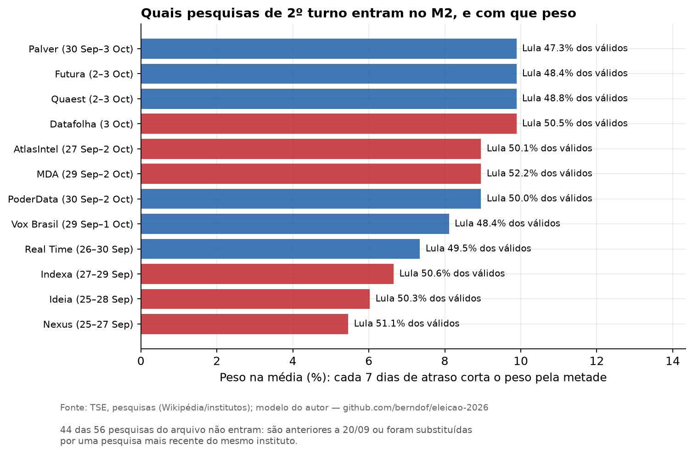
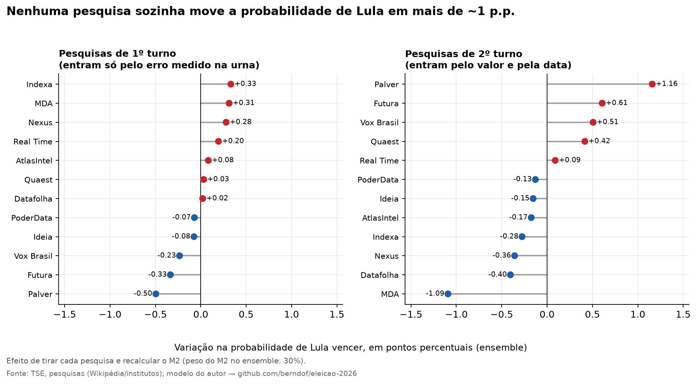
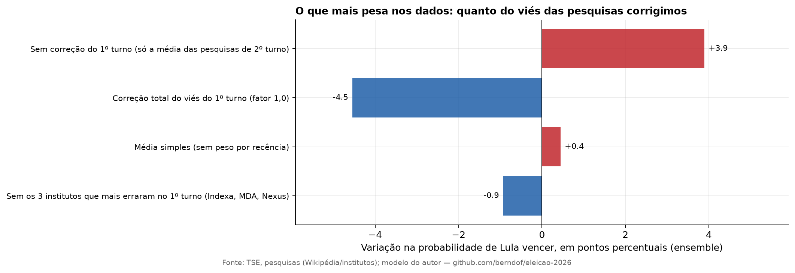

# Quais pesquisas entram, onde entram e quanto pesam

> Arquivo **gerado** por `python -m eleicao2026.report_influencia` a partir de `data/processed/influencia*.csv`. A explicação conceitual de cada camada está em [camadas.pt.md](camadas.pt.md).

## 1. Mapa: cada tipo de dado alimenta exatamente um componente

| Dado | Alimenta | Como entra | Onde está |
|---|---|---|---|
| Pesquisas de 2º turno (Lula × Flávio) | M2 | última de cada instituto desde 20/09; peso `0,5^(dias/7)` | `data/interim/pesquisas_2turno.csv` |
| Pesquisas de 1º turno | M2 | erro contra a urna (último de cada instituto desde 26/09) → viés médio → correção × 0,4 | `data/interim/pesquisas_1turno.csv` |
| Pesquisas de transferência (Quaest, Datafolha) | M1 | fração do voto de cada eliminado que vai a Flávio; % que declara voto | `data/external/transferencia_pesquisas.csv` |
| Resultado do 2º turno de 2022 por município | M1 | calibra retenção, mobilização, comparecimento e inclinação regional | `data/interim/pres_2022*_mun.csv` |
| 2º turno de 2002–2022 | M3 | regressão `2T = 50 + β·(1T − 50)` | `data/external/historico_2turnos.csv` |
| Pesquisas anteriores ao corte ou superadas | nenhum | só aparecem no gráfico 06 | (mesmos arquivos) |

Nenhuma pesquisa de 2º turno toca o M1, e nenhuma pesquisa de transferência toca o M2: os três métodos usam **dados disjuntos**. É por isso que concordam ou discordam de forma informativa.

## 2. Pesquisas de 2º turno → M2

Das 56 pesquisas do arquivo, **12 entram**. Média ponderada: **Lula 49,7%** dos válidos entre os dois. Os efeitos abaixo são de **tirar aquela pesquisa** e refazer o M2 (forma fechada, validada contra as simulações: 48,84% × 48,86% de média; P = 31,6% × 31,7%).

| Instituto | Período | Lula | Flávio | Lula/(L+F) | Peso na média (%) | Δ M2 se removida (pp) | Δ P(Lula) ensemble (pp) |
|---|---|--:|--:|--:|--:|--:|--:|
| Datafolha | 3 Oct | 47,0 | 46,0 | 50,5 | 9,9 | -0,10 | -0,40 |
| Quaest | 2–3 Oct | 42,0 | 44,0 | 48,8 | 9,9 | +0,09 | +0,42 |
| Futura | 2–3 Oct | 45,1 | 48,0 | 48,4 | 9,9 | +0,13 | +0,61 |
| Palver | 30 Sep–3 Oct | 44,0 | 49,0 | 47,3 | 9,9 | +0,26 | +1,16 |
| PoderData | 30 Sep–2 Oct | 46,0 | 46,0 | 50,0 | 9,0 | -0,03 | -0,13 |
| MDA | 29 Sep–2 Oct | 47,0 | 43,0 | 52,2 | 9,0 | -0,25 | -1,09 |
| AtlasIntel | 27 Sep–2 Oct | 47,6 | 47,4 | 50,1 | 9,0 | -0,04 | -0,17 |
| Vox Brasil | 29 Sep–1 Oct | 45,2 | 48,2 | 48,4 | 8,1 | +0,11 | +0,51 |
| Real Time | 26–30 Sep | 45,0 | 46,0 | 49,5 | 7,3 | +0,02 | +0,09 |
| Indexa | 27–29 Sep | 43,0 | 42,0 | 50,6 | 6,7 | -0,07 | -0,28 |
| Ideia | 25–28 Sep | 48,5 | 48,0 | 50,3 | 6,0 | -0,04 | -0,15 |
| Nexus | 25–27 Sep | 46,0 | 44,0 | 51,1 | 5,5 | -0,08 | -0,36 |

Cor das barras: vermelho = Lula acima de 50% dos válidos naquela pesquisa; azul = abaixo.

Pesquisas de 2º turno que não entram (44)

| Instituto | Período | Lula | Flávio | Motivo |
|---|---|--:|--:|---|
| Datafolha | 28–30 Sep | 48,0 | 45,0 | substituída por mais recente |
| Futura | 25–29 Sep | 43,5 | 49,0 | substituída por mais recente |
| Vox Brasil | 26–28 Sep | 44,7 | 45,2 | substituída por mais recente |
| AtlasIntel | 23–28 Sep | 47,6 | 47,7 | substituída por mais recente |
| Quaest | 24–27 Sep | 42,0 | 42,0 | substituída por mais recente |
| Palver | 24–27 Sep | 45,0 | 47,0 | substituída por mais recente |
| Datafolha | 22–24 Sep | 47,0 | 45,0 | substituída por mais recente |
| Futura | 18–24 Sep | 43,7 | 49,4 | substituída por mais recente |
| PoderData | 20–23 Sep | 45,0 | 46,0 | substituída por mais recente |
| Palver | 20–23 Sep | 45,0 | 48,0 | substituída por mais recente |
| Real Time | 19–23 Sep | 44,0 | 45,0 | substituída por mais recente |
| AtlasIntel | 17–22 Sep | 47,7 | 47,4 | substituída por mais recente |
| Nexus | 18–20 Sep | 46,0 | 45,0 | substituída por mais recente |
| Quaest | 17–20 Sep | 41,0 | 42,0 | substituída por mais recente |
| Palver | 15–20 Sep | 43,0 | 47,0 | substituída por mais recente |
| Datafolha | 15–16 Sep | 46,0 | 44,0 | anterior ao corte |
| PoderData | 13–16 Sep | 44,0 | 46,0 | anterior ao corte |
| AtlasIntel | 11–16 Sep | 46,8 | 47,2 | anterior ao corte |
| Futura | 11–15 Sep | 43,7 | 48,1 | anterior ao corte |
| Nexus | 11–13 Sep | 47,0 | 46,0 | anterior ao corte |
| Quaest | 10–13 Sep | 40,0 | 42,0 | anterior ao corte |
| Indexa | 10–13 Sep | 43,0 | 42,0 | anterior ao corte |
| MDA | 9–13 Sep | 47,3 | 40,0 | anterior ao corte |
| Datafolha | 8–10 Sep | 46,0 | 44,0 | anterior ao corte |
| Futura | 4–10 Sep | 45,0 | 45,4 | anterior ao corte |
| PoderData | 6–9 Sep | 45,0 | 47,0 | anterior ao corte |
| AtlasIntel | 4–9 Sep | 46,2 | 46,4 | anterior ao corte |
| Palver | 4–7 Sep | 44,0 | 46,0 | anterior ao corte |
| Ideia | 4–7 Sep | 46,0 | 46,0 | anterior ao corte |
| Nexus | 4–7 Sep | 45,0 | 46,0 | anterior ao corte |
| Quaest | 3–6 Sep | 41,0 | 41,0 | anterior ao corte |
| Datafolha | 1–2 Sep | 46,0 | 44,0 | anterior ao corte |
| PoderData | 30 Aug – 2 Sep | 44,0 | 45,0 | anterior ao corte |
| Quaest | 30 Aug – 1 Sep | 42,0 | 41,0 | anterior ao corte |
| Futura | 27 Aug – 1 Sep | 45,6 | 45,2 | anterior ao corte |
| Real Time | 27–31 Aug | 44,0 | 44,0 | anterior ao corte |
| Nexus | 28–30 Aug | 46,0 | 45,0 | anterior ao corte |
| AtlasIntel | 25–30 Aug | 47,1 | 42,6 | anterior ao corte |
| Vox Brasil | 25–27 Aug | 44,5 | 45,1 | anterior ao corte |
| PoderData | 23–26 Aug | 45,0 | 44,0 | anterior ao corte |
| Nexus | 21–23 Aug | 46,0 | 45,0 | anterior ao corte |
| Indexa | 20–23 Aug | 46,0 | 41,0 | anterior ao corte |
| Datafolha | 18–20 Aug | 47,0 | 43,0 | anterior ao corte |
| Nexus | 14–16 Aug | 47,0 | 44,0 | anterior ao corte |

## 3. Pesquisas de 1º turno → viés → M2

Das 56 pesquisas do arquivo (a linha "Results" da Wikipédia, que é a **urna**, não é pesquisa e foi excluída), **12 entram**: a última de cada instituto desde 26/09. Cada uma vira um número, o **erro na margem Lula − Flávio** (pesquisa − urna, usando só os candidatos, sem brancos). Média: **+3,83 pp**.

| Instituto | Período | Lula (norm.) | Flávio (norm.) | Erro na margem (pp) | Δ viés médio se removida (pp) | Δ P(Lula) ensemble (pp) |
|---|---|--:|--:|--:|--:|--:|
| Datafolha | 3 Oct | 45,7 | 43,5 | +4,0 | -0,02 | +0,02 |
| Quaest | 2–3 Oct | 46,0 | 43,7 | +4,2 | -0,03 | +0,03 |
| Futura | 2–3 Oct | 42,6 | 44,7 | -0,2 | +0,37 | -0,33 |
| Palver | 30 Sep–3 Oct | 43,4 | 47,5 | -2,2 | +0,55 | -0,50 |
| PoderData | 30 Sep–2 Oct | 45,2 | 44,1 | +2,9 | +0,08 | -0,07 |
| MDA | 29 Sep–2 Oct | 47,8 | 42,2 | +7,5 | -0,34 | +0,31 |
| AtlasIntel | 27 Sep–2 Oct | 46,9 | 44,0 | +4,8 | -0,09 | +0,08 |
| Vox Brasil | 29 Sep–1 Oct | 45,0 | 45,9 | +1,0 | +0,26 | -0,23 |
| Real Time | 26–30 Sep | 45,7 | 41,5 | +6,1 | -0,21 | +0,20 |
| Indexa | 27–29 Sep | 45,9 | 40,0 | +7,7 | -0,36 | +0,33 |
| Ideia | 25–28 Sep | 40,1 | 39,1 | +2,9 | +0,09 | -0,08 |
| Nexus | 25–27 Sep | 44,2 | 38,9 | +7,1 | -0,30 | +0,28 |

Pesquisas de 1º turno que não entram (44)

| Instituto | Período | Lula | Flávio | Motivo |
|---|---|--:|--:|---|
| Datafolha | 28–30 Sep | 45,2 | 40,9 | substituída por mais recente |
| Futura | 25–29 Sep | 41,5 | 44,4 | substituída por mais recente |
| Vox Brasil | 26–28 Sep | 46,0 | 42,0 | substituída por mais recente |
| AtlasIntel | 23–28 Sep | 46,3 | 43,1 | substituída por mais recente |
| Quaest | 24–27 Sep | 45,9 | 40,0 | substituída por mais recente |
| Palver | 24–27 Sep | 44,4 | 44,4 | substituída por mais recente |
| Datafolha | 22–24 Sep | 44,4 | 40,0 | anterior ao corte |
| Futura | 18–24 Sep | 40,6 | 42,7 | anterior ao corte |
| PoderData | 20–23 Sep | 43,2 | 41,1 | anterior ao corte |
| Palver | 20–23 Sep | 43,4 | 43,4 | anterior ao corte |
| Real Time | 19–23 Sep | 43,6 | 39,4 | anterior ao corte |
| AtlasIntel | 17–22 Sep | 46,4 | 43,9 | anterior ao corte |
| Nexus | 18–20 Sep | 43,0 | 39,8 | anterior ao corte |
| Quaest | 17–20 Sep | 43,5 | 38,8 | anterior ao corte |
| Palver | 15–20 Sep | 41,4 | 42,4 | anterior ao corte |
| Datafolha | 15–16 Sep | 42,4 | 39,1 | anterior ao corte |
| PoderData | 13–16 Sep | 39,4 | 38,3 | anterior ao corte |
| AtlasIntel | 11–16 Sep | 45,0 | 42,6 | anterior ao corte |
| Futura | 11–15 Sep | 40,8 | 40,2 | anterior ao corte |
| Nexus | 11–13 Sep | 44,7 | 39,4 | anterior ao corte |
| Quaest | 10–13 Sep | 43,4 | 37,3 | anterior ao corte |
| Indexa | 10–13 Sep | 44,2 | 39,5 | anterior ao corte |
| MDA | 9–13 Sep | 46,8 | 35,1 | anterior ao corte |
| Datafolha | 8–10 Sep | 41,9 | 37,6 | anterior ao corte |
| Futura | 4–10 Sep | 42,8 | 36,7 | anterior ao corte |
| PoderData | 6–9 Sep | 40,0 | 37,9 | anterior ao corte |
| AtlasIntel | 4–9 Sep | 43,4 | 37,8 | anterior ao corte |
| Palver | 4–7 Sep | 41,2 | 40,2 | anterior ao corte |
| Ideia | 4–7 Sep | 40,5 | 39,3 | anterior ao corte |
| Nexus | 4–7 Sep | 41,5 | 37,2 | anterior ao corte |
| Quaest | 3–6 Sep | 43,9 | 35,4 | anterior ao corte |
| Datafolha | 1–2 Sep | 41,8 | 36,3 | anterior ao corte |
| PoderData | 30 Aug – 2 Sep | 38,9 | 35,8 | anterior ao corte |
| Quaest | 30 Aug – 1 Sep | 45,1 | 35,4 | anterior ao corte |
| Futura | 27 Aug – 1 Sep | 41,2 | 35,8 | anterior ao corte |
| Real Time | 27–31 Aug | 40,4 | 31,9 | anterior ao corte |
| Nexus | 28–30 Aug | 41,9 | 35,5 | anterior ao corte |
| AtlasIntel | 25–30 Aug | 43,1 | 33,4 | anterior ao corte |
| Vox Brasil | 25–27 Aug | 41,4 | 38,8 | anterior ao corte |
| PoderData | 23–26 Aug | 40,4 | 37,2 | anterior ao corte |
| Nexus | 21–23 Aug | 44,6 | 40,2 | anterior ao corte |
| Indexa | 20–23 Aug | 46,4 | 40,5 | anterior ao corte |
| Datafolha | 18–20 Aug | 43,3 | 36,7 | anterior ao corte |
| Nexus | 14–16 Aug | 44,6 | 39,1 | anterior ao corte |

## 4. O que mais pesa: as hipóteses, não uma pesquisa

| Cenário do M2 | Lula no M2 (%) | P(Lula) M2 (%) | Δ P(Lula) ensemble (pp) |
|---|--:|--:|--:|
| M2 base (média das pesquisas corrigida pelo viés do 1º turno × 0,4) | 48,84 | 31,6 | +0,0 |
| Sem correção do 1º turno (só a média das pesquisas de 2º turno) | 49,67 | 44,6 | +3,9 |
| Correção total do viés do 1º turno (fator 1,0) | 47,60 | 16,4 | -4,5 |
| Média simples (sem peso por recência) | 48,94 | 33,1 | +0,4 |
| Sem os 3 institutos que mais erraram no 1º turno (Indexa, MDA, Nexus) | 48,64 | 28,5 | -0,9 |

O fator 0,4 (quanto do viés do 1º turno persiste no 2º) é uma **suposição**, e é a maior alavanca entre os dados de pesquisa: de 0 a 1, a probabilidade de Lula no ensemble vai de ~22% a ~13%.

## 5. Pesquisas de transferência → M1

Cada pesquisa pergunta aos eleitores de um candidato eliminado em quem votariam no 2º turno. Dois institutos, poucos números (todos de resumos de busca; confiança média-baixa):

| Instituto | Eleitores de | → Flávio | → Lula | Branco/nulo/NS | Obs. |
|---|---|--:|--:|--:|---|
| Quaest | Renan Santos | 60 | 11 | 29 | resumo de busca (reconferido em 2 buscas); branco/nulo/NS=29 soma nulo 27 + indeciso 2 |
| Quaest | Ronaldo Caiado | 43 | 19 | 38 | resumo de busca (reconferido em 2 buscas) |
| Quaest | Augusto Cury | 34 | 23 | 43 | resumo de busca (reconferido em 2 buscas) |
| Datafolha | Romeu Zema | 48 | 25 | — | resumo de busca; amostra pequena |
| Datafolha | Renan Santos | 43 | 22 | — | resumo de busca; difere bastante do Quaest (60/11) |
| Datafolha | Agregado(Zema+Caiado+Renan+Cury) | 43 | 30 | 26 | único número disponível para Caiado e Cury no Datafolha |

Como viram um número do modelo: para cada candidato, média simples de `Flávio/(Flávio+Lula)` do Quaest e do Datafolha (se o Datafolha não tem número individual, usa-se o agregado 43/30); candidatos sem pesquisa recebem uma **suposição** (direita menor 65%, esquerda minoritária 30%).

| Eleitores de | Votos válidos 1T (mi) | % do total | → Flávio (usado) | Origem | Δ Lula no M1 se +10 pp p/ Flávio (pp) |
|---|--:|--:|--:|---|--:|
| Augusto Cury | 3,45 | 2,89 | 59,3% | Quaest 34/23 + Datafolha agregado 43/30 | -0,27 |
| Renan Santos | 2,68 | 2,24 | 75,3% | Quaest 60/11 + Datafolha 43/22 | -0,21 |
| Ronaldo Caiado | 2,61 | 2,18 | 64,1% | Quaest 43/19 + Datafolha agregado 43/30 | -0,21 |
| Romeu Zema | 0,33 | 0,27 | 65,8% | Datafolha 48/25 | -0,03 |
| Samara | 0,12 | 0,10 | 65,0% | suposição: direita menor | -0,01 |
| Hertz Dias | 0,04 | 0,04 | 30,0% | suposição: esquerda minoritária | -0,00 |
| Clariana Barão | 0,04 | 0,03 | 65,0% | suposição: direita menor | -0,00 |
| Edmilson Costa | 0,02 | 0,02 | 30,0% | suposição: esquerda minoritária | -0,00 |
| Wilson Grassi | 0,02 | 0,01 | 65,0% | suposição: direita menor | -0,00 |
| Rui Costa Pimenta | 0,02 | 0,01 | 30,0% | suposição: esquerda minoritária | -0,00 |

Três candidatos (Cury, Renan, Caiado) concentram quase todo o efeito. Efeito de usar só um instituto, ou nenhum:

| Cenário | Lula no M1 (%) | Δ no M1 (pp) | Δ no ensemble, média (pp) |
|---|--:|--:|--:|
| Só Quaest (sem Datafolha) | 46,67 | -0,31 | -0,16 |
| Só Datafolha (sem Quaest) | 47,30 | +0,31 | +0,16 |
| Sem nenhuma pesquisa de transferência (todos por suposição) | 47,03 | +0,05 | +0,02 |

Repare que **sem nenhuma** pesquisa de transferência o M1 mal muda (Quaest e Datafolha, em média, caem perto das suposições); a incerteza relevante é o que cada instituto diz **individualmente** (Quaest sozinho: Lula −0,3 pp; Datafolha sozinho: +0,3 pp).

## 6. Eleições históricas → M3

| Ano | Líder 1T | % líder 1T | % 2º 1T | % líder 2T | β sem essa eleição | Δ Lula no M3 (pp) | Δ P(Lula) ensemble (pp) |
|---|---|--:|--:|--:|--:|--:|--:|
| 2002 | Lula × Serra | 46,44 | 23,20 | 61,27 | 0,64 | +0,02 | +0,22 |
| 2006 | Lula × Alckmin | 48,61 | 41,64 | 60,83 | 0,60 | +0,06 | -2,57 |
| 2010 | Dilma × Serra | 46,91 | 32,61 | 56,05 | 0,66 | +0,00 | +0,19 |
| 2014 | Dilma × Aécio | 41,59 | 33,55 | 51,64 | 0,68 | -0,02 | +0,10 |
| 2018 | Bolsonaro × Haddad | 46,03 | 29,28 | 55,13 | 0,72 | -0,06 | -0,03 |
| 2022 | Lula × Bolsonaro | 48,43 | 43,20 | 50,90 | 0,66 | -0,01 | +0,16 |

O centro do M3 quase não depende de nenhum ano; o que muda é a **dispersão** (2006 infla o erro-padrão: sem ele, a probabilidade do ensemble cai ~2,6 pp).

## 7. Como ler (e como não ler) estes números

* **Remover uma pesquisa não é medir causalidade.** É uma análise de sensibilidade: quanto o resultado depende daquele dado, dado o resto.
* **As pesquisas não são independentes** (mesmo período, metodologias parecidas, erros correlacionados, como mostrou o 1º turno). Por isso o erro-padrão da média é otimista.
* **Δ do ensemble** = peso do componente × Δ do componente (o ensemble é uma mistura linear de probabilidades).
* Os efeitos em P(Lula) usam a forma fechada normal do M2 (e t-4 do M3); a conferência contra as simulações está no topo da seção 2.

