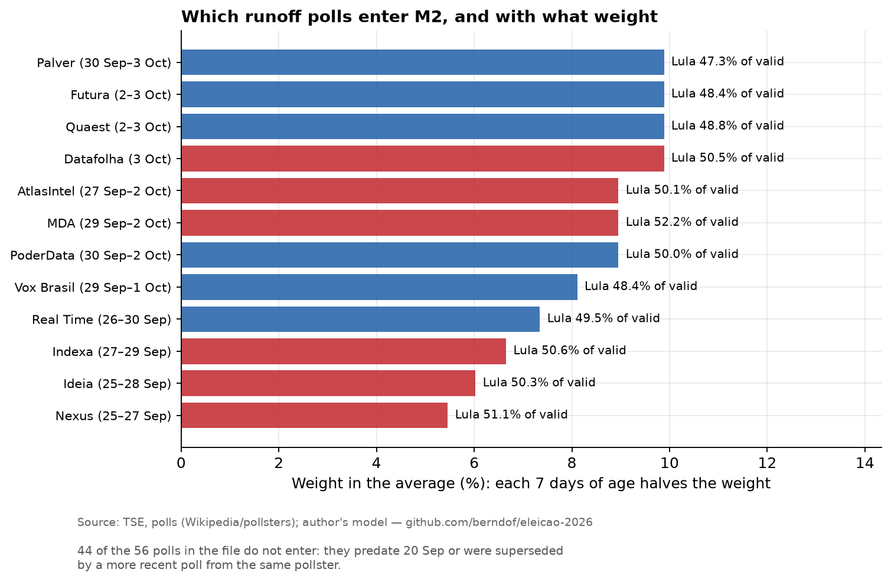
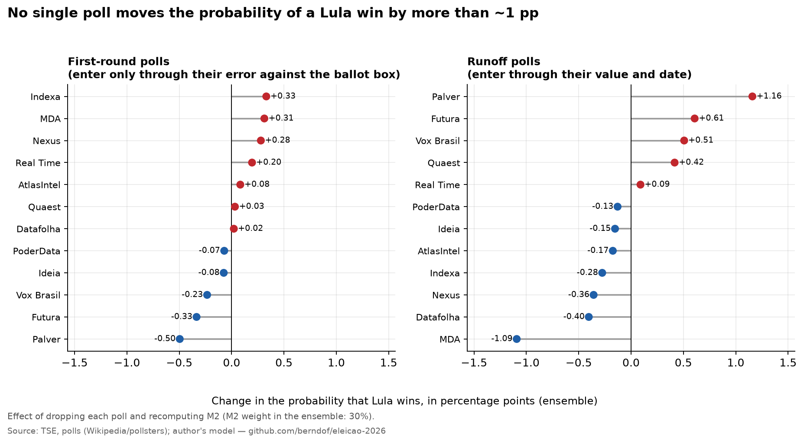
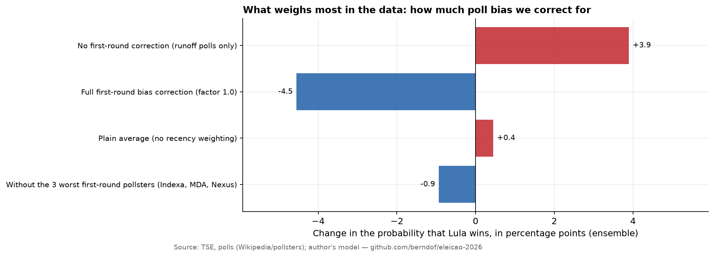

# Which polls enter, where, and how much they weigh

> **Generated** file (`python -m eleicao2026.report_influencia`, from `data/processed/influencia*.csv`). The conceptual explanation of each layer is in [layers.en.md](layers.en.md).

## 1. Map: each type of data feeds exactly one component

| Data | Feeds | How it enters | Where |
|---|---|---|---|
| Runoff polls (Lula vs. Flávio) | M2 | latest per pollster since 20 Sep; weight `0.5^(days/7)` | `data/interim/pesquisas_2turno.csv` |
| First-round polls | M2 | error vs. the ballot box (latest per pollster since 26 Sep) → mean bias → correction × 0.4 | `data/interim/pesquisas_1turno.csv` |
| Transfer polls (Quaest, Datafolha) | M1 | share of each eliminated candidate's vote that goes to Flávio; % who state a vote | `data/external/transferencia_pesquisas.csv` |
| 2022 runoff result by municipality | M1 | calibrates retention, mobilization, turnout and regional tilt | `data/interim/pres_2022*_mun.csv` |
| 2002–2022 runoffs | M3 | regression `R2 = 50 + β·(R1 − 50)` | `data/external/historico_2turnos.csv` |
| Polls before the cutoff or superseded | none | only shown in figure 06 | (same files) |

No runoff poll touches M1, and no transfer poll touches M2: the three methods use **disjoint data**. That is why their agreement or disagreement is informative.

## 2. Runoff polls → M2

Of the 56 polls in the file, **12 enter**. Weighted average: **Lula 49.7%** of the two-candidate vote. The effects below are from **dropping that poll** and recomputing M2 (closed form, validated against the simulations: mean 48.84% vs. 48.86%; P = 31.6% vs. 31.7%).

| Pollster | Period | Lula | Flávio | Lula/(L+F) | Weight (%) | Δ M2 if dropped (pp) | Δ ensemble P(Lula) (pp) |
|---|---|--:|--:|--:|--:|--:|--:|
| Datafolha | 3 Oct | 47.0 | 46.0 | 50.5 | 9.9 | -0.10 | -0.40 |
| Quaest | 2–3 Oct | 42.0 | 44.0 | 48.8 | 9.9 | +0.09 | +0.42 |
| Futura | 2–3 Oct | 45.1 | 48.0 | 48.4 | 9.9 | +0.13 | +0.61 |
| Palver | 30 Sep–3 Oct | 44.0 | 49.0 | 47.3 | 9.9 | +0.26 | +1.16 |
| PoderData | 30 Sep–2 Oct | 46.0 | 46.0 | 50.0 | 9.0 | -0.03 | -0.13 |
| MDA | 29 Sep–2 Oct | 47.0 | 43.0 | 52.2 | 9.0 | -0.25 | -1.09 |
| AtlasIntel | 27 Sep–2 Oct | 47.6 | 47.4 | 50.1 | 9.0 | -0.04 | -0.17 |
| Vox Brasil | 29 Sep–1 Oct | 45.2 | 48.2 | 48.4 | 8.1 | +0.11 | +0.51 |
| Real Time | 26–30 Sep | 45.0 | 46.0 | 49.5 | 7.3 | +0.02 | +0.09 |
| Indexa | 27–29 Sep | 43.0 | 42.0 | 50.6 | 6.7 | -0.07 | -0.28 |
| Ideia | 25–28 Sep | 48.5 | 48.0 | 50.3 | 6.0 | -0.04 | -0.15 |
| Nexus | 25–27 Sep | 46.0 | 44.0 | 51.1 | 5.5 | -0.08 | -0.36 |

Bar colors: red = Lula above 50% of valid votes in that poll; blue = below.

Runoff polls that do not enter (44)

| Pollster | Period | Lula | Flávio | Reason |
|---|---|--:|--:|---|
| Datafolha | 28–30 Sep | 48.0 | 45.0 | superseded by a newer poll |
| Futura | 25–29 Sep | 43.5 | 49.0 | superseded by a newer poll |
| Vox Brasil | 26–28 Sep | 44.7 | 45.2 | superseded by a newer poll |
| AtlasIntel | 23–28 Sep | 47.6 | 47.7 | superseded by a newer poll |
| Quaest | 24–27 Sep | 42.0 | 42.0 | superseded by a newer poll |
| Palver | 24–27 Sep | 45.0 | 47.0 | superseded by a newer poll |
| Datafolha | 22–24 Sep | 47.0 | 45.0 | superseded by a newer poll |
| Futura | 18–24 Sep | 43.7 | 49.4 | superseded by a newer poll |
| PoderData | 20–23 Sep | 45.0 | 46.0 | superseded by a newer poll |
| Palver | 20–23 Sep | 45.0 | 48.0 | superseded by a newer poll |
| Real Time | 19–23 Sep | 44.0 | 45.0 | superseded by a newer poll |
| AtlasIntel | 17–22 Sep | 47.7 | 47.4 | superseded by a newer poll |
| Nexus | 18–20 Sep | 46.0 | 45.0 | superseded by a newer poll |
| Quaest | 17–20 Sep | 41.0 | 42.0 | superseded by a newer poll |
| Palver | 15–20 Sep | 43.0 | 47.0 | superseded by a newer poll |
| Datafolha | 15–16 Sep | 46.0 | 44.0 | before cutoff |
| PoderData | 13–16 Sep | 44.0 | 46.0 | before cutoff |
| AtlasIntel | 11–16 Sep | 46.8 | 47.2 | before cutoff |
| Futura | 11–15 Sep | 43.7 | 48.1 | before cutoff |
| Nexus | 11–13 Sep | 47.0 | 46.0 | before cutoff |
| Quaest | 10–13 Sep | 40.0 | 42.0 | before cutoff |
| Indexa | 10–13 Sep | 43.0 | 42.0 | before cutoff |
| MDA | 9–13 Sep | 47.3 | 40.0 | before cutoff |
| Datafolha | 8–10 Sep | 46.0 | 44.0 | before cutoff |
| Futura | 4–10 Sep | 45.0 | 45.4 | before cutoff |
| PoderData | 6–9 Sep | 45.0 | 47.0 | before cutoff |
| AtlasIntel | 4–9 Sep | 46.2 | 46.4 | before cutoff |
| Palver | 4–7 Sep | 44.0 | 46.0 | before cutoff |
| Ideia | 4–7 Sep | 46.0 | 46.0 | before cutoff |
| Nexus | 4–7 Sep | 45.0 | 46.0 | before cutoff |
| Quaest | 3–6 Sep | 41.0 | 41.0 | before cutoff |
| Datafolha | 1–2 Sep | 46.0 | 44.0 | before cutoff |
| PoderData | 30 Aug – 2 Sep | 44.0 | 45.0 | before cutoff |
| Quaest | 30 Aug – 1 Sep | 42.0 | 41.0 | before cutoff |
| Futura | 27 Aug – 1 Sep | 45.6 | 45.2 | before cutoff |
| Real Time | 27–31 Aug | 44.0 | 44.0 | before cutoff |
| Nexus | 28–30 Aug | 46.0 | 45.0 | before cutoff |
| AtlasIntel | 25–30 Aug | 47.1 | 42.6 | before cutoff |
| Vox Brasil | 25–27 Aug | 44.5 | 45.1 | before cutoff |
| PoderData | 23–26 Aug | 45.0 | 44.0 | before cutoff |
| Nexus | 21–23 Aug | 46.0 | 45.0 | before cutoff |
| Indexa | 20–23 Aug | 46.0 | 41.0 | before cutoff |
| Datafolha | 18–20 Aug | 47.0 | 43.0 | before cutoff |
| Nexus | 14–16 Aug | 47.0 | 44.0 | before cutoff |

## 3. First-round polls → bias → M2

Of the 56 polls in the file (the Wikipedia "Results" row is the **ballot box**, not a poll, and is excluded), **12 enter**: each pollster's latest since 26 Sep. Each becomes one number, the **error in the Lula − Flávio margin** (poll − ballot box, candidates only, no blanks). Mean: **+3.83 pp**.

| Pollster | Period | Lula (norm.) | Flávio (norm.) | Margin error (pp) | Δ mean bias if dropped (pp) | Δ ensemble P(Lula) (pp) |
|---|---|--:|--:|--:|--:|--:|
| Datafolha | 3 Oct | 45.7 | 43.5 | +4.0 | -0.02 | +0.02 |
| Quaest | 2–3 Oct | 46.0 | 43.7 | +4.2 | -0.03 | +0.03 |
| Futura | 2–3 Oct | 42.6 | 44.7 | -0.2 | +0.37 | -0.33 |
| Palver | 30 Sep–3 Oct | 43.4 | 47.5 | -2.2 | +0.55 | -0.50 |
| PoderData | 30 Sep–2 Oct | 45.2 | 44.1 | +2.9 | +0.08 | -0.07 |
| MDA | 29 Sep–2 Oct | 47.8 | 42.2 | +7.5 | -0.34 | +0.31 |
| AtlasIntel | 27 Sep–2 Oct | 46.9 | 44.0 | +4.8 | -0.09 | +0.08 |
| Vox Brasil | 29 Sep–1 Oct | 45.0 | 45.9 | +1.0 | +0.26 | -0.23 |
| Real Time | 26–30 Sep | 45.7 | 41.5 | +6.1 | -0.21 | +0.20 |
| Indexa | 27–29 Sep | 45.9 | 40.0 | +7.7 | -0.36 | +0.33 |
| Ideia | 25–28 Sep | 40.1 | 39.1 | +2.9 | +0.09 | -0.08 |
| Nexus | 25–27 Sep | 44.2 | 38.9 | +7.1 | -0.30 | +0.28 |

First-round polls that do not enter (44)

| Pollster | Period | Lula | Flávio | Reason |
|---|---|--:|--:|---|
| Datafolha | 28–30 Sep | 45.2 | 40.9 | superseded by a newer poll |
| Futura | 25–29 Sep | 41.5 | 44.4 | superseded by a newer poll |
| Vox Brasil | 26–28 Sep | 46.0 | 42.0 | superseded by a newer poll |
| AtlasIntel | 23–28 Sep | 46.3 | 43.1 | superseded by a newer poll |
| Quaest | 24–27 Sep | 45.9 | 40.0 | superseded by a newer poll |
| Palver | 24–27 Sep | 44.4 | 44.4 | superseded by a newer poll |
| Datafolha | 22–24 Sep | 44.4 | 40.0 | before cutoff |
| Futura | 18–24 Sep | 40.6 | 42.7 | before cutoff |
| PoderData | 20–23 Sep | 43.2 | 41.1 | before cutoff |
| Palver | 20–23 Sep | 43.4 | 43.4 | before cutoff |
| Real Time | 19–23 Sep | 43.6 | 39.4 | before cutoff |
| AtlasIntel | 17–22 Sep | 46.4 | 43.9 | before cutoff |
| Nexus | 18–20 Sep | 43.0 | 39.8 | before cutoff |
| Quaest | 17–20 Sep | 43.5 | 38.8 | before cutoff |
| Palver | 15–20 Sep | 41.4 | 42.4 | before cutoff |
| Datafolha | 15–16 Sep | 42.4 | 39.1 | before cutoff |
| PoderData | 13–16 Sep | 39.4 | 38.3 | before cutoff |
| AtlasIntel | 11–16 Sep | 45.0 | 42.6 | before cutoff |
| Futura | 11–15 Sep | 40.8 | 40.2 | before cutoff |
| Nexus | 11–13 Sep | 44.7 | 39.4 | before cutoff |
| Quaest | 10–13 Sep | 43.4 | 37.3 | before cutoff |
| Indexa | 10–13 Sep | 44.2 | 39.5 | before cutoff |
| MDA | 9–13 Sep | 46.8 | 35.1 | before cutoff |
| Datafolha | 8–10 Sep | 41.9 | 37.6 | before cutoff |
| Futura | 4–10 Sep | 42.8 | 36.7 | before cutoff |
| PoderData | 6–9 Sep | 40.0 | 37.9 | before cutoff |
| AtlasIntel | 4–9 Sep | 43.4 | 37.8 | before cutoff |
| Palver | 4–7 Sep | 41.2 | 40.2 | before cutoff |
| Ideia | 4–7 Sep | 40.5 | 39.3 | before cutoff |
| Nexus | 4–7 Sep | 41.5 | 37.2 | before cutoff |
| Quaest | 3–6 Sep | 43.9 | 35.4 | before cutoff |
| Datafolha | 1–2 Sep | 41.8 | 36.3 | before cutoff |
| PoderData | 30 Aug – 2 Sep | 38.9 | 35.8 | before cutoff |
| Quaest | 30 Aug – 1 Sep | 45.1 | 35.4 | before cutoff |
| Futura | 27 Aug – 1 Sep | 41.2 | 35.8 | before cutoff |
| Real Time | 27–31 Aug | 40.4 | 31.9 | before cutoff |
| Nexus | 28–30 Aug | 41.9 | 35.5 | before cutoff |
| AtlasIntel | 25–30 Aug | 43.1 | 33.4 | before cutoff |
| Vox Brasil | 25–27 Aug | 41.4 | 38.8 | before cutoff |
| PoderData | 23–26 Aug | 40.4 | 37.2 | before cutoff |
| Nexus | 21–23 Aug | 44.6 | 40.2 | before cutoff |
| Indexa | 20–23 Aug | 46.4 | 40.5 | before cutoff |
| Datafolha | 18–20 Aug | 43.3 | 36.7 | before cutoff |
| Nexus | 14–16 Aug | 44.6 | 39.1 | before cutoff |

## 4. What weighs most: the assumptions, not any one poll

| M2 scenario | Lula in M2 (%) | P(Lula) M2 (%) | Δ ensemble P(Lula) (pp) |
|---|--:|--:|--:|
| M2 base (poll average corrected by 0.4 × first-round bias) | 48.84 | 31.6 | +0.0 |
| No first-round correction (runoff polls only) | 49.67 | 44.6 | +3.9 |
| Full first-round bias correction (factor 1.0) | 47.60 | 16.4 | -4.5 |
| Plain average (no recency weighting) | 48.94 | 33.1 | +0.4 |
| Without the 3 worst first-round pollsters (Indexa, MDA, Nexus) | 48.64 | 28.5 | -0.9 |

The 0.4 factor (how much first-round bias persists into the runoff) is an **assumption**, and it is the largest lever among poll data: from 0 to 1, Lula's ensemble probability goes from ~22% to ~13%.

## 5. Transfer polls → M1

Each poll asks the voters of an eliminated candidate whom they would pick in the runoff. Two pollsters, few numbers (all from search summaries; medium-low confidence):

| Pollster | Voters of | → Flávio | → Lula | Blank/null/DK | Notes |
|---|---|--:|--:|--:|---|
| Quaest | Renan Santos | 60 | 11 | 29 | resumo de busca (reconferido em 2 buscas); branco/nulo/NS=29 soma nulo 27 + indeciso 2 |
| Quaest | Ronaldo Caiado | 43 | 19 | 38 | resumo de busca (reconferido em 2 buscas) |
| Quaest | Augusto Cury | 34 | 23 | 43 | resumo de busca (reconferido em 2 buscas) |
| Datafolha | Romeu Zema | 48 | 25 | — | resumo de busca; amostra pequena |
| Datafolha | Renan Santos | 43 | 22 | — | resumo de busca; difere bastante do Quaest (60/11) |
| Datafolha | Agregado(Zema+Caiado+Renan+Cury) | 43 | 30 | 26 | único número disponível para Caiado e Cury no Datafolha |

How they become a model input: for each candidate, the simple mean of `Flávio/(Flávio+Lula)` from Quaest and Datafolha (if Datafolha has no individual number, the 43/30 aggregate is used); candidates without a poll get an **assumption** (minor right 65%, minor left 30%).

| Voters of | Valid R1 votes (M) | % of total | → Flávio (used) | Source | Δ Lula in M1 if +10 pp to Flávio (pp) |
|---|--:|--:|--:|---|--:|
| Augusto Cury | 3.45 | 2.89 | 59.3% | Quaest 34/23 + Datafolha agregado 43/30 | -0.27 |
| Renan Santos | 2.68 | 2.24 | 75.3% | Quaest 60/11 + Datafolha 43/22 | -0.21 |
| Ronaldo Caiado | 2.61 | 2.18 | 64.1% | Quaest 43/19 + Datafolha agregado 43/30 | -0.21 |
| Romeu Zema | 0.33 | 0.27 | 65.8% | Datafolha 48/25 | -0.03 |
| Samara | 0.12 | 0.10 | 65.0% | assumption: minor right | -0.01 |
| Hertz Dias | 0.04 | 0.04 | 30.0% | assumption: minor left | -0.00 |
| Clariana Barão | 0.04 | 0.03 | 65.0% | assumption: minor right | -0.00 |
| Edmilson Costa | 0.02 | 0.02 | 30.0% | assumption: minor left | -0.00 |
| Wilson Grassi | 0.02 | 0.01 | 65.0% | assumption: minor right | -0.00 |
| Rui Costa Pimenta | 0.02 | 0.01 | 30.0% | assumption: minor left | -0.00 |

Three candidates (Cury, Renan, Caiado) concentrate almost all of the effect. Effect of using only one pollster, or none:

| Scenario | Lula in M1 (%) | Δ in M1 (pp) | Δ in ensemble mean (pp) |
|---|--:|--:|--:|
| Quaest only (no Datafolha) | 46.67 | -0.31 | -0.16 |
| Datafolha only (no Quaest) | 47.30 | +0.31 | +0.16 |
| No transfer poll at all (all assumed) | 47.03 | +0.05 | +0.02 |

Note that **with no** transfer poll at all M1 barely changes (Quaest and Datafolha, on average, land close to the assumptions); the relevant uncertainty is what each pollster says **individually** (Quaest alone: Lula −0.3 pp; Datafolha alone: +0.3 pp).

## 6. Historical elections → M3

| Year | R1 leader | Leader % R1 | Runner-up % R1 | Leader % R2 | β without it | Δ Lula in M3 (pp) | Δ ensemble P(Lula) (pp) |
|---|---|--:|--:|--:|--:|--:|--:|
| 2002 | Lula × Serra | 46.44 | 23.20 | 61.27 | 0.64 | +0.02 | +0.22 |
| 2006 | Lula × Alckmin | 48.61 | 41.64 | 60.83 | 0.60 | +0.06 | -2.57 |
| 2010 | Dilma × Serra | 46.91 | 32.61 | 56.05 | 0.66 | +0.00 | +0.19 |
| 2014 | Dilma × Aécio | 41.59 | 33.55 | 51.64 | 0.68 | -0.02 | +0.10 |
| 2018 | Bolsonaro × Haddad | 46.03 | 29.28 | 55.13 | 0.72 | -0.06 | -0.03 |
| 2022 | Lula × Bolsonaro | 48.43 | 43.20 | 50.90 | 0.66 | -0.01 | +0.16 |

M3's center barely depends on any single year; what changes is the **spread** (2006 inflates the standard error: without it, the ensemble probability drops ~2.6 pp).

## 7. How to read (and not read) these numbers

* **Dropping a poll is not causal measurement.** It is a sensitivity analysis: how much the result depends on that datum, given the rest.
* **Polls are not independent** (same period, similar methodologies, correlated errors, as the first round showed). The standard error of the mean is therefore optimistic.
* **Ensemble Δ** = component weight × component Δ (the ensemble is a linear mixture of probabilities).
* P(Lula) effects use the closed-form normal M2 (and t-4 M3); the check against the simulations is at the top of section 2.

